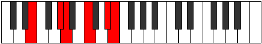

# Mode Lycritonic

## Links

- [Documentation](index.md)
- [Scales Index](Scales.md)
- [Modes Index](Modes.md)
- [Chords Index](Chords.md)

## Parent Scale

[Lycritonic](ScaleLycritonic.md)

## Number

[2353](https://ianring.com/musictheory/scales/2353)

## Perfection

- 2 Perfect notes
- 3 Perfect notes

## Perfection Profile

[false true true false false]

## Permutations

| Tonic | Notes | Signature | Illustration | Audio |
|-------|-------|-----------|--------------|-------|
| [C](ModeCNaturalLycritonic.md) | **C**, E, F, **G#**, **B**, **C** | C |  | [midi](ModeCNaturalLycritonic.mid) [ogg](ModeCNaturalLycritonic.ogg) |
| [C#](ModeCSharpLycritonic.md) | **C#**, F, F#, **A**, **C**, **C#** | C |  | [midi](ModeCSharpLycritonic.mid) [ogg](ModeCSharpLycritonic.ogg) |
| [Db](ModeDFlatLycritonic.md) | **Db**, F, Gb, **A**, **C**, **Db** | C |  | [midi](ModeDFlatLycritonic.mid) [ogg](ModeDFlatLycritonic.ogg) |
| [D](ModeDNaturalLycritonic.md) | **D**, F#, G, **A#**, **C#**, **D** | C |  | [midi](ModeDNaturalLycritonic.mid) [ogg](ModeDNaturalLycritonic.ogg) |
| [D#](ModeDSharpLycritonic.md) | **D#**, G, G#, **B**, **D**, **D#** | C |  | [midi](ModeDSharpLycritonic.mid) [ogg](ModeDSharpLycritonic.ogg) |
| [Eb](ModeEFlatLycritonic.md) | **Eb**, G, Ab, **B**, **D**, **Eb** | C |  | [midi](ModeEFlatLycritonic.mid) [ogg](ModeEFlatLycritonic.ogg) |
| [E](ModeENaturalLycritonic.md) | **E**, G#, A, **C**, **D#**, **E** | C |  | [midi](ModeENaturalLycritonic.mid) [ogg](ModeENaturalLycritonic.ogg) |
| [F](ModeFNaturalLycritonic.md) | **F**, A, A#, **C#**, **E**, **F** | C |  | [midi](ModeFNaturalLycritonic.mid) [ogg](ModeFNaturalLycritonic.ogg) |
| [F#](ModeFSharpLycritonic.md) | **F#**, A#, B, **D**, **F**, **F#** | C |  | [midi](ModeFSharpLycritonic.mid) [ogg](ModeFSharpLycritonic.ogg) |
| [Gb](ModeGFlatLycritonic.md) | **Gb**, Bb, B, **D**, **F**, **Gb** | C |  | [midi](ModeGFlatLycritonic.mid) [ogg](ModeGFlatLycritonic.ogg) |
| [G](ModeGNaturalLycritonic.md) | **G**, B, C, **D#**, **F#**, **G** | C |  | [midi](ModeGNaturalLycritonic.mid) [ogg](ModeGNaturalLycritonic.ogg) |
| [G#](ModeGSharpLycritonic.md) | **G#**, C, C#, **E**, **G**, **G#** | C |  | [midi](ModeGSharpLycritonic.mid) [ogg](ModeGSharpLycritonic.ogg) |
| [Ab](ModeAFlatLycritonic.md) | **Ab**, C, Db, **E**, **G**, **Ab** | C |  | [midi](ModeAFlatLycritonic.mid) [ogg](ModeAFlatLycritonic.ogg) |
| [A](ModeANaturalLycritonic.md) | **A**, C#, D, **F**, **G#**, **A** | C |  | [midi](ModeANaturalLycritonic.mid) [ogg](ModeANaturalLycritonic.ogg) |
| [A#](ModeASharpLycritonic.md) | **A#**, D, D#, **F#**, **A**, **A#** | C |  | [midi](ModeASharpLycritonic.mid) [ogg](ModeASharpLycritonic.ogg) |
| [Bb](ModeBFlatLycritonic.md) | **Bb**, D, Eb, **Gb**, **A**, **Bb** | C |  | [midi](ModeBFlatLycritonic.mid) [ogg](ModeBFlatLycritonic.ogg) |
| [B](ModeBNaturalLycritonic.md) | **B**, D#, E, **G**, **A#**, **B** | C |  | [midi](ModeBNaturalLycritonic.mid) [ogg](ModeBNaturalLycritonic.ogg) |
