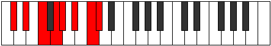

# Mode Lydian

## Links

- [Documentation](README.md)
- [Scales Index](Scales.md)
- [Modes Index](Modes.md)
- [Chords Index](Chords.md)

## Parent Scale

[Lydian](ScaleLydian.md)

## Number

[2773](https://ianring.com/musictheory/scales/2773)

## Interval Pattern

2, 2, 2, 1, 2, 2, 1

## Chord Pattern

I, II, iii, iv⁰, V, vi, vii

## Perfection

- 6 Perfect notes
- 1 Perfect notes

## Perfection Profile

[true true true false true true true]

## Permutations

| Tonic | Notes | Signature | Illustration | Audio |
|-------|-------|-----------|--------------|-------|
| [C](ModeCNaturalLydian.md) | C, D, E, **F#**, G, A, B, C | G |  | [midi](https://github.com/edipermadi/music/blob/main/docs/ModeCNaturalLydian.mid?raw=true) |
| [C#](ModeCSharpLydian.md) | C#, D#, E#, **F##**, G#, A#, B#, C# | Ab |  | [midi](https://github.com/edipermadi/music/blob/main/docs/ModeCSharpLydian.mid?raw=true) |
| [Db](ModeDFlatLydian.md) | Db, Eb, F, **G**, Ab, Bb, C, Db | Ab |  | [midi](https://github.com/edipermadi/music/blob/main/docs/ModeDFlatLydian.mid?raw=true) |
| [D](ModeDNaturalLydian.md) | D, E, F#, **G#**, A, B, C#, D | A |  | [midi](https://github.com/edipermadi/music/blob/main/docs/ModeDNaturalLydian.mid?raw=true) |
| [D#](ModeDSharpLydian.md) | D#, E#, F##, **G##**, A#, B#, C##, D# | Bb |  | [midi](https://github.com/edipermadi/music/blob/main/docs/ModeDSharpLydian.mid?raw=true) |
| [Eb](ModeEFlatLydian.md) | Eb, F, G, **A**, Bb, C, D, Eb | Bb |  | [midi](https://github.com/edipermadi/music/blob/main/docs/ModeEFlatLydian.mid?raw=true) |
| [E](ModeENaturalLydian.md) | E, F#, G#, **A#**, B, C#, D#, E | B |  | [midi](https://github.com/edipermadi/music/blob/main/docs/ModeENaturalLydian.mid?raw=true) |
| [F](ModeFNaturalLydian.md) | F, G, A, **B**, C, D, E, F | C |  | [midi](https://github.com/edipermadi/music/blob/main/docs/ModeFNaturalLydian.mid?raw=true) |
| [F#](ModeFSharpLydian.md) | F#, G#, A#, **B#**, C#, D#, E#, F# | Db, C# |  | [midi](https://github.com/edipermadi/music/blob/main/docs/ModeFSharpLydian.mid?raw=true) |
| [Gb](ModeGFlatLydian.md) | Gb, Ab, Bb, **C**, Db, Eb, F, Gb | Db, C# |  | [midi](https://github.com/edipermadi/music/blob/main/docs/ModeGFlatLydian.mid?raw=true) |
| [G](ModeGNaturalLydian.md) | G, A, B, **C#**, D, E, F#, G | D |  | [midi](https://github.com/edipermadi/music/blob/main/docs/ModeGNaturalLydian.mid?raw=true) |
| [G#](ModeGSharpLydian.md) | G#, A#, B#, **C##**, D#, E#, F##, G# | Eb |  | [midi](https://github.com/edipermadi/music/blob/main/docs/ModeGSharpLydian.mid?raw=true) |
| [Ab](ModeAFlatLydian.md) | Ab, Bb, C, **D**, Eb, F, G, Ab | Eb |  | [midi](https://github.com/edipermadi/music/blob/main/docs/ModeAFlatLydian.mid?raw=true) |
| [A](ModeANaturalLydian.md) | A, B, C#, **D#**, E, F#, G#, A | E |  | [midi](https://github.com/edipermadi/music/blob/main/docs/ModeANaturalLydian.mid?raw=true) |
| [A#](ModeASharpLydian.md) | A#, B#, C##, **D##**, E#, F##, G##, A# | F |  | [midi](https://github.com/edipermadi/music/blob/main/docs/ModeASharpLydian.mid?raw=true) |
| [Bb](ModeBFlatLydian.md) | Bb, C, D, **E**, F, G, A, Bb | F |  | [midi](https://github.com/edipermadi/music/blob/main/docs/ModeBFlatLydian.mid?raw=true) |
| [B](ModeBNaturalLydian.md) | B, C#, D#, **E#**, F#, G#, A#, B | F#, Gb |  | [midi](https://github.com/edipermadi/music/blob/main/docs/ModeBNaturalLydian.mid?raw=true) |
