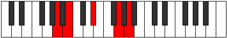
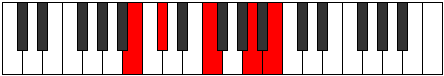

# Mode Lydic

## Links

- [Documentation](index.md)
- [Scales Index](Scales.md)
- [Modes Index](Modes.md)
- [Chords Index](Chords.md)

## Parent Scale

[Aeolic](ScaleAeolic.md)

## Number

[1093](https://ianring.com/musictheory/scales/1093)

## Perfection

- 0 Perfect notes
- 4 Perfect notes

## Perfection Profile

[false false false false]

## Permutations

| Tonic | Notes | Signature | Illustration | Audio |
|-------|-------|-----------|--------------|-------|
| [C](ModeCNaturalLydic.md) | **C**, **D**, **F#**, **A#**, **C** | C |  | [midi](ModeCNaturalLydic.mid) [ogg](ModeCNaturalLydic.ogg) |
| [C#](ModeCSharpLydic.md) | **C#**, **D#**, **G**, **B**, **C#** | C |  | [midi](ModeCSharpLydic.mid) [ogg](ModeCSharpLydic.ogg) |
| [Db](ModeDFlatLydic.md) | **Db**, **Eb**, **G**, **B**, **Db** | C |  | [midi](ModeDFlatLydic.mid) [ogg](ModeDFlatLydic.ogg) |
| [D](ModeDNaturalLydic.md) | **D**, **E**, **G#**, **C**, **D** | C |  | [midi](ModeDNaturalLydic.mid) [ogg](ModeDNaturalLydic.ogg) |
| [D#](ModeDSharpLydic.md) | **D#**, **F**, **A**, **C#**, **D#** | C |  | [midi](ModeDSharpLydic.mid) [ogg](ModeDSharpLydic.ogg) |
| [Eb](ModeEFlatLydic.md) | **Eb**, **F**, **A**, **Db**, **Eb** | C |  | [midi](ModeEFlatLydic.mid) [ogg](ModeEFlatLydic.ogg) |
| [E](ModeENaturalLydic.md) | **E**, **F#**, **A#**, **D**, **E** | C |  | [midi](ModeENaturalLydic.mid) [ogg](ModeENaturalLydic.ogg) |
| [F](ModeFNaturalLydic.md) | **F**, **G**, **B**, **D#**, **F** | C |  | [midi](ModeFNaturalLydic.mid) [ogg](ModeFNaturalLydic.ogg) |
| [F#](ModeFSharpLydic.md) | **F#**, **G#**, **C**, **E**, **F#** | C |  | [midi](ModeFSharpLydic.mid) [ogg](ModeFSharpLydic.ogg) |
| [Gb](ModeGFlatLydic.md) | **Gb**, **Ab**, **C**, **E**, **Gb** | C |  | [midi](ModeGFlatLydic.mid) [ogg](ModeGFlatLydic.ogg) |
| [G](ModeGNaturalLydic.md) | **G**, **A**, **C#**, **F**, **G** | C |  | [midi](ModeGNaturalLydic.mid) [ogg](ModeGNaturalLydic.ogg) |
| [G#](ModeGSharpLydic.md) | **G#**, **A#**, **D**, **F#**, **G#** | C |  | [midi](ModeGSharpLydic.mid) [ogg](ModeGSharpLydic.ogg) |
| [Ab](ModeAFlatLydic.md) | **Ab**, **Bb**, **D**, **Gb**, **Ab** | C |  | [midi](ModeAFlatLydic.mid) [ogg](ModeAFlatLydic.ogg) |
| [A](ModeANaturalLydic.md) | **A**, **B**, **D#**, **G**, **A** | C |  | [midi](ModeANaturalLydic.mid) [ogg](ModeANaturalLydic.ogg) |
| [A#](ModeASharpLydic.md) | **A#**, **C**, **E**, **G#**, **A#** | C |  | [midi](ModeASharpLydic.mid) [ogg](ModeASharpLydic.ogg) |
| [Bb](ModeBFlatLydic.md) | **Bb**, **C**, **E**, **Ab**, **Bb** | C |  | [midi](ModeBFlatLydic.mid) [ogg](ModeBFlatLydic.ogg) |
| [B](ModeBNaturalLydic.md) | **B**, **C#**, **F**, **A**, **B** | C |  | [midi](ModeBNaturalLydic.mid) [ogg](ModeBNaturalLydic.ogg) |
