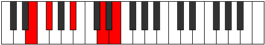

# Mode Lydic

## Links

- [Documentation](index.md)
- [Scales Index](Scales.md)
- [Modes Index](Modes.md)
- [Chords Index](Chords.md)

## Parent Scale

[Aeolic](ScaleAeolic.md)

## Number

[1093](https://ianring.com/musictheory/scales/1093)

## Interval Pattern

2, 4, 4, 2

## Chord Pattern

II⁺, III⁺, IV⁺

## Perfection

- 0 Perfect notes
- 4 Perfect notes

## Perfection Profile

[false false false false]

## Permutations

| Tonic | Notes | Signature | Illustration | Audio |
|-------|-------|-----------|--------------|-------|
| [C](ModeCNaturalLydic.md) | **C**, **D**, **F#**, **A#**, **C** | C |  | [midi](https://github.com/edipermadi/music/blob/main/docs/ModeCNaturalLydic.mid?raw=true) |
| [C#](ModeCSharpLydic.md) | **C#**, **D#**, **G**, **B**, **C#** | C |  | [midi](https://github.com/edipermadi/music/blob/main/docs/ModeCSharpLydic.mid?raw=true) |
| [Db](ModeDFlatLydic.md) | **Db**, **Eb**, **G**, **B**, **Db** | C |  | [midi](https://github.com/edipermadi/music/blob/main/docs/ModeDFlatLydic.mid?raw=true) |
| [D](ModeDNaturalLydic.md) | **D**, **E**, **G#**, **C**, **D** | C |  | [midi](https://github.com/edipermadi/music/blob/main/docs/ModeDNaturalLydic.mid?raw=true) |
| [D#](ModeDSharpLydic.md) | **D#**, **F**, **A**, **C#**, **D#** | C |  | [midi](https://github.com/edipermadi/music/blob/main/docs/ModeDSharpLydic.mid?raw=true) |
| [Eb](ModeEFlatLydic.md) | **Eb**, **F**, **A**, **Db**, **Eb** | C |  | [midi](https://github.com/edipermadi/music/blob/main/docs/ModeEFlatLydic.mid?raw=true) |
| [E](ModeENaturalLydic.md) | **E**, **F#**, **A#**, **D**, **E** | C |  | [midi](https://github.com/edipermadi/music/blob/main/docs/ModeENaturalLydic.mid?raw=true) |
| [F](ModeFNaturalLydic.md) | **F**, **G**, **B**, **D#**, **F** | C |  | [midi](https://github.com/edipermadi/music/blob/main/docs/ModeFNaturalLydic.mid?raw=true) |
| [F#](ModeFSharpLydic.md) | **F#**, **G#**, **C**, **E**, **F#** | C |  | [midi](https://github.com/edipermadi/music/blob/main/docs/ModeFSharpLydic.mid?raw=true) |
| [Gb](ModeGFlatLydic.md) | **Gb**, **Ab**, **C**, **E**, **Gb** | C |  | [midi](https://github.com/edipermadi/music/blob/main/docs/ModeGFlatLydic.mid?raw=true) |
| [G](ModeGNaturalLydic.md) | **G**, **A**, **C#**, **F**, **G** | C |  | [midi](https://github.com/edipermadi/music/blob/main/docs/ModeGNaturalLydic.mid?raw=true) |
| [G#](ModeGSharpLydic.md) | **G#**, **A#**, **D**, **F#**, **G#** | C |  | [midi](https://github.com/edipermadi/music/blob/main/docs/ModeGSharpLydic.mid?raw=true) |
| [Ab](ModeAFlatLydic.md) | **Ab**, **Bb**, **D**, **Gb**, **Ab** | C |  | [midi](https://github.com/edipermadi/music/blob/main/docs/ModeAFlatLydic.mid?raw=true) |
| [A](ModeANaturalLydic.md) | **A**, **B**, **D#**, **G**, **A** | C |  | [midi](https://github.com/edipermadi/music/blob/main/docs/ModeANaturalLydic.mid?raw=true) |
| [A#](ModeASharpLydic.md) | **A#**, **C**, **E**, **G#**, **A#** | C |  | [midi](https://github.com/edipermadi/music/blob/main/docs/ModeASharpLydic.mid?raw=true) |
| [Bb](ModeBFlatLydic.md) | **Bb**, **C**, **E**, **Ab**, **Bb** | C |  | [midi](https://github.com/edipermadi/music/blob/main/docs/ModeBFlatLydic.mid?raw=true) |
| [B](ModeBNaturalLydic.md) | **B**, **C#**, **F**, **A**, **B** | C |  | [midi](https://github.com/edipermadi/music/blob/main/docs/ModeBNaturalLydic.mid?raw=true) |
