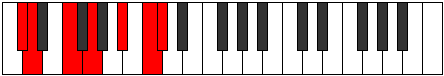

# Mode Lydimic

## Links

- [Documentation](index.md)
- [Scales Index](Scales.md)
- [Modes Index](Modes.md)
- [Chords Index](Chords.md)

## Parent Scale

[Mixolimic](ScaleMixolimic.md)

## Number

[2643](https://ianring.com/musictheory/scales/2643)

## Perfection

- 4 Perfect notes
- 2 Perfect notes

## Perfection Profile

[false false true true true true]

## Permutations

| Tonic | Notes | Signature | Illustration | Audio |
|-------|-------|-----------|--------------|-------|
| [C](ModeCNaturalLydimic.md) | **C**, **Db**, E, F#, G##, A##, **C** | C |  | [midi](https://github.com/edipermadi/music/blob/main/docs/ModeCNaturalLydimic.mid?raw=true) |
| [C#](ModeCSharpLydimic.md) | **C#**, **D**, E#, F##, G###, A###, **C#** | C |  | [midi](https://github.com/edipermadi/music/blob/main/docs/ModeCSharpLydimic.mid?raw=true) |
| [Db](ModeDFlatLydimic.md) | **Db**, **Ebb**, F, G, A#, B#, **Db** | C |  | [midi](https://github.com/edipermadi/music/blob/main/docs/ModeDFlatLydimic.mid?raw=true) |
| [D](ModeDNaturalLydimic.md) | **D**, **Eb**, F#, G#, A##, B##, **D** | C |  | [midi](https://github.com/edipermadi/music/blob/main/docs/ModeDNaturalLydimic.mid?raw=true) |
| [D#](ModeDSharpLydimic.md) | **D#**, **E**, F##, G##, A###, B###, **D#** | C |  | [midi](https://github.com/edipermadi/music/blob/main/docs/ModeDSharpLydimic.mid?raw=true) |
| [Eb](ModeEFlatLydimic.md) | **Eb**, **Fb**, G, A, B#, C##, **Eb** | C |  | [midi](https://github.com/edipermadi/music/blob/main/docs/ModeEFlatLydimic.mid?raw=true) |
| [E](ModeENaturalLydimic.md) | **E**, **F**, G#, A#, B##, C###, **E** | C |  | [midi](https://github.com/edipermadi/music/blob/main/docs/ModeENaturalLydimic.mid?raw=true) |
| [F](ModeFNaturalLydimic.md) | **F**, **Gb**, A, B, C##, D##, **F** | C |  | [midi](https://github.com/edipermadi/music/blob/main/docs/ModeFNaturalLydimic.mid?raw=true) |
| [F#](ModeFSharpLydimic.md) | **F#**, **G**, A#, B#, C###, D###, **F#** | C |  | [midi](https://github.com/edipermadi/music/blob/main/docs/ModeFSharpLydimic.mid?raw=true) |
| [Gb](ModeGFlatLydimic.md) | **Gb**, **Abb**, Bb, C, D#, E#, **Gb** | C |  | [midi](https://github.com/edipermadi/music/blob/main/docs/ModeGFlatLydimic.mid?raw=true) |
| [G](ModeGNaturalLydimic.md) | **G**, **Ab**, B, C#, D##, E##, **G** | C |  | [midi](https://github.com/edipermadi/music/blob/main/docs/ModeGNaturalLydimic.mid?raw=true) |
| [G#](ModeGSharpLydimic.md) | **G#**, **A**, B#, C##, D###, E###, **G#** | C |  | [midi](https://github.com/edipermadi/music/blob/main/docs/ModeGSharpLydimic.mid?raw=true) |
| [Ab](ModeAFlatLydimic.md) | **Ab**, **Bbb**, C, D, E#, F##, **Ab** | C |  | [midi](https://github.com/edipermadi/music/blob/main/docs/ModeAFlatLydimic.mid?raw=true) |
| [A](ModeANaturalLydimic.md) | **A**, **Bb**, C#, D#, E##, F###, **A** | C |  | [midi](https://github.com/edipermadi/music/blob/main/docs/ModeANaturalLydimic.mid?raw=true) |
| [A#](ModeASharpLydimic.md) | **A#**, **B**, C##, D##, E###, Cbbb, **A#** | C |  | [midi](https://github.com/edipermadi/music/blob/main/docs/ModeASharpLydimic.mid?raw=true) |
| [Bb](ModeBFlatLydimic.md) | **Bb**, **Cb**, D, E, F##, G##, **Bb** | C |  | [midi](https://github.com/edipermadi/music/blob/main/docs/ModeBFlatLydimic.mid?raw=true) |
| [B](ModeBNaturalLydimic.md) | **B**, **C**, D#, E#, F###, G###, **B** | C |  | [midi](https://github.com/edipermadi/music/blob/main/docs/ModeBNaturalLydimic.mid?raw=true) |
