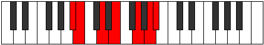

# Mode Lydimic

## Links

- [Documentation](index.md)
- [Scales Index](Scales.md)
- [Modes Index](Modes.md)
- [Chords Index](Chords.md)

## Parent Scale

[Mixolimic](ScaleMixolimic.md)

## Number

[2643](https://ianring.com/musictheory/scales/2643)

## Perfection

- 4 Perfect notes
- 2 Perfect notes

## Perfection Profile

[false false true true true true]

## Permutations

| Tonic | Notes | Signature | Illustration | Audio |
|-------|-------|-----------|--------------|-------|
| [C](ModeCNaturalLydimic.md) | **C**, **Db**, E, F#, G##, A##, **C** | C |  | [midi](ModeCNaturalLydimic.mid) [ogg](ModeCNaturalLydimic.ogg) |
| [C#](ModeCSharpLydimic.md) | **C#**, **D**, E#, F##, G###, A###, **C#** | C |  | [midi](ModeCSharpLydimic.mid) [ogg](ModeCSharpLydimic.ogg) |
| [Db](ModeDFlatLydimic.md) | **Db**, **Ebb**, F, G, A#, B#, **Db** | C |  | [midi](ModeDFlatLydimic.mid) [ogg](ModeDFlatLydimic.ogg) |
| [D](ModeDNaturalLydimic.md) | **D**, **Eb**, F#, G#, A##, B##, **D** | C |  | [midi](ModeDNaturalLydimic.mid) [ogg](ModeDNaturalLydimic.ogg) |
| [D#](ModeDSharpLydimic.md) | **D#**, **E**, F##, G##, A###, B###, **D#** | C |  | [midi](ModeDSharpLydimic.mid) [ogg](ModeDSharpLydimic.ogg) |
| [Eb](ModeEFlatLydimic.md) | **Eb**, **Fb**, G, A, B#, C##, **Eb** | C |  | [midi](ModeEFlatLydimic.mid) [ogg](ModeEFlatLydimic.ogg) |
| [E](ModeENaturalLydimic.md) | **E**, **F**, G#, A#, B##, C###, **E** | C |  | [midi](ModeENaturalLydimic.mid) [ogg](ModeENaturalLydimic.ogg) |
| [F](ModeFNaturalLydimic.md) | **F**, **Gb**, A, B, C##, D##, **F** | C |  | [midi](ModeFNaturalLydimic.mid) [ogg](ModeFNaturalLydimic.ogg) |
| [F#](ModeFSharpLydimic.md) | **F#**, **G**, A#, B#, C###, D###, **F#** | C |  | [midi](ModeFSharpLydimic.mid) [ogg](ModeFSharpLydimic.ogg) |
| [Gb](ModeGFlatLydimic.md) | **Gb**, **Abb**, Bb, C, D#, E#, **Gb** | C |  | [midi](ModeGFlatLydimic.mid) [ogg](ModeGFlatLydimic.ogg) |
| [G](ModeGNaturalLydimic.md) | **G**, **Ab**, B, C#, D##, E##, **G** | C |  | [midi](ModeGNaturalLydimic.mid) [ogg](ModeGNaturalLydimic.ogg) |
| [G#](ModeGSharpLydimic.md) | **G#**, **A**, B#, C##, D###, E###, **G#** | C |  | [midi](ModeGSharpLydimic.mid) [ogg](ModeGSharpLydimic.ogg) |
| [Ab](ModeAFlatLydimic.md) | **Ab**, **Bbb**, C, D, E#, F##, **Ab** | C |  | [midi](ModeAFlatLydimic.mid) [ogg](ModeAFlatLydimic.ogg) |
| [A](ModeANaturalLydimic.md) | **A**, **Bb**, C#, D#, E##, F###, **A** | C |  | [midi](ModeANaturalLydimic.mid) [ogg](ModeANaturalLydimic.ogg) |
| [A#](ModeASharpLydimic.md) | **A#**, **B**, C##, D##, E###, Cbbb, **A#** | C |  | [midi](ModeASharpLydimic.mid) [ogg](ModeASharpLydimic.ogg) |
| [Bb](ModeBFlatLydimic.md) | **Bb**, **Cb**, D, E, F##, G##, **Bb** | C |  | [midi](ModeBFlatLydimic.mid) [ogg](ModeBFlatLydimic.ogg) |
| [B](ModeBNaturalLydimic.md) | **B**, **C**, D#, E#, F###, G###, **B** | C |  | [midi](ModeBNaturalLydimic.mid) [ogg](ModeBNaturalLydimic.ogg) |
