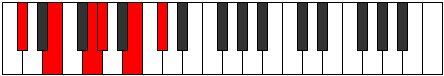
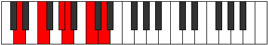
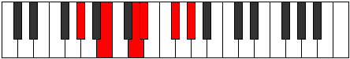

# Mode Lyditonic

## Links

- [Documentation](README.md)
- [Scales Index](Scales.md)
- [Modes Index](Modes.md)
- [Chords Index](Chords.md)

## Parent Scale

[Lyditonic](ScaleLyditonic.md)

## Number

[1225](https://ianring.com/musictheory/scales/1225)

## Interval Pattern

3, 3, 1, 3, 2

## Chord Pattern

## Perfection

- 2 Perfect notes
- 3 Perfect notes

## Perfection Profile

[true true false false false]

## Permutations

| Tonic | Notes | Signature | Illustration | Audio |
|-------|-------|-----------|--------------|-------|
| [C](ModeCNaturalLyditonic.md) | C, D#, **F#**, **G**, **A#**, C | C |  | [midi](https://github.com/edipermadi/music/blob/main/docs/ModeCNaturalLyditonic.mid?raw=true) |
| [C#](ModeCSharpLyditonic.md) | C#, E, **G**, **G#**, **B**, C# | C |  | [midi](https://github.com/edipermadi/music/blob/main/docs/ModeCSharpLyditonic.mid?raw=true) |
| [Db](ModeDFlatLyditonic.md) | Db, E, **G**, **Ab**, **B**, Db | C |  | [midi](https://github.com/edipermadi/music/blob/main/docs/ModeDFlatLyditonic.mid?raw=true) |
| [D](ModeDNaturalLyditonic.md) | D, F, **G#**, **A**, **C**, D | C |  | [midi](https://github.com/edipermadi/music/blob/main/docs/ModeDNaturalLyditonic.mid?raw=true) |
| [D#](ModeDSharpLyditonic.md) | D#, F#, **A**, **A#**, **C#**, D# | C |  | [midi](https://github.com/edipermadi/music/blob/main/docs/ModeDSharpLyditonic.mid?raw=true) |
| [Eb](ModeEFlatLyditonic.md) | Eb, Gb, **A**, **Bb**, **Db**, Eb | C |  | [midi](https://github.com/edipermadi/music/blob/main/docs/ModeEFlatLyditonic.mid?raw=true) |
| [E](ModeENaturalLyditonic.md) | E, G, **A#**, **B**, **D**, E | C |  | [midi](https://github.com/edipermadi/music/blob/main/docs/ModeENaturalLyditonic.mid?raw=true) |
| [F](ModeFNaturalLyditonic.md) | F, G#, **B**, **C**, **D#**, F | C |  | [midi](https://github.com/edipermadi/music/blob/main/docs/ModeFNaturalLyditonic.mid?raw=true) |
| [F#](ModeFSharpLyditonic.md) | F#, A, **C**, **C#**, **E**, F# | C |  | [midi](https://github.com/edipermadi/music/blob/main/docs/ModeFSharpLyditonic.mid?raw=true) |
| [Gb](ModeGFlatLyditonic.md) | Gb, A, **C**, **Db**, **E**, Gb | C |  | [midi](https://github.com/edipermadi/music/blob/main/docs/ModeGFlatLyditonic.mid?raw=true) |
| [G](ModeGNaturalLyditonic.md) | G, A#, **C#**, **D**, **F**, G | C |  | [midi](https://github.com/edipermadi/music/blob/main/docs/ModeGNaturalLyditonic.mid?raw=true) |
| [G#](ModeGSharpLyditonic.md) | G#, B, **D**, **D#**, **F#**, G# | C |  | [midi](https://github.com/edipermadi/music/blob/main/docs/ModeGSharpLyditonic.mid?raw=true) |
| [Ab](ModeAFlatLyditonic.md) | Ab, B, **D**, **Eb**, **Gb**, Ab | C |  | [midi](https://github.com/edipermadi/music/blob/main/docs/ModeAFlatLyditonic.mid?raw=true) |
| [A](ModeANaturalLyditonic.md) | A, C, **D#**, **E**, **G**, A | C |  | [midi](https://github.com/edipermadi/music/blob/main/docs/ModeANaturalLyditonic.mid?raw=true) |
| [A#](ModeASharpLyditonic.md) | A#, C#, **E**, **F**, **G#**, A# | C |  | [midi](https://github.com/edipermadi/music/blob/main/docs/ModeASharpLyditonic.mid?raw=true) |
| [Bb](ModeBFlatLyditonic.md) | Bb, Db, **E**, **F**, **Ab**, Bb | C |  | [midi](https://github.com/edipermadi/music/blob/main/docs/ModeBFlatLyditonic.mid?raw=true) |
| [B](ModeBNaturalLyditonic.md) | B, D, **F**, **F#**, **A**, B | C |  | [midi](https://github.com/edipermadi/music/blob/main/docs/ModeBNaturalLyditonic.mid?raw=true) |
