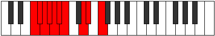

# Mode Lydygic

## Links

- [Documentation](README.md)
- [Scales Index](Scales.md)
- [Modes Index](Modes.md)
- [Chords Index](Chords.md)

## Parent Scale

[Phrygic](ScalePhrygic.md)

## Number

[1663](https://ianring.com/musictheory/scales/1663)

## Luminosity

6

## Transposition

1, 1, 1, 1, 1, 1, 3, 1, 2

## Chord Pattern

iv⁰b3, v⁰b3, VI, VII

## Perfection

- 6 Perfect notes
- 3 Perfect notes

## Perfection Profile

false, false, true, true, false, true, true, true, true

## Permutations

| Tonic | Notes | Signature | Illustration | Audio |
|-------|-------|-----------|--------------|-------|
| [C](ModeCNaturalLydygic.md) | **C**, **C#**, D, D#, **E**, F, F#, A, A#, **C** | C |  | [midi](https://github.com/edipermadi/music/blob/main/docs/ModeCNaturalLydygic.mid?raw=true) |
| [C#](ModeCSharpLydygic.md) | **C#**, **D**, D#, E, **F**, F#, G, A#, B, **C#** | C |  | [midi](https://github.com/edipermadi/music/blob/main/docs/ModeCSharpLydygic.mid?raw=true) |
| [Db](ModeDFlatLydygic.md) | **Db**, **D**, Eb, E, **F**, Gb, G, Bb, B, **Db** | C |  | [midi](https://github.com/edipermadi/music/blob/main/docs/ModeDFlatLydygic.mid?raw=true) |
| [D](ModeDNaturalLydygic.md) | **D**, **D#**, E, F, **F#**, G, G#, B, C, **D** | C |  | [midi](https://github.com/edipermadi/music/blob/main/docs/ModeDNaturalLydygic.mid?raw=true) |
| [D#](ModeDSharpLydygic.md) | **D#**, **E**, F, F#, **G**, G#, A, C, C#, **D#** | C |  | [midi](https://github.com/edipermadi/music/blob/main/docs/ModeDSharpLydygic.mid?raw=true) |
| [Eb](ModeEFlatLydygic.md) | **Eb**, **E**, F, Gb, **G**, Ab, A, C, Db, **Eb** | C |  | [midi](https://github.com/edipermadi/music/blob/main/docs/ModeEFlatLydygic.mid?raw=true) |
| [E](ModeENaturalLydygic.md) | **E**, **F**, F#, G, **G#**, A, A#, C#, D, **E** | C |  | [midi](https://github.com/edipermadi/music/blob/main/docs/ModeENaturalLydygic.mid?raw=true) |
| [F](ModeFNaturalLydygic.md) | **F**, **F#**, G, G#, **A**, A#, B, D, D#, **F** | C |  | [midi](https://github.com/edipermadi/music/blob/main/docs/ModeFNaturalLydygic.mid?raw=true) |
| [F#](ModeFSharpLydygic.md) | **F#**, **G**, G#, A, **A#**, B, C, D#, E, **F#** | C |  | [midi](https://github.com/edipermadi/music/blob/main/docs/ModeFSharpLydygic.mid?raw=true) |
| [Gb](ModeGFlatLydygic.md) | **Gb**, **G**, Ab, A, **Bb**, B, C, Eb, E, **Gb** | C |  | [midi](https://github.com/edipermadi/music/blob/main/docs/ModeGFlatLydygic.mid?raw=true) |
| [G](ModeGNaturalLydygic.md) | **G**, **G#**, A, A#, **B**, C, C#, E, F, **G** | C |  | [midi](https://github.com/edipermadi/music/blob/main/docs/ModeGNaturalLydygic.mid?raw=true) |
| [G#](ModeGSharpLydygic.md) | **G#**, **A**, A#, B, **C**, C#, D, F, F#, **G#** | C |  | [midi](https://github.com/edipermadi/music/blob/main/docs/ModeGSharpLydygic.mid?raw=true) |
| [Ab](ModeAFlatLydygic.md) | **Ab**, **A**, Bb, B, **C**, Db, D, F, Gb, **Ab** | C |  | [midi](https://github.com/edipermadi/music/blob/main/docs/ModeAFlatLydygic.mid?raw=true) |
| [A](ModeANaturalLydygic.md) | **A**, **A#**, B, C, **C#**, D, D#, F#, G, **A** | C |  | [midi](https://github.com/edipermadi/music/blob/main/docs/ModeANaturalLydygic.mid?raw=true) |
| [A#](ModeASharpLydygic.md) | **A#**, **B**, C, C#, **D**, D#, E, G, G#, **A#** | C |  | [midi](https://github.com/edipermadi/music/blob/main/docs/ModeASharpLydygic.mid?raw=true) |
| [Bb](ModeBFlatLydygic.md) | **Bb**, **B**, C, Db, **D**, Eb, E, G, Ab, **Bb** | C |  | [midi](https://github.com/edipermadi/music/blob/main/docs/ModeBFlatLydygic.mid?raw=true) |
| [B](ModeBNaturalLydygic.md) | **B**, **C**, C#, D, **D#**, E, F, G#, A, **B** | C |  | [midi](https://github.com/edipermadi/music/blob/main/docs/ModeBNaturalLydygic.mid?raw=true) |
