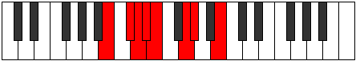

# Mode Lygian

## Links

- [Documentation](index.md)
- [Scales Index](Scales.md)
- [Modes Index](Modes.md)
- [Chords Index](Chords.md)

## Parent Scale

[Laptian](ScaleLaptian.md)

## Number

[829](https://ianring.com/musictheory/scales/829)

## Perfection

- 4 Perfect notes
- 3 Perfect notes

## Perfection Profile

[false true false false true true true]

## Permutations

| Tonic | Notes | Signature | Illustration | Audio |
|-------|-------|-----------|--------------|-------|
| [C](ModeCNaturalLygian.md) | **C**, D, **Eb**, **Fb**, Gbb, Ab, Bbb, **C** | C |  | [midi](https://github.com/edipermadi/music/blob/main/docs/ModeCNaturalLygian.mid?raw=true) |
| [C#](ModeCSharpLygian.md) | **C#**, D#, **E**, **F**, Gb, A, Bb, **C#** | C |  | [midi](https://github.com/edipermadi/music/blob/main/docs/ModeCSharpLygian.mid?raw=true) |
| [Db](ModeDFlatLygian.md) | **Db**, Eb, **Fb**, **Gbb**, Abbb, Bbb, Cbb, **Db** | C |  | [midi](https://github.com/edipermadi/music/blob/main/docs/ModeDFlatLygian.mid?raw=true) |
| [D](ModeDNaturalLygian.md) | **D**, E, **F**, **Gb**, Abb, Bb, Cb, **D** | C |  | [midi](https://github.com/edipermadi/music/blob/main/docs/ModeDNaturalLygian.mid?raw=true) |
| [D#](ModeDSharpLygian.md) | **D#**, E#, **F#**, **G**, Ab, B, C, **D#** | C |  | [midi](https://github.com/edipermadi/music/blob/main/docs/ModeDSharpLygian.mid?raw=true) |
| [Eb](ModeEFlatLygian.md) | **Eb**, F, **Gb**, **Abb**, Bbbb, Cb, Dbb, **Eb** | C |  | [midi](https://github.com/edipermadi/music/blob/main/docs/ModeEFlatLygian.mid?raw=true) |
| [E](ModeENaturalLygian.md) | **E**, F#, **G**, **Ab**, Bbb, C, Db, **E** | C |  | [midi](https://github.com/edipermadi/music/blob/main/docs/ModeENaturalLygian.mid?raw=true) |
| [F](ModeFNaturalLygian.md) | **F**, G, **Ab**, **Bbb**, Cbb, Db, Ebb, **F** | C |  | [midi](https://github.com/edipermadi/music/blob/main/docs/ModeFNaturalLygian.mid?raw=true) |
| [F#](ModeFSharpLygian.md) | **F#**, G#, **A**, **Bb**, Cb, D, Eb, **F#** | C |  | [midi](https://github.com/edipermadi/music/blob/main/docs/ModeFSharpLygian.mid?raw=true) |
| [Gb](ModeGFlatLygian.md) | **Gb**, Ab, **Bbb**, **Cbb**, Dbbb, Ebb, Fbb, **Gb** | C |  | [midi](https://github.com/edipermadi/music/blob/main/docs/ModeGFlatLygian.mid?raw=true) |
| [G](ModeGNaturalLygian.md) | **G**, A, **Bb**, **Cb**, Dbb, Eb, Fb, **G** | C |  | [midi](https://github.com/edipermadi/music/blob/main/docs/ModeGNaturalLygian.mid?raw=true) |
| [G#](ModeGSharpLygian.md) | **G#**, A#, **B**, **C**, Db, E, F, **G#** | C |  | [midi](https://github.com/edipermadi/music/blob/main/docs/ModeGSharpLygian.mid?raw=true) |
| [Ab](ModeAFlatLygian.md) | **Ab**, Bb, **Cb**, **Dbb**, Ebbb, Fb, Gbb, **Ab** | C |  | [midi](https://github.com/edipermadi/music/blob/main/docs/ModeAFlatLygian.mid?raw=true) |
| [A](ModeANaturalLygian.md) | **A**, B, **C**, **Db**, Ebb, F, Gb, **A** | C |  | [midi](https://github.com/edipermadi/music/blob/main/docs/ModeANaturalLygian.mid?raw=true) |
| [A#](ModeASharpLygian.md) | **A#**, B#, **C#**, **D**, Eb, F#, G, **A#** | C |  | [midi](https://github.com/edipermadi/music/blob/main/docs/ModeASharpLygian.mid?raw=true) |
| [Bb](ModeBFlatLygian.md) | **Bb**, C, **Db**, **Ebb**, Fbb, Gb, Abb, **Bb** | C |  | [midi](https://github.com/edipermadi/music/blob/main/docs/ModeBFlatLygian.mid?raw=true) |
| [B](ModeBNaturalLygian.md) | **B**, C#, **D**, **Eb**, Fb, G, Ab, **B** | C |  | [midi](https://github.com/edipermadi/music/blob/main/docs/ModeBNaturalLygian.mid?raw=true) |
