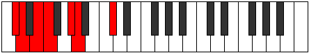
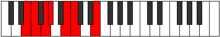

# Mode Lygimic

## Links

- [Documentation](index.md)
- [Scales Index](Scales.md)
- [Modes Index](Modes.md)
- [Chords Index](Chords.md)

## Parent Scale

[Laptimic](ScaleLaptimic.md)

## Number

[411](https://ianring.com/musictheory/scales/411)

## Perfection

- 3 Perfect notes
- 3 Perfect notes

## Perfection Profile

[true true false false false true]

## Permutations

| Tonic | Notes | Signature | Illustration | Audio |
|-------|-------|-----------|--------------|-------|
| [C](ModeCNaturalLygimic.md) | C, Db, **Eb**, **Fb**, **G**, Ab, C | C |  | [midi](ModeCNaturalLygimic.mid) [ogg](ModeCNaturalLygimic.ogg) |
| [C#](ModeCSharpLygimic.md) | C#, D, **E**, **F**, **G#**, A, C# | C |  | [midi](ModeCSharpLygimic.mid) [ogg](ModeCSharpLygimic.ogg) |
| [Db](ModeDFlatLygimic.md) | Db, Ebb, **Fb**, **Gbb**, **Ab**, Bbb, Db | C |  | [midi](ModeDFlatLygimic.mid) [ogg](ModeDFlatLygimic.ogg) |
| [D](ModeDNaturalLygimic.md) | D, Eb, **F**, **Gb**, **A**, Bb, D | C |  | [midi](ModeDNaturalLygimic.mid) [ogg](ModeDNaturalLygimic.ogg) |
| [D#](ModeDSharpLygimic.md) | D#, E, **F#**, **G**, **A#**, B, D# | C |  | [midi](ModeDSharpLygimic.mid) [ogg](ModeDSharpLygimic.ogg) |
| [Eb](ModeEFlatLygimic.md) | Eb, Fb, **Gb**, **Abb**, **Bb**, Cb, Eb | C |  | [midi](ModeEFlatLygimic.mid) [ogg](ModeEFlatLygimic.ogg) |
| [E](ModeENaturalLygimic.md) | E, F, **G**, **Ab**, **B**, C, E | C |  | [midi](ModeENaturalLygimic.mid) [ogg](ModeENaturalLygimic.ogg) |
| [F](ModeFNaturalLygimic.md) | F, Gb, **Ab**, **Bbb**, **C**, Db, F | C |  | [midi](ModeFNaturalLygimic.mid) [ogg](ModeFNaturalLygimic.ogg) |
| [F#](ModeFSharpLygimic.md) | F#, G, **A**, **Bb**, **C#**, D, F# | C |  | [midi](ModeFSharpLygimic.mid) [ogg](ModeFSharpLygimic.ogg) |
| [Gb](ModeGFlatLygimic.md) | Gb, Abb, **Bbb**, **Cbb**, **Db**, Ebb, Gb | C |  | [midi](ModeGFlatLygimic.mid) [ogg](ModeGFlatLygimic.ogg) |
| [G](ModeGNaturalLygimic.md) | G, Ab, **Bb**, **Cb**, **D**, Eb, G | C |  | [midi](ModeGNaturalLygimic.mid) [ogg](ModeGNaturalLygimic.ogg) |
| [G#](ModeGSharpLygimic.md) | G#, A, **B**, **C**, **D#**, E, G# | C |  | [midi](ModeGSharpLygimic.mid) [ogg](ModeGSharpLygimic.ogg) |
| [Ab](ModeAFlatLygimic.md) | Ab, Bbb, **Cb**, **Dbb**, **Eb**, Fb, Ab | C |  | [midi](ModeAFlatLygimic.mid) [ogg](ModeAFlatLygimic.ogg) |
| [A](ModeANaturalLygimic.md) | A, Bb, **C**, **Db**, **E**, F, A | C |  | [midi](ModeANaturalLygimic.mid) [ogg](ModeANaturalLygimic.ogg) |
| [A#](ModeASharpLygimic.md) | A#, B, **C#**, **D**, **E#**, F#, A# | C |  | [midi](ModeASharpLygimic.mid) [ogg](ModeASharpLygimic.ogg) |
| [Bb](ModeBFlatLygimic.md) | Bb, Cb, **Db**, **Ebb**, **F**, Gb, Bb | C |  | [midi](ModeBFlatLygimic.mid) [ogg](ModeBFlatLygimic.ogg) |
| [B](ModeBNaturalLygimic.md) | B, C, **D**, **Eb**, **F#**, G, B | C |  | [midi](ModeBNaturalLygimic.mid) [ogg](ModeBNaturalLygimic.ogg) |
