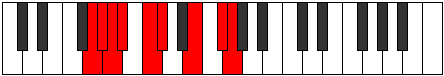

# Mode Lylyllic

## Links

- [Documentation](index.md)
- [Scales Index](Scales.md)
- [Modes Index](Modes.md)
- [Chords Index](Chords.md)

## Parent Scale

[Aeronyllic](ScaleAeronyllic.md)

## Number

[2671](https://ianring.com/musictheory/scales/2671)

## Perfection

- 4 Perfect notes
- 4 Perfect notes

## Perfection Profile

[false false true false true true false true]

## Permutations

| Tonic | Notes | Signature | Illustration | Audio |
|-------|-------|-----------|--------------|-------|
| [C](ModeCNaturalLylyllic.md) | **C**, **C#**, D, **D#**, F, F#, **A**, B, **C** | C |  | [midi](ModeCNaturalLylyllic.mid) [ogg](ModeCNaturalLylyllic.ogg) |
| [C#](ModeCSharpLylyllic.md) | **C#**, **D**, D#, **E**, F#, G, **A#**, C, **C#** | C |  | [midi](ModeCSharpLylyllic.mid) [ogg](ModeCSharpLylyllic.ogg) |
| [Db](ModeDFlatLylyllic.md) | **Db**, **D**, Eb, **E**, Gb, G, **Bb**, C, **Db** | C |  | [midi](ModeDFlatLylyllic.mid) [ogg](ModeDFlatLylyllic.ogg) |
| [D](ModeDNaturalLylyllic.md) | **D**, **D#**, E, **F**, G, G#, **B**, C#, **D** | C |  | [midi](ModeDNaturalLylyllic.mid) [ogg](ModeDNaturalLylyllic.ogg) |
| [D#](ModeDSharpLylyllic.md) | **D#**, **E**, F, **F#**, G#, A, **C**, D, **D#** | C |  | [midi](ModeDSharpLylyllic.mid) [ogg](ModeDSharpLylyllic.ogg) |
| [Eb](ModeEFlatLylyllic.md) | **Eb**, **E**, F, **Gb**, Ab, A, **C**, D, **Eb** | C |  | [midi](ModeEFlatLylyllic.mid) [ogg](ModeEFlatLylyllic.ogg) |
| [E](ModeENaturalLylyllic.md) | **E**, **F**, F#, **G**, A, A#, **C#**, D#, **E** | C |  | [midi](ModeENaturalLylyllic.mid) [ogg](ModeENaturalLylyllic.ogg) |
| [F](ModeFNaturalLylyllic.md) | **F**, **F#**, G, **G#**, A#, B, **D**, E, **F** | C |  | [midi](ModeFNaturalLylyllic.mid) [ogg](ModeFNaturalLylyllic.ogg) |
| [F#](ModeFSharpLylyllic.md) | **F#**, **G**, G#, **A**, B, C, **D#**, F, **F#** | C |  | [midi](ModeFSharpLylyllic.mid) [ogg](ModeFSharpLylyllic.ogg) |
| [Gb](ModeGFlatLylyllic.md) | **Gb**, **G**, Ab, **A**, B, C, **Eb**, F, **Gb** | C |  | [midi](ModeGFlatLylyllic.mid) [ogg](ModeGFlatLylyllic.ogg) |
| [G](ModeGNaturalLylyllic.md) | **G**, **G#**, A, **A#**, C, C#, **E**, F#, **G** | C |  | [midi](ModeGNaturalLylyllic.mid) [ogg](ModeGNaturalLylyllic.ogg) |
| [G#](ModeGSharpLylyllic.md) | **G#**, **A**, A#, **B**, C#, D, **F**, G, **G#** | C |  | [midi](ModeGSharpLylyllic.mid) [ogg](ModeGSharpLylyllic.ogg) |
| [Ab](ModeAFlatLylyllic.md) | **Ab**, **A**, Bb, **B**, Db, D, **F**, G, **Ab** | C |  | [midi](ModeAFlatLylyllic.mid) [ogg](ModeAFlatLylyllic.ogg) |
| [A](ModeANaturalLylyllic.md) | **A**, **A#**, B, **C**, D, D#, **F#**, G#, **A** | C |  | [midi](ModeANaturalLylyllic.mid) [ogg](ModeANaturalLylyllic.ogg) |
| [A#](ModeASharpLylyllic.md) | **A#**, **B**, C, **C#**, D#, E, **G**, A, **A#** | C |  | [midi](ModeASharpLylyllic.mid) [ogg](ModeASharpLylyllic.ogg) |
| [Bb](ModeBFlatLylyllic.md) | **Bb**, **B**, C, **Db**, Eb, E, **G**, A, **Bb** | C |  | [midi](ModeBFlatLylyllic.mid) [ogg](ModeBFlatLylyllic.ogg) |
| [B](ModeBNaturalLylyllic.md) | **B**, **C**, C#, **D**, E, F, **G#**, A#, **B** | C |  | [midi](ModeBNaturalLylyllic.mid) [ogg](ModeBNaturalLylyllic.ogg) |
