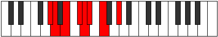

# Mode Lynian

## Links

- [Documentation](README.md)
- [Scales Index](Scales.md)
- [Modes Index](Modes.md)
- [Chords Index](Chords.md)

## Parent Scale

[Korian](ScaleKorian.md)

## Number

[747](https://ianring.com/musictheory/scales/747)

## Transposition

1, 2, 2, 1, 1, 2, 3

## Chord Pattern

i⁰, IIb5, iii⁰, v, VII⁺

## Perfection

- 3 Perfect notes
- 4 Perfect notes

## Perfection Profile

[true false false true true false false]

## Permutations

| Tonic | Notes | Signature | Illustration | Audio |
|-------|-------|-----------|--------------|-------|
| [C](ModeCNaturalLynian.md) | C, **Db**, **Eb**, F, Gb, **Abb**, **Bbb**, C | C |  | [midi](https://github.com/edipermadi/music/blob/main/docs/ModeCNaturalLynian.mid?raw=true) |
| [C#](ModeCSharpLynian.md) | C#, **D**, **E**, F#, G, **Ab**, **Bb**, C# | C |  | [midi](https://github.com/edipermadi/music/blob/main/docs/ModeCSharpLynian.mid?raw=true) |
| [Db](ModeDFlatLynian.md) | Db, **Ebb**, **Fb**, Gb, Abb, **Bbbb**, **Cbb**, Db | C |  | [midi](https://github.com/edipermadi/music/blob/main/docs/ModeDFlatLynian.mid?raw=true) |
| [D](ModeDNaturalLynian.md) | D, **Eb**, **F**, G, Ab, **Bbb**, **Cb**, D | C |  | [midi](https://github.com/edipermadi/music/blob/main/docs/ModeDNaturalLynian.mid?raw=true) |
| [D#](ModeDSharpLynian.md) | D#, **E**, **F#**, G#, A, **Bb**, **C**, D# | C |  | [midi](https://github.com/edipermadi/music/blob/main/docs/ModeDSharpLynian.mid?raw=true) |
| [Eb](ModeEFlatLynian.md) | Eb, **Fb**, **Gb**, Ab, Bbb, **Cbb**, **Dbb**, Eb | C |  | [midi](https://github.com/edipermadi/music/blob/main/docs/ModeEFlatLynian.mid?raw=true) |
| [E](ModeENaturalLynian.md) | E, **F**, **G**, A, Bb, **Cb**, **Db**, E | C |  | [midi](https://github.com/edipermadi/music/blob/main/docs/ModeENaturalLynian.mid?raw=true) |
| [F](ModeFNaturalLynian.md) | F, **Gb**, **Ab**, Bb, Cb, **Dbb**, **Ebb**, F | C |  | [midi](https://github.com/edipermadi/music/blob/main/docs/ModeFNaturalLynian.mid?raw=true) |
| [F#](ModeFSharpLynian.md) | F#, **G**, **A**, B, C, **Db**, **Eb**, F# | C |  | [midi](https://github.com/edipermadi/music/blob/main/docs/ModeFSharpLynian.mid?raw=true) |
| [Gb](ModeGFlatLynian.md) | Gb, **Abb**, **Bbb**, Cb, Dbb, **Ebbb**, **Fbb**, Gb | C |  | [midi](https://github.com/edipermadi/music/blob/main/docs/ModeGFlatLynian.mid?raw=true) |
| [G](ModeGNaturalLynian.md) | G, **Ab**, **Bb**, C, Db, **Ebb**, **Fb**, G | C |  | [midi](https://github.com/edipermadi/music/blob/main/docs/ModeGNaturalLynian.mid?raw=true) |
| [G#](ModeGSharpLynian.md) | G#, **A**, **B**, C#, D, **Eb**, **F**, G# | C |  | [midi](https://github.com/edipermadi/music/blob/main/docs/ModeGSharpLynian.mid?raw=true) |
| [Ab](ModeAFlatLynian.md) | Ab, **Bbb**, **Cb**, Db, Ebb, **Fbb**, **Gbb**, Ab | C |  | [midi](https://github.com/edipermadi/music/blob/main/docs/ModeAFlatLynian.mid?raw=true) |
| [A](ModeANaturalLynian.md) | A, **Bb**, **C**, D, Eb, **Fb**, **Gb**, A | C |  | [midi](https://github.com/edipermadi/music/blob/main/docs/ModeANaturalLynian.mid?raw=true) |
| [A#](ModeASharpLynian.md) | A#, **B**, **C#**, D#, E, **F**, **G**, A# | C |  | [midi](https://github.com/edipermadi/music/blob/main/docs/ModeASharpLynian.mid?raw=true) |
| [Bb](ModeBFlatLynian.md) | Bb, **Cb**, **Db**, Eb, Fb, **Gbb**, **Abb**, Bb | C |  | [midi](https://github.com/edipermadi/music/blob/main/docs/ModeBFlatLynian.mid?raw=true) |
| [B](ModeBNaturalLynian.md) | B, **C**, **D**, E, F, **Gb**, **Ab**, B | C |  | [midi](https://github.com/edipermadi/music/blob/main/docs/ModeBNaturalLynian.mid?raw=true) |
