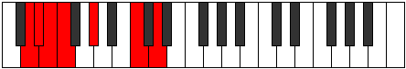

# Mode Lynimic

## Links

- [Documentation](README.md)
- [Scales Index](Scales.md)
- [Modes Index](Modes.md)
- [Chords Index](Chords.md)

## Parent Scale

[Kocrimic](ScaleKocrimic.md)

## Number

[1103](https://ianring.com/musictheory/scales/1103)

## Transposition

1, 1, 1, 3, 4, 2

## Chord Pattern

i⁰b3

## Perfection

- 2 Perfect notes
- 4 Perfect notes

## Perfection Profile

[false false false true true false]

## Permutations

| Tonic | Notes | Signature | Illustration | Audio |
|-------|-------|-----------|--------------|-------|
| [C](ModeCNaturalLynimic.md) | **C**, **Db**, **Ebb**, Fbb, Gb, **A#**, **C** | C |  | [midi](https://github.com/edipermadi/music/blob/main/docs/ModeCNaturalLynimic.mid?raw=true) |
| [C#](ModeCSharpLynimic.md) | **C#**, **D**, **Eb**, Fb, G, **A##**, **C#** | C |  | [midi](https://github.com/edipermadi/music/blob/main/docs/ModeCSharpLynimic.mid?raw=true) |
| [Db](ModeDFlatLynimic.md) | **Db**, **Ebb**, **Fbb**, Gbbb, Abb, **B**, **Db** | C |  | [midi](https://github.com/edipermadi/music/blob/main/docs/ModeDFlatLynimic.mid?raw=true) |
| [D](ModeDNaturalLynimic.md) | **D**, **Eb**, **Fb**, Gbb, Ab, **B#**, **D** | C |  | [midi](https://github.com/edipermadi/music/blob/main/docs/ModeDNaturalLynimic.mid?raw=true) |
| [D#](ModeDSharpLynimic.md) | **D#**, **E**, **F**, Gb, A, **B##**, **D#** | C |  | [midi](https://github.com/edipermadi/music/blob/main/docs/ModeDSharpLynimic.mid?raw=true) |
| [Eb](ModeEFlatLynimic.md) | **Eb**, **Fb**, **Gbb**, Abbb, Bbb, **C#**, **Eb** | C |  | [midi](https://github.com/edipermadi/music/blob/main/docs/ModeEFlatLynimic.mid?raw=true) |
| [E](ModeENaturalLynimic.md) | **E**, **F**, **Gb**, Abb, Bb, **C##**, **E** | C |  | [midi](https://github.com/edipermadi/music/blob/main/docs/ModeENaturalLynimic.mid?raw=true) |
| [F](ModeFNaturalLynimic.md) | **F**, **Gb**, **Abb**, Bbbb, Cb, **D#**, **F** | C |  | [midi](https://github.com/edipermadi/music/blob/main/docs/ModeFNaturalLynimic.mid?raw=true) |
| [F#](ModeFSharpLynimic.md) | **F#**, **G**, **Ab**, Bbb, C, **D##**, **F#** | C |  | [midi](https://github.com/edipermadi/music/blob/main/docs/ModeFSharpLynimic.mid?raw=true) |
| [Gb](ModeGFlatLynimic.md) | **Gb**, **Abb**, **Bbbb**, Cbbb, Dbb, **E**, **Gb** | C |  | [midi](https://github.com/edipermadi/music/blob/main/docs/ModeGFlatLynimic.mid?raw=true) |
| [G](ModeGNaturalLynimic.md) | **G**, **Ab**, **Bbb**, Cbb, Db, **E#**, **G** | C |  | [midi](https://github.com/edipermadi/music/blob/main/docs/ModeGNaturalLynimic.mid?raw=true) |
| [G#](ModeGSharpLynimic.md) | **G#**, **A**, **Bb**, Cb, D, **E##**, **G#** | C |  | [midi](https://github.com/edipermadi/music/blob/main/docs/ModeGSharpLynimic.mid?raw=true) |
| [Ab](ModeAFlatLynimic.md) | **Ab**, **Bbb**, **Cbb**, Dbbb, Ebb, **F#**, **Ab** | C |  | [midi](https://github.com/edipermadi/music/blob/main/docs/ModeAFlatLynimic.mid?raw=true) |
| [A](ModeANaturalLynimic.md) | **A**, **Bb**, **Cb**, Dbb, Eb, **F##**, **A** | C |  | [midi](https://github.com/edipermadi/music/blob/main/docs/ModeANaturalLynimic.mid?raw=true) |
| [A#](ModeASharpLynimic.md) | **A#**, **B**, **C**, Db, E, **F###**, **A#** | C |  | [midi](https://github.com/edipermadi/music/blob/main/docs/ModeASharpLynimic.mid?raw=true) |
| [Bb](ModeBFlatLynimic.md) | **Bb**, **Cb**, **Dbb**, Ebbb, Fb, **G#**, **Bb** | C |  | [midi](https://github.com/edipermadi/music/blob/main/docs/ModeBFlatLynimic.mid?raw=true) |
| [B](ModeBNaturalLynimic.md) | **B**, **C**, **Db**, Ebb, F, **G##**, **B** | C |  | [midi](https://github.com/edipermadi/music/blob/main/docs/ModeBNaturalLynimic.mid?raw=true) |
