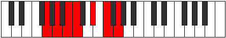

# Mode Lyptimic

## Links

- [Documentation](README.md)
- [Scales Index](Scales.md)
- [Modes Index](Modes.md)
- [Chords Index](Chords.md)

## Parent Scale

[Aeragimic](ScaleAeragimic.md)

## Number

[1333](https://ianring.com/musictheory/scales/1333)

## Interval Pattern

2, 2, 1, 3, 2, 2

## Chord Pattern

I⁺, III⁺, V⁺, VI

## Perfection

- 2 Perfect notes
- 4 Perfect notes

## Perfection Profile

[false false false true false true]

## Permutations

| Tonic | Notes | Signature | Illustration | Audio |
|-------|-------|-----------|--------------|-------|
| [C](ModeCNaturalLyptimic.md) | **C**, **D**, **E**, F, **G#**, A#, **C** | C |  | [midi](https://github.com/edipermadi/music/blob/main/docs/ModeCNaturalLyptimic.mid?raw=true) |
| [C#](ModeCSharpLyptimic.md) | **C#**, **D#**, **E#**, F#, **G##**, A##, **C#** | C |  | [midi](https://github.com/edipermadi/music/blob/main/docs/ModeCSharpLyptimic.mid?raw=true) |
| [Db](ModeDFlatLyptimic.md) | **Db**, **Eb**, **F**, Gb, **A**, B, **Db** | C |  | [midi](https://github.com/edipermadi/music/blob/main/docs/ModeDFlatLyptimic.mid?raw=true) |
| [D](ModeDNaturalLyptimic.md) | **D**, **E**, **F#**, G, **A#**, B#, **D** | C |  | [midi](https://github.com/edipermadi/music/blob/main/docs/ModeDNaturalLyptimic.mid?raw=true) |
| [D#](ModeDSharpLyptimic.md) | **D#**, **E#**, **F##**, G#, **A##**, B##, **D#** | C |  | [midi](https://github.com/edipermadi/music/blob/main/docs/ModeDSharpLyptimic.mid?raw=true) |
| [Eb](ModeEFlatLyptimic.md) | **Eb**, **F**, **G**, Ab, **B**, C#, **Eb** | C |  | [midi](https://github.com/edipermadi/music/blob/main/docs/ModeEFlatLyptimic.mid?raw=true) |
| [E](ModeENaturalLyptimic.md) | **E**, **F#**, **G#**, A, **B#**, C##, **E** | C |  | [midi](https://github.com/edipermadi/music/blob/main/docs/ModeENaturalLyptimic.mid?raw=true) |
| [F](ModeFNaturalLyptimic.md) | **F**, **G**, **A**, Bb, **C#**, D#, **F** | C |  | [midi](https://github.com/edipermadi/music/blob/main/docs/ModeFNaturalLyptimic.mid?raw=true) |
| [F#](ModeFSharpLyptimic.md) | **F#**, **G#**, **A#**, B, **C##**, D##, **F#** | C |  | [midi](https://github.com/edipermadi/music/blob/main/docs/ModeFSharpLyptimic.mid?raw=true) |
| [Gb](ModeGFlatLyptimic.md) | **Gb**, **Ab**, **Bb**, Cb, **D**, E, **Gb** | C |  | [midi](https://github.com/edipermadi/music/blob/main/docs/ModeGFlatLyptimic.mid?raw=true) |
| [G](ModeGNaturalLyptimic.md) | **G**, **A**, **B**, C, **D#**, E#, **G** | C |  | [midi](https://github.com/edipermadi/music/blob/main/docs/ModeGNaturalLyptimic.mid?raw=true) |
| [G#](ModeGSharpLyptimic.md) | **G#**, **A#**, **B#**, C#, **D##**, E##, **G#** | C |  | [midi](https://github.com/edipermadi/music/blob/main/docs/ModeGSharpLyptimic.mid?raw=true) |
| [Ab](ModeAFlatLyptimic.md) | **Ab**, **Bb**, **C**, Db, **E**, F#, **Ab** | C |  | [midi](https://github.com/edipermadi/music/blob/main/docs/ModeAFlatLyptimic.mid?raw=true) |
| [A](ModeANaturalLyptimic.md) | **A**, **B**, **C#**, D, **E#**, F##, **A** | C |  | [midi](https://github.com/edipermadi/music/blob/main/docs/ModeANaturalLyptimic.mid?raw=true) |
| [A#](ModeASharpLyptimic.md) | **A#**, **B#**, **C##**, D#, **E##**, F###, **A#** | C |  | [midi](https://github.com/edipermadi/music/blob/main/docs/ModeASharpLyptimic.mid?raw=true) |
| [Bb](ModeBFlatLyptimic.md) | **Bb**, **C**, **D**, Eb, **F#**, G#, **Bb** | C |  | [midi](https://github.com/edipermadi/music/blob/main/docs/ModeBFlatLyptimic.mid?raw=true) |
| [B](ModeBNaturalLyptimic.md) | **B**, **C#**, **D#**, E, **F##**, G##, **B** | C |  | [midi](https://github.com/edipermadi/music/blob/main/docs/ModeBNaturalLyptimic.mid?raw=true) |
