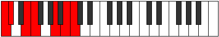
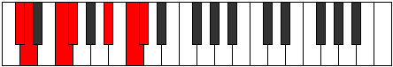
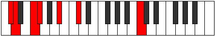
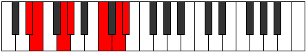
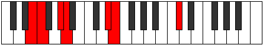
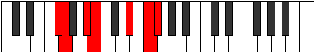
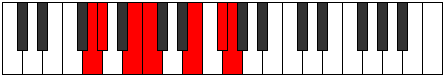
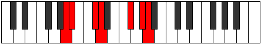

# Mode Lyrimic

## Links

- [Documentation](README.md)
- [Scales Index](Scales.md)
- [Modes Index](Modes.md)
- [Chords Index](Chords.md)

## Parent Scale

[Aerycrimic](ScaleAerycrimic.md)

## Number

[2611](https://ianring.com/musictheory/scales/2611)

## Transposition

1, 3, 1, 4, 2, 1

## Chord Pattern

v, vi⁰b3

## Perfection

- 3 Perfect notes
- 3 Perfect notes

## Perfection Profile

[false false true true true false]

## Permutations

| Tonic | Notes | Signature | Illustration | Audio |
|-------|-------|-----------|--------------|-------|
| [C](ModeCNaturalLyrimic.md) | **C**, **Db**, E, F, G##, **A##**, **C** | C |  | [midi](https://github.com/edipermadi/music/blob/main/docs/ModeCNaturalLyrimic.mid?raw=true) |
| [C#](ModeCSharpLyrimic.md) | **C#**, **D**, E#, F#, G###, **A###**, **C#** | C |  | [midi](https://github.com/edipermadi/music/blob/main/docs/ModeCSharpLyrimic.mid?raw=true) |
| [Db](ModeDFlatLyrimic.md) | **Db**, **Ebb**, F, Gb, A#, **B#**, **Db** | C |  | [midi](https://github.com/edipermadi/music/blob/main/docs/ModeDFlatLyrimic.mid?raw=true) |
| [D](ModeDNaturalLyrimic.md) | **D**, **Eb**, F#, G, A##, **B##**, **D** | C |  | [midi](https://github.com/edipermadi/music/blob/main/docs/ModeDNaturalLyrimic.mid?raw=true) |
| [D#](ModeDSharpLyrimic.md) | **D#**, **E**, F##, G#, A###, **B###**, **D#** | C |  | [midi](https://github.com/edipermadi/music/blob/main/docs/ModeDSharpLyrimic.mid?raw=true) |
| [Eb](ModeEFlatLyrimic.md) | **Eb**, **Fb**, G, Ab, B#, **C##**, **Eb** | C |  | [midi](https://github.com/edipermadi/music/blob/main/docs/ModeEFlatLyrimic.mid?raw=true) |
| [E](ModeENaturalLyrimic.md) | **E**, **F**, G#, A, B##, **C###**, **E** | C |  | [midi](https://github.com/edipermadi/music/blob/main/docs/ModeENaturalLyrimic.mid?raw=true) |
| [F](ModeFNaturalLyrimic.md) | **F**, **Gb**, A, Bb, C##, **D##**, **F** | C |  | [midi](https://github.com/edipermadi/music/blob/main/docs/ModeFNaturalLyrimic.mid?raw=true) |
| [F#](ModeFSharpLyrimic.md) | **F#**, **G**, A#, B, C###, **D###**, **F#** | C |  | [midi](https://github.com/edipermadi/music/blob/main/docs/ModeFSharpLyrimic.mid?raw=true) |
| [Gb](ModeGFlatLyrimic.md) | **Gb**, **Abb**, Bb, Cb, D#, **E#**, **Gb** | C |  | [midi](https://github.com/edipermadi/music/blob/main/docs/ModeGFlatLyrimic.mid?raw=true) |
| [G](ModeGNaturalLyrimic.md) | **G**, **Ab**, B, C, D##, **E##**, **G** | C |  | [midi](https://github.com/edipermadi/music/blob/main/docs/ModeGNaturalLyrimic.mid?raw=true) |
| [G#](ModeGSharpLyrimic.md) | **G#**, **A**, B#, C#, D###, **E###**, **G#** | C |  | [midi](https://github.com/edipermadi/music/blob/main/docs/ModeGSharpLyrimic.mid?raw=true) |
| [Ab](ModeAFlatLyrimic.md) | **Ab**, **Bbb**, C, Db, E#, **F##**, **Ab** | C |  | [midi](https://github.com/edipermadi/music/blob/main/docs/ModeAFlatLyrimic.mid?raw=true) |
| [A](ModeANaturalLyrimic.md) | **A**, **Bb**, C#, D, E##, **F###**, **A** | C |  | [midi](https://github.com/edipermadi/music/blob/main/docs/ModeANaturalLyrimic.mid?raw=true) |
| [A#](ModeASharpLyrimic.md) | **A#**, **B**, C##, D#, E###, **Cbbb**, **A#** | C |  | [midi](https://github.com/edipermadi/music/blob/main/docs/ModeASharpLyrimic.mid?raw=true) |
| [Bb](ModeBFlatLyrimic.md) | **Bb**, **Cb**, D, Eb, F##, **G##**, **Bb** | C |  | [midi](https://github.com/edipermadi/music/blob/main/docs/ModeBFlatLyrimic.mid?raw=true) |
| [B](ModeBNaturalLyrimic.md) | **B**, **C**, D#, E, F###, **G###**, **B** | C |  | [midi](https://github.com/edipermadi/music/blob/main/docs/ModeBNaturalLyrimic.mid?raw=true) |
