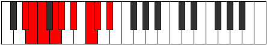
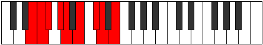

# Mode Lyryllic

## Links

- [Documentation](index.md)
- [Scales Index](Scales.md)
- [Modes Index](Modes.md)
- [Chords Index](Chords.md)

## Parent Scale

[Ionoptyllic](ScaleIonoptyllic.md)

## Number

[1719](https://ianring.com/musictheory/scales/1719)

## Perfection

- 6 Perfect notes
- 2 Perfect notes

## Perfection Profile

[true false true false true true true true]

## Permutations

| Tonic | Notes | Signature | Illustration | Audio |
|-------|-------|-----------|--------------|-------|
| [C](ModeCNaturalLyryllic.md) | C, **C#**, D, **E**, F, G, A, A#, C | C |  | [midi](ModeCNaturalLyryllic.mid) [ogg](ModeCNaturalLyryllic.ogg) |
| [C#](ModeCSharpLyryllic.md) | C#, **D**, D#, **F**, F#, G#, A#, B, C# | C |  | [midi](ModeCSharpLyryllic.mid) [ogg](ModeCSharpLyryllic.ogg) |
| [Db](ModeDFlatLyryllic.md) | Db, **D**, Eb, **F**, Gb, Ab, Bb, B, Db | C |  | [midi](ModeDFlatLyryllic.mid) [ogg](ModeDFlatLyryllic.ogg) |
| [D](ModeDNaturalLyryllic.md) | D, **D#**, E, **F#**, G, A, B, C, D | C |  | [midi](ModeDNaturalLyryllic.mid) [ogg](ModeDNaturalLyryllic.ogg) |
| [D#](ModeDSharpLyryllic.md) | D#, **E**, F, **G**, G#, A#, C, C#, D# | C |  | [midi](ModeDSharpLyryllic.mid) [ogg](ModeDSharpLyryllic.ogg) |
| [Eb](ModeEFlatLyryllic.md) | Eb, **E**, F, **G**, Ab, Bb, C, Db, Eb | C |  | [midi](ModeEFlatLyryllic.mid) [ogg](ModeEFlatLyryllic.ogg) |
| [E](ModeENaturalLyryllic.md) | E, **F**, F#, **G#**, A, B, C#, D, E | C |  | [midi](ModeENaturalLyryllic.mid) [ogg](ModeENaturalLyryllic.ogg) |
| [F](ModeFNaturalLyryllic.md) | F, **F#**, G, **A**, A#, C, D, D#, F | C |  | [midi](ModeFNaturalLyryllic.mid) [ogg](ModeFNaturalLyryllic.ogg) |
| [F#](ModeFSharpLyryllic.md) | F#, **G**, G#, **A#**, B, C#, D#, E, F# | C |  | [midi](ModeFSharpLyryllic.mid) [ogg](ModeFSharpLyryllic.ogg) |
| [Gb](ModeGFlatLyryllic.md) | Gb, **G**, Ab, **Bb**, B, Db, Eb, E, Gb | C |  | [midi](ModeGFlatLyryllic.mid) [ogg](ModeGFlatLyryllic.ogg) |
| [G](ModeGNaturalLyryllic.md) | G, **G#**, A, **B**, C, D, E, F, G | C |  | [midi](ModeGNaturalLyryllic.mid) [ogg](ModeGNaturalLyryllic.ogg) |
| [G#](ModeGSharpLyryllic.md) | G#, **A**, A#, **C**, C#, D#, F, F#, G# | C |  | [midi](ModeGSharpLyryllic.mid) [ogg](ModeGSharpLyryllic.ogg) |
| [Ab](ModeAFlatLyryllic.md) | Ab, **A**, Bb, **C**, Db, Eb, F, Gb, Ab | C |  | [midi](ModeAFlatLyryllic.mid) [ogg](ModeAFlatLyryllic.ogg) |
| [A](ModeANaturalLyryllic.md) | A, **A#**, B, **C#**, D, E, F#, G, A | C |  | [midi](ModeANaturalLyryllic.mid) [ogg](ModeANaturalLyryllic.ogg) |
| [A#](ModeASharpLyryllic.md) | A#, **B**, C, **D**, D#, F, G, G#, A# | C |  | [midi](ModeASharpLyryllic.mid) [ogg](ModeASharpLyryllic.ogg) |
| [Bb](ModeBFlatLyryllic.md) | Bb, **B**, C, **D**, Eb, F, G, Ab, Bb | C |  | [midi](ModeBFlatLyryllic.mid) [ogg](ModeBFlatLyryllic.ogg) |
| [B](ModeBNaturalLyryllic.md) | B, **C**, C#, **D#**, E, F#, G#, A, B | C |  | [midi](ModeBNaturalLyryllic.mid) [ogg](ModeBNaturalLyryllic.ogg) |
