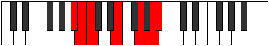

# Mode Macrimic

## Links

- [Documentation](README.md)
- [Scales Index](Scales.md)
- [Modes Index](Modes.md)
- [Chords Index](Chords.md)

## Parent Scale

[Starimic](ScaleStarimic.md)

## Number

[2631](https://ianring.com/musictheory/scales/2631)

## Transposition

1, 1, 4, 3, 2, 1

## Chord Pattern

## Perfection

- 3 Perfect notes
- 3 Perfect notes

## Perfection Profile

false, false, true, true, false, true

## Permutations

| Tonic | Notes | Signature | Illustration | Audio |
|-------|-------|-----------|--------------|-------|
| [C](ModeCNaturalMacrimic.md) | **C**, **Db**, Ebb, F#, **G##**, A##, **C** | C |  | [midi](https://github.com/edipermadi/music/blob/main/docs/ModeCNaturalMacrimic.mid?raw=true) |
| [C#](ModeCSharpMacrimic.md) | **C#**, **D**, Eb, F##, **G###**, A###, **C#** | C |  | [midi](https://github.com/edipermadi/music/blob/main/docs/ModeCSharpMacrimic.mid?raw=true) |
| [Db](ModeDFlatMacrimic.md) | **Db**, **Ebb**, Fbb, G, **A#**, B#, **Db** | C |  | [midi](https://github.com/edipermadi/music/blob/main/docs/ModeDFlatMacrimic.mid?raw=true) |
| [D](ModeDNaturalMacrimic.md) | **D**, **Eb**, Fb, G#, **A##**, B##, **D** | C |  | [midi](https://github.com/edipermadi/music/blob/main/docs/ModeDNaturalMacrimic.mid?raw=true) |
| [D#](ModeDSharpMacrimic.md) | **D#**, **E**, F, G##, **A###**, B###, **D#** | C |  | [midi](https://github.com/edipermadi/music/blob/main/docs/ModeDSharpMacrimic.mid?raw=true) |
| [Eb](ModeEFlatMacrimic.md) | **Eb**, **Fb**, Gbb, A, **B#**, C##, **Eb** | C |  | [midi](https://github.com/edipermadi/music/blob/main/docs/ModeEFlatMacrimic.mid?raw=true) |
| [E](ModeENaturalMacrimic.md) | **E**, **F**, Gb, A#, **B##**, C###, **E** | C |  | [midi](https://github.com/edipermadi/music/blob/main/docs/ModeENaturalMacrimic.mid?raw=true) |
| [F](ModeFNaturalMacrimic.md) | **F**, **Gb**, Abb, B, **C##**, D##, **F** | C |  | [midi](https://github.com/edipermadi/music/blob/main/docs/ModeFNaturalMacrimic.mid?raw=true) |
| [F#](ModeFSharpMacrimic.md) | **F#**, **G**, Ab, B#, **C###**, D###, **F#** | C |  | [midi](https://github.com/edipermadi/music/blob/main/docs/ModeFSharpMacrimic.mid?raw=true) |
| [Gb](ModeGFlatMacrimic.md) | **Gb**, **Abb**, Bbbb, C, **D#**, E#, **Gb** | C |  | [midi](https://github.com/edipermadi/music/blob/main/docs/ModeGFlatMacrimic.mid?raw=true) |
| [G](ModeGNaturalMacrimic.md) | **G**, **Ab**, Bbb, C#, **D##**, E##, **G** | C |  | [midi](https://github.com/edipermadi/music/blob/main/docs/ModeGNaturalMacrimic.mid?raw=true) |
| [G#](ModeGSharpMacrimic.md) | **G#**, **A**, Bb, C##, **D###**, E###, **G#** | C |  | [midi](https://github.com/edipermadi/music/blob/main/docs/ModeGSharpMacrimic.mid?raw=true) |
| [Ab](ModeAFlatMacrimic.md) | **Ab**, **Bbb**, Cbb, D, **E#**, F##, **Ab** | C |  | [midi](https://github.com/edipermadi/music/blob/main/docs/ModeAFlatMacrimic.mid?raw=true) |
| [A](ModeANaturalMacrimic.md) | **A**, **Bb**, Cb, D#, **E##**, F###, **A** | C |  | [midi](https://github.com/edipermadi/music/blob/main/docs/ModeANaturalMacrimic.mid?raw=true) |
| [A#](ModeASharpMacrimic.md) | **A#**, **B**, C, D##, **E###**, Cbbb, **A#** | C |  | [midi](https://github.com/edipermadi/music/blob/main/docs/ModeASharpMacrimic.mid?raw=true) |
| [Bb](ModeBFlatMacrimic.md) | **Bb**, **Cb**, Dbb, E, **F##**, G##, **Bb** | C |  | [midi](https://github.com/edipermadi/music/blob/main/docs/ModeBFlatMacrimic.mid?raw=true) |
| [B](ModeBNaturalMacrimic.md) | **B**, **C**, Db, E#, **F###**, G###, **B** | C |  | [midi](https://github.com/edipermadi/music/blob/main/docs/ModeBNaturalMacrimic.mid?raw=true) |
