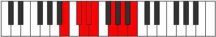

# Mode Madian

## Links

- [Documentation](index.md)
- [Scales Index](Scales.md)
- [Modes Index](Modes.md)
- [Chords Index](Chords.md)

## Parent Scale

[Phraptian](ScalePhraptian.md)

## Number

[1341](https://ianring.com/musictheory/scales/1341)

## Perfection

- 4 Perfect notes
- 3 Perfect notes

## Perfection Profile

[false false true false true true true]

## Permutations

| Tonic | Notes | Signature | Illustration | Audio |
|-------|-------|-----------|--------------|-------|
| [C](ModeCNaturalMadian.md) | **C**, **D**, Eb, **Fb**, Gbb, Ab, Bb, **C** | C |  | [midi](ModeCNaturalMadian.mid) [ogg](ModeCNaturalMadian.ogg) |
| [C#](ModeCSharpMadian.md) | **C#**, **D#**, E, **F**, Gb, A, B, **C#** | C |  | [midi](ModeCSharpMadian.mid) [ogg](ModeCSharpMadian.ogg) |
| [Db](ModeDFlatMadian.md) | **Db**, **Eb**, Fb, **Gbb**, Abbb, Bbb, Cb, **Db** | C |  | [midi](ModeDFlatMadian.mid) [ogg](ModeDFlatMadian.ogg) |
| [D](ModeDNaturalMadian.md) | **D**, **E**, F, **Gb**, Abb, Bb, C, **D** | C |  | [midi](ModeDNaturalMadian.mid) [ogg](ModeDNaturalMadian.ogg) |
| [D#](ModeDSharpMadian.md) | **D#**, **E#**, F#, **G**, Ab, B, C#, **D#** | C |  | [midi](ModeDSharpMadian.mid) [ogg](ModeDSharpMadian.ogg) |
| [Eb](ModeEFlatMadian.md) | **Eb**, **F**, Gb, **Abb**, Bbbb, Cb, Db, **Eb** | C |  | [midi](ModeEFlatMadian.mid) [ogg](ModeEFlatMadian.ogg) |
| [E](ModeENaturalMadian.md) | **E**, **F#**, G, **Ab**, Bbb, C, D, **E** | C |  | [midi](ModeENaturalMadian.mid) [ogg](ModeENaturalMadian.ogg) |
| [F](ModeFNaturalMadian.md) | **F**, **G**, Ab, **Bbb**, Cbb, Db, Eb, **F** | C |  | [midi](ModeFNaturalMadian.mid) [ogg](ModeFNaturalMadian.ogg) |
| [F#](ModeFSharpMadian.md) | **F#**, **G#**, A, **Bb**, Cb, D, E, **F#** | C |  | [midi](ModeFSharpMadian.mid) [ogg](ModeFSharpMadian.ogg) |
| [Gb](ModeGFlatMadian.md) | **Gb**, **Ab**, Bbb, **Cbb**, Dbbb, Ebb, Fb, **Gb** | C |  | [midi](ModeGFlatMadian.mid) [ogg](ModeGFlatMadian.ogg) |
| [G](ModeGNaturalMadian.md) | **G**, **A**, Bb, **Cb**, Dbb, Eb, F, **G** | C |  | [midi](ModeGNaturalMadian.mid) [ogg](ModeGNaturalMadian.ogg) |
| [G#](ModeGSharpMadian.md) | **G#**, **A#**, B, **C**, Db, E, F#, **G#** | C |  | [midi](ModeGSharpMadian.mid) [ogg](ModeGSharpMadian.ogg) |
| [Ab](ModeAFlatMadian.md) | **Ab**, **Bb**, Cb, **Dbb**, Ebbb, Fb, Gb, **Ab** | C |  | [midi](ModeAFlatMadian.mid) [ogg](ModeAFlatMadian.ogg) |
| [A](ModeANaturalMadian.md) | **A**, **B**, C, **Db**, Ebb, F, G, **A** | C |  | [midi](ModeANaturalMadian.mid) [ogg](ModeANaturalMadian.ogg) |
| [A#](ModeASharpMadian.md) | **A#**, **B#**, C#, **D**, Eb, F#, G#, **A#** | C |  | [midi](ModeASharpMadian.mid) [ogg](ModeASharpMadian.ogg) |
| [Bb](ModeBFlatMadian.md) | **Bb**, **C**, Db, **Ebb**, Fbb, Gb, Ab, **Bb** | C |  | [midi](ModeBFlatMadian.mid) [ogg](ModeBFlatMadian.ogg) |
| [B](ModeBNaturalMadian.md) | **B**, **C#**, D, **Eb**, Fb, G, A, **B** | C |  | [midi](ModeBNaturalMadian.mid) [ogg](ModeBNaturalMadian.ogg) |
