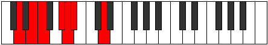

# Mode Madimic

## Links

- [Documentation](README.md)
- [Scales Index](Scales.md)
- [Modes Index](Modes.md)
- [Chords Index](Chords.md)

## Parent Scale

[Katythimic](ScaleKatythimic.md)

## Number

[461](https://ianring.com/musictheory/scales/461)

## Transposition

2, 1, 3, 1, 1, 4

## Chord Pattern

i, IIb5

## Perfection

- 3 Perfect notes
- 3 Perfect notes

## Perfection Profile

[true false false false true true]

## Permutations

| Tonic | Notes | Signature | Illustration | Audio |
|-------|-------|-----------|--------------|-------|
| [C](ModeCNaturalMadimic.md) | C, **D**, **Eb**, **F#**, G, Ab, C | C |  | [midi](https://github.com/edipermadi/music/blob/main/docs/ModeCNaturalMadimic.mid?raw=true) |
| [C#](ModeCSharpMadimic.md) | C#, **D#**, **E**, **F##**, G#, A, C# | C |  | [midi](https://github.com/edipermadi/music/blob/main/docs/ModeCSharpMadimic.mid?raw=true) |
| [Db](ModeDFlatMadimic.md) | Db, **Eb**, **Fb**, **G**, Ab, Bbb, Db | C |  | [midi](https://github.com/edipermadi/music/blob/main/docs/ModeDFlatMadimic.mid?raw=true) |
| [D](ModeDNaturalMadimic.md) | D, **E**, **F**, **G#**, A, Bb, D | C |  | [midi](https://github.com/edipermadi/music/blob/main/docs/ModeDNaturalMadimic.mid?raw=true) |
| [D#](ModeDSharpMadimic.md) | D#, **E#**, **F#**, **G##**, A#, B, D# | C |  | [midi](https://github.com/edipermadi/music/blob/main/docs/ModeDSharpMadimic.mid?raw=true) |
| [Eb](ModeEFlatMadimic.md) | Eb, **F**, **Gb**, **A**, Bb, Cb, Eb | C |  | [midi](https://github.com/edipermadi/music/blob/main/docs/ModeEFlatMadimic.mid?raw=true) |
| [E](ModeENaturalMadimic.md) | E, **F#**, **G**, **A#**, B, C, E | C |  | [midi](https://github.com/edipermadi/music/blob/main/docs/ModeENaturalMadimic.mid?raw=true) |
| [F](ModeFNaturalMadimic.md) | F, **G**, **Ab**, **B**, C, Db, F | C |  | [midi](https://github.com/edipermadi/music/blob/main/docs/ModeFNaturalMadimic.mid?raw=true) |
| [F#](ModeFSharpMadimic.md) | F#, **G#**, **A**, **B#**, C#, D, F# | C |  | [midi](https://github.com/edipermadi/music/blob/main/docs/ModeFSharpMadimic.mid?raw=true) |
| [Gb](ModeGFlatMadimic.md) | Gb, **Ab**, **Bbb**, **C**, Db, Ebb, Gb | C |  | [midi](https://github.com/edipermadi/music/blob/main/docs/ModeGFlatMadimic.mid?raw=true) |
| [G](ModeGNaturalMadimic.md) | G, **A**, **Bb**, **C#**, D, Eb, G | C |  | [midi](https://github.com/edipermadi/music/blob/main/docs/ModeGNaturalMadimic.mid?raw=true) |
| [G#](ModeGSharpMadimic.md) | G#, **A#**, **B**, **C##**, D#, E, G# | C |  | [midi](https://github.com/edipermadi/music/blob/main/docs/ModeGSharpMadimic.mid?raw=true) |
| [Ab](ModeAFlatMadimic.md) | Ab, **Bb**, **Cb**, **D**, Eb, Fb, Ab | C |  | [midi](https://github.com/edipermadi/music/blob/main/docs/ModeAFlatMadimic.mid?raw=true) |
| [A](ModeANaturalMadimic.md) | A, **B**, **C**, **D#**, E, F, A | C |  | [midi](https://github.com/edipermadi/music/blob/main/docs/ModeANaturalMadimic.mid?raw=true) |
| [A#](ModeASharpMadimic.md) | A#, **B#**, **C#**, **D##**, E#, F#, A# | C |  | [midi](https://github.com/edipermadi/music/blob/main/docs/ModeASharpMadimic.mid?raw=true) |
| [Bb](ModeBFlatMadimic.md) | Bb, **C**, **Db**, **E**, F, Gb, Bb | C |  | [midi](https://github.com/edipermadi/music/blob/main/docs/ModeBFlatMadimic.mid?raw=true) |
| [B](ModeBNaturalMadimic.md) | B, **C#**, **D**, **E#**, F#, G, B | C |  | [midi](https://github.com/edipermadi/music/blob/main/docs/ModeBNaturalMadimic.mid?raw=true) |
