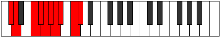

# Mode Madygic

## Links

- [Documentation](index.md)
- [Scales Index](Scales.md)
- [Modes Index](Modes.md)
- [Chords Index](Chords.md)

## Parent Scale

[Loptygic](ScaleLoptygic.md)

## Number

[3059](https://ianring.com/musictheory/scales/3059)

## Perfection

- 7 Perfect notes
- 2 Perfect notes

## Perfection Profile

[true true true true true false false true true]

## Permutations

| Tonic | Notes | Signature | Illustration | Audio |
|-------|-------|-----------|--------------|-------|
| [C](ModeCNaturalMadygic.md) | C, C#, E, F, F#, **G**, **G#**, A, B, C | C |  | [midi](ModeCNaturalMadygic.mid) [ogg](ModeCNaturalMadygic.ogg) |
| [C#](ModeCSharpMadygic.md) | C#, D, F, F#, G, **G#**, **A**, A#, C, C# | C |  | [midi](ModeCSharpMadygic.mid) [ogg](ModeCSharpMadygic.ogg) |
| [Db](ModeDFlatMadygic.md) | Db, D, F, Gb, G, **Ab**, **A**, Bb, C, Db | C |  | [midi](ModeDFlatMadygic.mid) [ogg](ModeDFlatMadygic.ogg) |
| [D](ModeDNaturalMadygic.md) | D, D#, F#, G, G#, **A**, **A#**, B, C#, D | C |  | [midi](ModeDNaturalMadygic.mid) [ogg](ModeDNaturalMadygic.ogg) |
| [D#](ModeDSharpMadygic.md) | D#, E, G, G#, A, **A#**, **B**, C, D, D# | C |  | [midi](ModeDSharpMadygic.mid) [ogg](ModeDSharpMadygic.ogg) |
| [Eb](ModeEFlatMadygic.md) | Eb, E, G, Ab, A, **Bb**, **B**, C, D, Eb | C |  | [midi](ModeEFlatMadygic.mid) [ogg](ModeEFlatMadygic.ogg) |
| [E](ModeENaturalMadygic.md) | E, F, G#, A, A#, **B**, **C**, C#, D#, E | C |  | [midi](ModeENaturalMadygic.mid) [ogg](ModeENaturalMadygic.ogg) |
| [F](ModeFNaturalMadygic.md) | F, F#, A, A#, B, **C**, **C#**, D, E, F | C |  | [midi](ModeFNaturalMadygic.mid) [ogg](ModeFNaturalMadygic.ogg) |
| [F#](ModeFSharpMadygic.md) | F#, G, A#, B, C, **C#**, **D**, D#, F, F# | C |  | [midi](ModeFSharpMadygic.mid) [ogg](ModeFSharpMadygic.ogg) |
| [Gb](ModeGFlatMadygic.md) | Gb, G, Bb, B, C, **Db**, **D**, Eb, F, Gb | C |  | [midi](ModeGFlatMadygic.mid) [ogg](ModeGFlatMadygic.ogg) |
| [G](ModeGNaturalMadygic.md) | G, G#, B, C, C#, **D**, **D#**, E, F#, G | C |  | [midi](ModeGNaturalMadygic.mid) [ogg](ModeGNaturalMadygic.ogg) |
| [G#](ModeGSharpMadygic.md) | G#, A, C, C#, D, **D#**, **E**, F, G, G# | C |  | [midi](ModeGSharpMadygic.mid) [ogg](ModeGSharpMadygic.ogg) |
| [Ab](ModeAFlatMadygic.md) | Ab, A, C, Db, D, **Eb**, **E**, F, G, Ab | C |  | [midi](ModeAFlatMadygic.mid) [ogg](ModeAFlatMadygic.ogg) |
| [A](ModeANaturalMadygic.md) | A, A#, C#, D, D#, **E**, **F**, F#, G#, A | C |  | [midi](ModeANaturalMadygic.mid) [ogg](ModeANaturalMadygic.ogg) |
| [A#](ModeASharpMadygic.md) | A#, B, D, D#, E, **F**, **F#**, G, A, A# | C |  | [midi](ModeASharpMadygic.mid) [ogg](ModeASharpMadygic.ogg) |
| [Bb](ModeBFlatMadygic.md) | Bb, B, D, Eb, E, **F**, **Gb**, G, A, Bb | C |  | [midi](ModeBFlatMadygic.mid) [ogg](ModeBFlatMadygic.ogg) |
| [B](ModeBNaturalMadygic.md) | B, C, D#, E, F, **F#**, **G**, G#, A#, B | C |  | [midi](ModeBNaturalMadygic.mid) [ogg](ModeBNaturalMadygic.ogg) |
