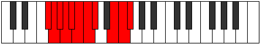

# Mode Madyllian

## Links

- [Documentation](index.md)
- [Scales Index](Scales.md)
- [Modes Index](Modes.md)
- [Chords Index](Chords.md)

## Parent Scale

[Katoryllian](ScaleKatoryllian.md)

## Number

[3327](https://ianring.com/musictheory/scales/3327)

## Perfection

- 8 Perfect notes
- 2 Perfect notes

## Perfection Profile

[true false false true true true true true true true]

## Permutations

| Tonic | Notes | Signature | Illustration | Audio |
|-------|-------|-----------|--------------|-------|
| [C](ModeCNaturalMadyllian.md) | C, **C#**, **D**, D#, E, F, F#, G, A#, B, C | C |  | [midi](ModeCNaturalMadyllian.mid) [ogg](ModeCNaturalMadyllian.ogg) |
| [C#](ModeCSharpMadyllian.md) | C#, **D**, **D#**, E, F, F#, G, G#, B, C, C# | C |  | [midi](ModeCSharpMadyllian.mid) [ogg](ModeCSharpMadyllian.ogg) |
| [Db](ModeDFlatMadyllian.md) | Db, **D**, **Eb**, E, F, Gb, G, Ab, B, C, Db | C |  | [midi](ModeDFlatMadyllian.mid) [ogg](ModeDFlatMadyllian.ogg) |
| [D](ModeDNaturalMadyllian.md) | D, **D#**, **E**, F, F#, G, G#, A, C, C#, D | C |  | [midi](ModeDNaturalMadyllian.mid) [ogg](ModeDNaturalMadyllian.ogg) |
| [D#](ModeDSharpMadyllian.md) | D#, **E**, **F**, F#, G, G#, A, A#, C#, D, D# | C |  | [midi](ModeDSharpMadyllian.mid) [ogg](ModeDSharpMadyllian.ogg) |
| [Eb](ModeEFlatMadyllian.md) | Eb, **E**, **F**, Gb, G, Ab, A, Bb, Db, D, Eb | C |  | [midi](ModeEFlatMadyllian.mid) [ogg](ModeEFlatMadyllian.ogg) |
| [E](ModeENaturalMadyllian.md) | E, **F**, **F#**, G, G#, A, A#, B, D, D#, E | C |  | [midi](ModeENaturalMadyllian.mid) [ogg](ModeENaturalMadyllian.ogg) |
| [F](ModeFNaturalMadyllian.md) | F, **F#**, **G**, G#, A, A#, B, C, D#, E, F | C |  | [midi](ModeFNaturalMadyllian.mid) [ogg](ModeFNaturalMadyllian.ogg) |
| [F#](ModeFSharpMadyllian.md) | F#, **G**, **G#**, A, A#, B, C, C#, E, F, F# | C |  | [midi](ModeFSharpMadyllian.mid) [ogg](ModeFSharpMadyllian.ogg) |
| [Gb](ModeGFlatMadyllian.md) | Gb, **G**, **Ab**, A, Bb, B, C, Db, E, F, Gb | C |  | [midi](ModeGFlatMadyllian.mid) [ogg](ModeGFlatMadyllian.ogg) |
| [G](ModeGNaturalMadyllian.md) | G, **G#**, **A**, A#, B, C, C#, D, F, F#, G | C |  | [midi](ModeGNaturalMadyllian.mid) [ogg](ModeGNaturalMadyllian.ogg) |
| [G#](ModeGSharpMadyllian.md) | G#, **A**, **A#**, B, C, C#, D, D#, F#, G, G# | C |  | [midi](ModeGSharpMadyllian.mid) [ogg](ModeGSharpMadyllian.ogg) |
| [Ab](ModeAFlatMadyllian.md) | Ab, **A**, **Bb**, B, C, Db, D, Eb, Gb, G, Ab | C |  | [midi](ModeAFlatMadyllian.mid) [ogg](ModeAFlatMadyllian.ogg) |
| [A](ModeANaturalMadyllian.md) | A, **A#**, **B**, C, C#, D, D#, E, G, G#, A | C |  | [midi](ModeANaturalMadyllian.mid) [ogg](ModeANaturalMadyllian.ogg) |
| [A#](ModeASharpMadyllian.md) | A#, **B**, **C**, C#, D, D#, E, F, G#, A, A# | C |  | [midi](ModeASharpMadyllian.mid) [ogg](ModeASharpMadyllian.ogg) |
| [Bb](ModeBFlatMadyllian.md) | Bb, **B**, **C**, Db, D, Eb, E, F, Ab, A, Bb | C |  | [midi](ModeBFlatMadyllian.mid) [ogg](ModeBFlatMadyllian.ogg) |
| [B](ModeBNaturalMadyllian.md) | B, **C**, **C#**, D, D#, E, F, F#, A, A#, B | C |  | [midi](ModeBNaturalMadyllian.mid) [ogg](ModeBNaturalMadyllian.ogg) |
