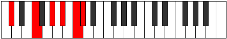

# Mode Magitonic

## Links

- [Documentation](index.md)
- [Scales Index](Scales.md)
- [Modes Index](Modes.md)
- [Chords Index](Chords.md)

## Parent Scale

[Magitonic](ScaleMagitonic.md)

## Number

[2705](https://ianring.com/musictheory/scales/2705)

## Perfection

- 3 Perfect notes
- 2 Perfect notes

## Perfection Profile

[true true false true false]

## Permutations

| Tonic | Notes | Signature | Illustration | Audio |
|-------|-------|-----------|--------------|-------|
| [C](ModeCNaturalMagitonic.md) | C, E, **G**, A, **B**, C | C |  | [midi](ModeCNaturalMagitonic.mid) [ogg](ModeCNaturalMagitonic.ogg) |
| [C#](ModeCSharpMagitonic.md) | C#, F, **G#**, A#, **C**, C# | C |  | [midi](ModeCSharpMagitonic.mid) [ogg](ModeCSharpMagitonic.ogg) |
| [Db](ModeDFlatMagitonic.md) | Db, F, **Ab**, Bb, **C**, Db | C |  | [midi](ModeDFlatMagitonic.mid) [ogg](ModeDFlatMagitonic.ogg) |
| [D](ModeDNaturalMagitonic.md) | D, F#, **A**, B, **C#**, D | C |  | [midi](ModeDNaturalMagitonic.mid) [ogg](ModeDNaturalMagitonic.ogg) |
| [D#](ModeDSharpMagitonic.md) | D#, G, **A#**, C, **D**, D# | C |  | [midi](ModeDSharpMagitonic.mid) [ogg](ModeDSharpMagitonic.ogg) |
| [Eb](ModeEFlatMagitonic.md) | Eb, G, **Bb**, C, **D**, Eb | C |  | [midi](ModeEFlatMagitonic.mid) [ogg](ModeEFlatMagitonic.ogg) |
| [E](ModeENaturalMagitonic.md) | E, G#, **B**, C#, **D#**, E | C |  | [midi](ModeENaturalMagitonic.mid) [ogg](ModeENaturalMagitonic.ogg) |
| [F](ModeFNaturalMagitonic.md) | F, A, **C**, D, **E**, F | C |  | [midi](ModeFNaturalMagitonic.mid) [ogg](ModeFNaturalMagitonic.ogg) |
| [F#](ModeFSharpMagitonic.md) | F#, A#, **C#**, D#, **F**, F# | C |  | [midi](ModeFSharpMagitonic.mid) [ogg](ModeFSharpMagitonic.ogg) |
| [Gb](ModeGFlatMagitonic.md) | Gb, Bb, **Db**, Eb, **F**, Gb | C |  | [midi](ModeGFlatMagitonic.mid) [ogg](ModeGFlatMagitonic.ogg) |
| [G](ModeGNaturalMagitonic.md) | G, B, **D**, E, **F#**, G | C |  | [midi](ModeGNaturalMagitonic.mid) [ogg](ModeGNaturalMagitonic.ogg) |
| [G#](ModeGSharpMagitonic.md) | G#, C, **D#**, F, **G**, G# | C |  | [midi](ModeGSharpMagitonic.mid) [ogg](ModeGSharpMagitonic.ogg) |
| [Ab](ModeAFlatMagitonic.md) | Ab, C, **Eb**, F, **G**, Ab | C |  | [midi](ModeAFlatMagitonic.mid) [ogg](ModeAFlatMagitonic.ogg) |
| [A](ModeANaturalMagitonic.md) | A, C#, **E**, F#, **G#**, A | C |  | [midi](ModeANaturalMagitonic.mid) [ogg](ModeANaturalMagitonic.ogg) |
| [A#](ModeASharpMagitonic.md) | A#, D, **F**, G, **A**, A# | C |  | [midi](ModeASharpMagitonic.mid) [ogg](ModeASharpMagitonic.ogg) |
| [Bb](ModeBFlatMagitonic.md) | Bb, D, **F**, G, **A**, Bb | C |  | [midi](ModeBFlatMagitonic.mid) [ogg](ModeBFlatMagitonic.ogg) |
| [B](ModeBNaturalMagitonic.md) | B, D#, **F#**, G#, **A#**, B | C |  | [midi](ModeBNaturalMagitonic.mid) [ogg](ModeBNaturalMagitonic.ogg) |
