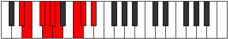

# Mode Magyllic

## Links

- [Documentation](README.md)
- [Scales Index](Scales.md)
- [Modes Index](Modes.md)
- [Chords Index](Chords.md)

## Parent Scale

[Maptyllic](ScaleMaptyllic.md)

## Number

[1659](https://ianring.com/musictheory/scales/1659)

## Transposition

1, 2, 1, 1, 1, 3, 1, 2

## Chord Pattern

iii⁰b3, iv⁰b3, V, VI, vii⁰, viii⁰

## Perfection

- 5 Perfect notes
- 3 Perfect notes

## Perfection Profile

[false false true false true true true true]

## Permutations

| Tonic | Notes | Signature | Illustration | Audio |
|-------|-------|-----------|--------------|-------|
| [C](ModeCNaturalMagyllic.md) | **C**, **C#**, D#, **E**, F, F#, A, A#, **C** | C |  | [midi](https://github.com/edipermadi/music/blob/main/docs/ModeCNaturalMagyllic.mid?raw=true) |
| [C#](ModeCSharpMagyllic.md) | **C#**, **D**, E, **F**, F#, G, A#, B, **C#** | C |  | [midi](https://github.com/edipermadi/music/blob/main/docs/ModeCSharpMagyllic.mid?raw=true) |
| [Db](ModeDFlatMagyllic.md) | **Db**, **D**, E, **F**, Gb, G, Bb, B, **Db** | C |  | [midi](https://github.com/edipermadi/music/blob/main/docs/ModeDFlatMagyllic.mid?raw=true) |
| [D](ModeDNaturalMagyllic.md) | **D**, **D#**, F, **F#**, G, G#, B, C, **D** | C |  | [midi](https://github.com/edipermadi/music/blob/main/docs/ModeDNaturalMagyllic.mid?raw=true) |
| [D#](ModeDSharpMagyllic.md) | **D#**, **E**, F#, **G**, G#, A, C, C#, **D#** | C |  | [midi](https://github.com/edipermadi/music/blob/main/docs/ModeDSharpMagyllic.mid?raw=true) |
| [Eb](ModeEFlatMagyllic.md) | **Eb**, **E**, Gb, **G**, Ab, A, C, Db, **Eb** | C |  | [midi](https://github.com/edipermadi/music/blob/main/docs/ModeEFlatMagyllic.mid?raw=true) |
| [E](ModeENaturalMagyllic.md) | **E**, **F**, G, **G#**, A, A#, C#, D, **E** | C |  | [midi](https://github.com/edipermadi/music/blob/main/docs/ModeENaturalMagyllic.mid?raw=true) |
| [F](ModeFNaturalMagyllic.md) | **F**, **F#**, G#, **A**, A#, B, D, D#, **F** | C |  | [midi](https://github.com/edipermadi/music/blob/main/docs/ModeFNaturalMagyllic.mid?raw=true) |
| [F#](ModeFSharpMagyllic.md) | **F#**, **G**, A, **A#**, B, C, D#, E, **F#** | C |  | [midi](https://github.com/edipermadi/music/blob/main/docs/ModeFSharpMagyllic.mid?raw=true) |
| [Gb](ModeGFlatMagyllic.md) | **Gb**, **G**, A, **Bb**, B, C, Eb, E, **Gb** | C |  | [midi](https://github.com/edipermadi/music/blob/main/docs/ModeGFlatMagyllic.mid?raw=true) |
| [G](ModeGNaturalMagyllic.md) | **G**, **G#**, A#, **B**, C, C#, E, F, **G** | C |  | [midi](https://github.com/edipermadi/music/blob/main/docs/ModeGNaturalMagyllic.mid?raw=true) |
| [G#](ModeGSharpMagyllic.md) | **G#**, **A**, B, **C**, C#, D, F, F#, **G#** | C |  | [midi](https://github.com/edipermadi/music/blob/main/docs/ModeGSharpMagyllic.mid?raw=true) |
| [Ab](ModeAFlatMagyllic.md) | **Ab**, **A**, B, **C**, Db, D, F, Gb, **Ab** | C |  | [midi](https://github.com/edipermadi/music/blob/main/docs/ModeAFlatMagyllic.mid?raw=true) |
| [A](ModeANaturalMagyllic.md) | **A**, **A#**, C, **C#**, D, D#, F#, G, **A** | C |  | [midi](https://github.com/edipermadi/music/blob/main/docs/ModeANaturalMagyllic.mid?raw=true) |
| [A#](ModeASharpMagyllic.md) | **A#**, **B**, C#, **D**, D#, E, G, G#, **A#** | C |  | [midi](https://github.com/edipermadi/music/blob/main/docs/ModeASharpMagyllic.mid?raw=true) |
| [Bb](ModeBFlatMagyllic.md) | **Bb**, **B**, Db, **D**, Eb, E, G, Ab, **Bb** | C |  | [midi](https://github.com/edipermadi/music/blob/main/docs/ModeBFlatMagyllic.mid?raw=true) |
| [B](ModeBNaturalMagyllic.md) | **B**, **C**, D, **D#**, E, F, G#, A, **B** | C |  | [midi](https://github.com/edipermadi/music/blob/main/docs/ModeBNaturalMagyllic.mid?raw=true) |
