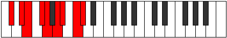

# Mode MajorDiminished

## Links

- [Documentation](README.md)
- [Scales Index](Scales.md)
- [Modes Index](Modes.md)
- [Chords Index](Chords.md)

## Parent Scale

[MajorDiminished](ScaleMajorDiminished.md)

## Number

[2925](https://ianring.com/musictheory/scales/2925)

## Luminosity

7

## Transposition

2, 1, 2, 1, 2, 1, 2, 1

## Chord Pattern

i⁰, ii⁰, iii⁰, iv⁰, v⁰, vi⁰, vii⁰, viii⁰

## Perfection

- 4 Perfect notes
- 4 Perfect notes

## Perfection Profile

false, true, false, true, false, true, false, true

## Permutations

| Tonic | Notes | Signature | Illustration | Audio |
|-------|-------|-----------|--------------|-------|
| [C](ModeCNaturalMajorDiminished.md) | **C**, D, **D#**, F, **F#**, G#, **A**, B, **C** | C |  | [midi](https://github.com/edipermadi/music/blob/main/docs/ModeCNaturalMajorDiminished.mid?raw=true) |
| [C#](ModeCSharpMajorDiminished.md) | **C#**, D#, **E**, F#, **G**, A, **A#**, C, **C#** | C |  | [midi](https://github.com/edipermadi/music/blob/main/docs/ModeCSharpMajorDiminished.mid?raw=true) |
| [Db](ModeDFlatMajorDiminished.md) | **Db**, Eb, **E**, Gb, **G**, A, **Bb**, C, **Db** | C |  | [midi](https://github.com/edipermadi/music/blob/main/docs/ModeDFlatMajorDiminished.mid?raw=true) |
| [D](ModeDNaturalMajorDiminished.md) | **D**, E, **F**, G, **G#**, A#, **B**, C#, **D** | C |  | [midi](https://github.com/edipermadi/music/blob/main/docs/ModeDNaturalMajorDiminished.mid?raw=true) |
| [D#](ModeDSharpMajorDiminished.md) | **D#**, F, **F#**, G#, **A**, B, **C**, D, **D#** | C |  | [midi](https://github.com/edipermadi/music/blob/main/docs/ModeDSharpMajorDiminished.mid?raw=true) |
| [Eb](ModeEFlatMajorDiminished.md) | **Eb**, F, **Gb**, Ab, **A**, B, **C**, D, **Eb** | C |  | [midi](https://github.com/edipermadi/music/blob/main/docs/ModeEFlatMajorDiminished.mid?raw=true) |
| [E](ModeENaturalMajorDiminished.md) | **E**, F#, **G**, A, **A#**, C, **C#**, D#, **E** | C |  | [midi](https://github.com/edipermadi/music/blob/main/docs/ModeENaturalMajorDiminished.mid?raw=true) |
| [F](ModeFNaturalMajorDiminished.md) | **F**, G, **G#**, A#, **B**, C#, **D**, E, **F** | C |  | [midi](https://github.com/edipermadi/music/blob/main/docs/ModeFNaturalMajorDiminished.mid?raw=true) |
| [F#](ModeFSharpMajorDiminished.md) | **F#**, G#, **A**, B, **C**, D, **D#**, F, **F#** | C |  | [midi](https://github.com/edipermadi/music/blob/main/docs/ModeFSharpMajorDiminished.mid?raw=true) |
| [Gb](ModeGFlatMajorDiminished.md) | **Gb**, Ab, **A**, B, **C**, D, **Eb**, F, **Gb** | C |  | [midi](https://github.com/edipermadi/music/blob/main/docs/ModeGFlatMajorDiminished.mid?raw=true) |
| [G](ModeGNaturalMajorDiminished.md) | **G**, A, **A#**, C, **C#**, D#, **E**, F#, **G** | C |  | [midi](https://github.com/edipermadi/music/blob/main/docs/ModeGNaturalMajorDiminished.mid?raw=true) |
| [G#](ModeGSharpMajorDiminished.md) | **G#**, A#, **B**, C#, **D**, E, **F**, G, **G#** | C |  | [midi](https://github.com/edipermadi/music/blob/main/docs/ModeGSharpMajorDiminished.mid?raw=true) |
| [Ab](ModeAFlatMajorDiminished.md) | **Ab**, Bb, **B**, Db, **D**, E, **F**, G, **Ab** | C |  | [midi](https://github.com/edipermadi/music/blob/main/docs/ModeAFlatMajorDiminished.mid?raw=true) |
| [A](ModeANaturalMajorDiminished.md) | **A**, B, **C**, D, **D#**, F, **F#**, G#, **A** | C |  | [midi](https://github.com/edipermadi/music/blob/main/docs/ModeANaturalMajorDiminished.mid?raw=true) |
| [A#](ModeASharpMajorDiminished.md) | **A#**, C, **C#**, D#, **E**, F#, **G**, A, **A#** | C |  | [midi](https://github.com/edipermadi/music/blob/main/docs/ModeASharpMajorDiminished.mid?raw=true) |
| [Bb](ModeBFlatMajorDiminished.md) | **Bb**, C, **Db**, Eb, **E**, Gb, **G**, A, **Bb** | C |  | [midi](https://github.com/edipermadi/music/blob/main/docs/ModeBFlatMajorDiminished.mid?raw=true) |
| [B](ModeBNaturalMajorDiminished.md) | **B**, C#, **D**, E, **F**, G, **G#**, A#, **B** | C |  | [midi](https://github.com/edipermadi/music/blob/main/docs/ModeBNaturalMajorDiminished.mid?raw=true) |
