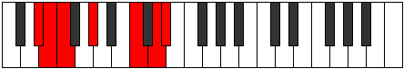

# Mode Malimic

## Links

- [Documentation](index.md)
- [Scales Index](Scales.md)
- [Modes Index](Modes.md)
- [Chords Index](Chords.md)

## Parent Scale

[Kocrimic](ScaleKocrimic.md)

## Number

[2599](https://ianring.com/musictheory/scales/2599)

## Perfection

- 2 Perfect notes
- 4 Perfect notes

## Interval Pattern

1, 1, 3, 4, 2, 1

## Perfection Profile

[false false true true false false]

## Permutations

| Tonic | Notes | Signature | Illustration | Audio |
|-------|-------|-----------|--------------|-------|
| [C](ModeCNaturalMalimic.md) | **C**, **Db**, Ebb, F, **G##**, **A##**, **C** | C |  | [midi](https://github.com/edipermadi/music/blob/main/docs/ModeCNaturalMalimic.mid?raw=true) |
| [C#](ModeCSharpMalimic.md) | **C#**, **D**, Eb, F#, **G###**, **A###**, **C#** | C |  | [midi](https://github.com/edipermadi/music/blob/main/docs/ModeCSharpMalimic.mid?raw=true) |
| [Db](ModeDFlatMalimic.md) | **Db**, **Ebb**, Fbb, Gb, **A#**, **B#**, **Db** | C |  | [midi](https://github.com/edipermadi/music/blob/main/docs/ModeDFlatMalimic.mid?raw=true) |
| [D](ModeDNaturalMalimic.md) | **D**, **Eb**, Fb, G, **A##**, **B##**, **D** | C |  | [midi](https://github.com/edipermadi/music/blob/main/docs/ModeDNaturalMalimic.mid?raw=true) |
| [D#](ModeDSharpMalimic.md) | **D#**, **E**, F, G#, **A###**, **B###**, **D#** | C |  | [midi](https://github.com/edipermadi/music/blob/main/docs/ModeDSharpMalimic.mid?raw=true) |
| [Eb](ModeEFlatMalimic.md) | **Eb**, **Fb**, Gbb, Ab, **B#**, **C##**, **Eb** | C |  | [midi](https://github.com/edipermadi/music/blob/main/docs/ModeEFlatMalimic.mid?raw=true) |
| [E](ModeENaturalMalimic.md) | **E**, **F**, Gb, A, **B##**, **C###**, **E** | C |  | [midi](https://github.com/edipermadi/music/blob/main/docs/ModeENaturalMalimic.mid?raw=true) |
| [F](ModeFNaturalMalimic.md) | **F**, **Gb**, Abb, Bb, **C##**, **D##**, **F** | C |  | [midi](https://github.com/edipermadi/music/blob/main/docs/ModeFNaturalMalimic.mid?raw=true) |
| [F#](ModeFSharpMalimic.md) | **F#**, **G**, Ab, B, **C###**, **D###**, **F#** | C |  | [midi](https://github.com/edipermadi/music/blob/main/docs/ModeFSharpMalimic.mid?raw=true) |
| [Gb](ModeGFlatMalimic.md) | **Gb**, **Abb**, Bbbb, Cb, **D#**, **E#**, **Gb** | C |  | [midi](https://github.com/edipermadi/music/blob/main/docs/ModeGFlatMalimic.mid?raw=true) |
| [G](ModeGNaturalMalimic.md) | **G**, **Ab**, Bbb, C, **D##**, **E##**, **G** | C |  | [midi](https://github.com/edipermadi/music/blob/main/docs/ModeGNaturalMalimic.mid?raw=true) |
| [G#](ModeGSharpMalimic.md) | **G#**, **A**, Bb, C#, **D###**, **E###**, **G#** | C |  | [midi](https://github.com/edipermadi/music/blob/main/docs/ModeGSharpMalimic.mid?raw=true) |
| [Ab](ModeAFlatMalimic.md) | **Ab**, **Bbb**, Cbb, Db, **E#**, **F##**, **Ab** | C |  | [midi](https://github.com/edipermadi/music/blob/main/docs/ModeAFlatMalimic.mid?raw=true) |
| [A](ModeANaturalMalimic.md) | **A**, **Bb**, Cb, D, **E##**, **F###**, **A** | C |  | [midi](https://github.com/edipermadi/music/blob/main/docs/ModeANaturalMalimic.mid?raw=true) |
| [A#](ModeASharpMalimic.md) | **A#**, **B**, C, D#, **E###**, **Cbbb**, **A#** | C |  | [midi](https://github.com/edipermadi/music/blob/main/docs/ModeASharpMalimic.mid?raw=true) |
| [Bb](ModeBFlatMalimic.md) | **Bb**, **Cb**, Dbb, Eb, **F##**, **G##**, **Bb** | C |  | [midi](https://github.com/edipermadi/music/blob/main/docs/ModeBFlatMalimic.mid?raw=true) |
| [B](ModeBNaturalMalimic.md) | **B**, **C**, Db, E, **F###**, **G###**, **B** | C |  | [midi](https://github.com/edipermadi/music/blob/main/docs/ModeBNaturalMalimic.mid?raw=true) |
