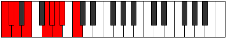

# Mode Malyllic

## Links

- [Documentation](index.md)
- [Scales Index](Scales.md)
- [Modes Index](Modes.md)
- [Chords Index](Chords.md)

## Parent Scale

[Zagyllic](ScaleZagyllic.md)

## Number

[1943](https://ianring.com/musictheory/scales/1943)

## Perfection

- 5 Perfect notes
- 3 Perfect notes

## Perfection Profile

[true true true false true false true false]

## Permutations

| Tonic | Notes | Signature | Illustration | Audio |
|-------|-------|-----------|--------------|-------|
| [C](ModeCNaturalMalyllic.md) | C, C#, D, **E**, G, **G#**, A, **A#**, C | C |  | [midi](ModeCNaturalMalyllic.mid) [ogg](ModeCNaturalMalyllic.ogg) |
| [C#](ModeCSharpMalyllic.md) | C#, D, D#, **F**, G#, **A**, A#, **B**, C# | C |  | [midi](ModeCSharpMalyllic.mid) [ogg](ModeCSharpMalyllic.ogg) |
| [Db](ModeDFlatMalyllic.md) | Db, D, Eb, **F**, Ab, **A**, Bb, **B**, Db | C |  | [midi](ModeDFlatMalyllic.mid) [ogg](ModeDFlatMalyllic.ogg) |
| [D](ModeDNaturalMalyllic.md) | D, D#, E, **F#**, A, **A#**, B, **C**, D | C |  | [midi](ModeDNaturalMalyllic.mid) [ogg](ModeDNaturalMalyllic.ogg) |
| [D#](ModeDSharpMalyllic.md) | D#, E, F, **G**, A#, **B**, C, **C#**, D# | C |  | [midi](ModeDSharpMalyllic.mid) [ogg](ModeDSharpMalyllic.ogg) |
| [Eb](ModeEFlatMalyllic.md) | Eb, E, F, **G**, Bb, **B**, C, **Db**, Eb | C |  | [midi](ModeEFlatMalyllic.mid) [ogg](ModeEFlatMalyllic.ogg) |
| [E](ModeENaturalMalyllic.md) | E, F, F#, **G#**, B, **C**, C#, **D**, E | C |  | [midi](ModeENaturalMalyllic.mid) [ogg](ModeENaturalMalyllic.ogg) |
| [F](ModeFNaturalMalyllic.md) | F, F#, G, **A**, C, **C#**, D, **D#**, F | C |  | [midi](ModeFNaturalMalyllic.mid) [ogg](ModeFNaturalMalyllic.ogg) |
| [F#](ModeFSharpMalyllic.md) | F#, G, G#, **A#**, C#, **D**, D#, **E**, F# | C |  | [midi](ModeFSharpMalyllic.mid) [ogg](ModeFSharpMalyllic.ogg) |
| [Gb](ModeGFlatMalyllic.md) | Gb, G, Ab, **Bb**, Db, **D**, Eb, **E**, Gb | C |  | [midi](ModeGFlatMalyllic.mid) [ogg](ModeGFlatMalyllic.ogg) |
| [G](ModeGNaturalMalyllic.md) | G, G#, A, **B**, D, **D#**, E, **F**, G | C |  | [midi](ModeGNaturalMalyllic.mid) [ogg](ModeGNaturalMalyllic.ogg) |
| [G#](ModeGSharpMalyllic.md) | G#, A, A#, **C**, D#, **E**, F, **F#**, G# | C |  | [midi](ModeGSharpMalyllic.mid) [ogg](ModeGSharpMalyllic.ogg) |
| [Ab](ModeAFlatMalyllic.md) | Ab, A, Bb, **C**, Eb, **E**, F, **Gb**, Ab | C |  | [midi](ModeAFlatMalyllic.mid) [ogg](ModeAFlatMalyllic.ogg) |
| [A](ModeANaturalMalyllic.md) | A, A#, B, **C#**, E, **F**, F#, **G**, A | C |  | [midi](ModeANaturalMalyllic.mid) [ogg](ModeANaturalMalyllic.ogg) |
| [A#](ModeASharpMalyllic.md) | A#, B, C, **D**, F, **F#**, G, **G#**, A# | C |  | [midi](ModeASharpMalyllic.mid) [ogg](ModeASharpMalyllic.ogg) |
| [Bb](ModeBFlatMalyllic.md) | Bb, B, C, **D**, F, **Gb**, G, **Ab**, Bb | C |  | [midi](ModeBFlatMalyllic.mid) [ogg](ModeBFlatMalyllic.ogg) |
| [B](ModeBNaturalMalyllic.md) | B, C, C#, **D#**, F#, **G**, G#, **A**, B | C |  | [midi](ModeBNaturalMalyllic.mid) [ogg](ModeBNaturalMalyllic.ogg) |
