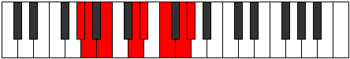

# Mode Manian

## Links

- [Documentation](index.md)
- [Scales Index](Scales.md)
- [Modes Index](Modes.md)
- [Chords Index](Chords.md)

## Parent Scale

[Korian](ScaleKorian.md)

## Number

[2763](https://ianring.com/musictheory/scales/2763)

## Perfection

- 3 Perfect notes
- 4 Perfect notes

## Perfection Profile

[true false false true false false true]

## Permutations

| Tonic | Notes | Signature | Illustration | Audio |
|-------|-------|-----------|--------------|-------|
| [C](ModeCNaturalManian.md) | C, **Db**, **Eb**, F#, **G**, **A**, B, C | C |  | [midi](ModeCNaturalManian.mid) [ogg](ModeCNaturalManian.ogg) |
| [C#](ModeCSharpManian.md) | C#, **D**, **E**, F##, **G#**, **A#**, B#, C# | C |  | [midi](ModeCSharpManian.mid) [ogg](ModeCSharpManian.ogg) |
| [Db](ModeDFlatManian.md) | Db, **Ebb**, **Fb**, G, **Ab**, **Bb**, C, Db | C |  | [midi](ModeDFlatManian.mid) [ogg](ModeDFlatManian.ogg) |
| [D](ModeDNaturalManian.md) | D, **Eb**, **F**, G#, **A**, **B**, C#, D | C |  | [midi](ModeDNaturalManian.mid) [ogg](ModeDNaturalManian.ogg) |
| [D#](ModeDSharpManian.md) | D#, **E**, **F#**, G##, **A#**, **B#**, C##, D# | C |  | [midi](ModeDSharpManian.mid) [ogg](ModeDSharpManian.ogg) |
| [Eb](ModeEFlatManian.md) | Eb, **Fb**, **Gb**, A, **Bb**, **C**, D, Eb | C |  | [midi](ModeEFlatManian.mid) [ogg](ModeEFlatManian.ogg) |
| [E](ModeENaturalManian.md) | E, **F**, **G**, A#, **B**, **C#**, D#, E | C |  | [midi](ModeENaturalManian.mid) [ogg](ModeENaturalManian.ogg) |
| [F](ModeFNaturalManian.md) | F, **Gb**, **Ab**, B, **C**, **D**, E, F | C |  | [midi](ModeFNaturalManian.mid) [ogg](ModeFNaturalManian.ogg) |
| [F#](ModeFSharpManian.md) | F#, **G**, **A**, B#, **C#**, **D#**, E#, F# | C |  | [midi](ModeFSharpManian.mid) [ogg](ModeFSharpManian.ogg) |
| [Gb](ModeGFlatManian.md) | Gb, **Abb**, **Bbb**, C, **Db**, **Eb**, F, Gb | C |  | [midi](ModeGFlatManian.mid) [ogg](ModeGFlatManian.ogg) |
| [G](ModeGNaturalManian.md) | G, **Ab**, **Bb**, C#, **D**, **E**, F#, G | C |  | [midi](ModeGNaturalManian.mid) [ogg](ModeGNaturalManian.ogg) |
| [G#](ModeGSharpManian.md) | G#, **A**, **B**, C##, **D#**, **E#**, F##, G# | C |  | [midi](ModeGSharpManian.mid) [ogg](ModeGSharpManian.ogg) |
| [Ab](ModeAFlatManian.md) | Ab, **Bbb**, **Cb**, D, **Eb**, **F**, G, Ab | C |  | [midi](ModeAFlatManian.mid) [ogg](ModeAFlatManian.ogg) |
| [A](ModeANaturalManian.md) | A, **Bb**, **C**, D#, **E**, **F#**, G#, A | C |  | [midi](ModeANaturalManian.mid) [ogg](ModeANaturalManian.ogg) |
| [A#](ModeASharpManian.md) | A#, **B**, **C#**, D##, **E#**, **F##**, G##, A# | C |  | [midi](ModeASharpManian.mid) [ogg](ModeASharpManian.ogg) |
| [Bb](ModeBFlatManian.md) | Bb, **Cb**, **Db**, E, **F**, **G**, A, Bb | C |  | [midi](ModeBFlatManian.mid) [ogg](ModeBFlatManian.ogg) |
| [B](ModeBNaturalManian.md) | B, **C**, **D**, E#, **F#**, **G#**, A#, B | C |  | [midi](ModeBNaturalManian.mid) [ogg](ModeBNaturalManian.ogg) |
