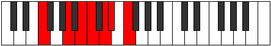

# Mode Manimic

## Links

- [Documentation](index.md)
- [Scales Index](Scales.md)
- [Modes Index](Modes.md)
- [Chords Index](Chords.md)

## Parent Scale

[Manimic](ScaleManimic.md)

## Number

[1745](https://ianring.com/musictheory/scales/1745)

## Perfection

- 2 Perfect notes
- 4 Perfect notes

## Perfection Profile

[true false false false true false]

## Permutations

| Tonic | Notes | Signature | Illustration | Audio |
|-------|-------|-----------|--------------|-------|
| [C](ModeCNaturalManimic.md) | C, **D##**, **E##**, **F##**, G##, **A#**, C | C |  | [midi](https://github.com/edipermadi/music/blob/main/docs/ModeCNaturalManimic.mid?raw=true) |
| [C#](ModeCSharpManimic.md) | C#, **D###**, **E###**, **F###**, G###, **A##**, C# | C |  | [midi](https://github.com/edipermadi/music/blob/main/docs/ModeCSharpManimic.mid?raw=true) |
| [Db](ModeDFlatManimic.md) | Db, **E#**, **F##**, **G#**, A#, **B**, Db | C |  | [midi](https://github.com/edipermadi/music/blob/main/docs/ModeDFlatManimic.mid?raw=true) |
| [D](ModeDNaturalManimic.md) | D, **E##**, **F###**, **G##**, A##, **B#**, D | C |  | [midi](https://github.com/edipermadi/music/blob/main/docs/ModeDNaturalManimic.mid?raw=true) |
| [D#](ModeDSharpManimic.md) | D#, **E###**, **Cbbb**, **Cbb**, Dbb, **Ebbb**, D# | C |  | [midi](https://github.com/edipermadi/music/blob/main/docs/ModeDSharpManimic.mid?raw=true) |
| [Eb](ModeEFlatManimic.md) | Eb, **F##**, **G##**, **A#**, B#, **C#**, Eb | C |  | [midi](https://github.com/edipermadi/music/blob/main/docs/ModeEFlatManimic.mid?raw=true) |
| [E](ModeENaturalManimic.md) | E, **F###**, **G###**, **A##**, B##, **C##**, E | C |  | [midi](https://github.com/edipermadi/music/blob/main/docs/ModeENaturalManimic.mid?raw=true) |
| [F](ModeFNaturalManimic.md) | F, **G##**, **A##**, **B#**, C##, **D#**, F | C |  | [midi](https://github.com/edipermadi/music/blob/main/docs/ModeFNaturalManimic.mid?raw=true) |
| [F#](ModeFSharpManimic.md) | F#, **G###**, **A###**, **B##**, C###, **D##**, F# | C |  | [midi](https://github.com/edipermadi/music/blob/main/docs/ModeFSharpManimic.mid?raw=true) |
| [Gb](ModeGFlatManimic.md) | Gb, **A#**, **B#**, **C#**, D#, **E**, Gb | C |  | [midi](https://github.com/edipermadi/music/blob/main/docs/ModeGFlatManimic.mid?raw=true) |
| [G](ModeGNaturalManimic.md) | G, **A##**, **B##**, **C##**, D##, **E#**, G | C |  | [midi](https://github.com/edipermadi/music/blob/main/docs/ModeGNaturalManimic.mid?raw=true) |
| [G#](ModeGSharpManimic.md) | G#, **A###**, **B###**, **C###**, D###, **E##**, G# | C |  | [midi](https://github.com/edipermadi/music/blob/main/docs/ModeGSharpManimic.mid?raw=true) |
| [Ab](ModeAFlatManimic.md) | Ab, **B#**, **C##**, **D#**, E#, **F#**, Ab | C |  | [midi](https://github.com/edipermadi/music/blob/main/docs/ModeAFlatManimic.mid?raw=true) |
| [A](ModeANaturalManimic.md) | A, **B##**, **C###**, **D##**, E##, **F##**, A | C |  | [midi](https://github.com/edipermadi/music/blob/main/docs/ModeANaturalManimic.mid?raw=true) |
| [A#](ModeASharpManimic.md) | A#, **B###**, **D##**, **E#**, F##, **G#**, A# | C |  | [midi](https://github.com/edipermadi/music/blob/main/docs/ModeASharpManimic.mid?raw=true) |
| [Bb](ModeBFlatManimic.md) | Bb, **C##**, **D##**, **E#**, F##, **G#**, Bb | C |  | [midi](https://github.com/edipermadi/music/blob/main/docs/ModeBFlatManimic.mid?raw=true) |
| [B](ModeBNaturalManimic.md) | B, **C###**, **D###**, **E##**, F###, **G##**, B | C |  | [midi](https://github.com/edipermadi/music/blob/main/docs/ModeBNaturalManimic.mid?raw=true) |
