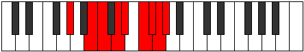

# Mode Maptyllic

## Links

- [Documentation](index.md)
- [Scales Index](Scales.md)
- [Modes Index](Modes.md)
- [Chords Index](Chords.md)

## Parent Scale

[Maptyllic](ScaleMaptyllic.md)

## Number

[3801](https://ianring.com/musictheory/scales/3801)

## Perfection

- 5 Perfect notes
- 3 Perfect notes

## Perfection Profile

[true true true false false true false true]

## Permutations

| Tonic | Notes | Signature | Illustration | Audio |
|-------|-------|-----------|--------------|-------|
| [C](ModeCNaturalMaptyllic.md) | C, D#, E, **F#**, **G**, A, **A#**, B, C | C |  | [midi](ModeCNaturalMaptyllic.mid) [ogg](ModeCNaturalMaptyllic.ogg) |
| [C#](ModeCSharpMaptyllic.md) | C#, E, F, **G**, **G#**, A#, **B**, C, C# | C |  | [midi](ModeCSharpMaptyllic.mid) [ogg](ModeCSharpMaptyllic.ogg) |
| [Db](ModeDFlatMaptyllic.md) | Db, E, F, **G**, **Ab**, Bb, **B**, C, Db | C |  | [midi](ModeDFlatMaptyllic.mid) [ogg](ModeDFlatMaptyllic.ogg) |
| [D](ModeDNaturalMaptyllic.md) | D, F, F#, **G#**, **A**, B, **C**, C#, D | C |  | [midi](ModeDNaturalMaptyllic.mid) [ogg](ModeDNaturalMaptyllic.ogg) |
| [D#](ModeDSharpMaptyllic.md) | D#, F#, G, **A**, **A#**, C, **C#**, D, D# | C |  | [midi](ModeDSharpMaptyllic.mid) [ogg](ModeDSharpMaptyllic.ogg) |
| [Eb](ModeEFlatMaptyllic.md) | Eb, Gb, G, **A**, **Bb**, C, **Db**, D, Eb | C |  | [midi](ModeEFlatMaptyllic.mid) [ogg](ModeEFlatMaptyllic.ogg) |
| [E](ModeENaturalMaptyllic.md) | E, G, G#, **A#**, **B**, C#, **D**, D#, E | C |  | [midi](ModeENaturalMaptyllic.mid) [ogg](ModeENaturalMaptyllic.ogg) |
| [F](ModeFNaturalMaptyllic.md) | F, G#, A, **B**, **C**, D, **D#**, E, F | C |  | [midi](ModeFNaturalMaptyllic.mid) [ogg](ModeFNaturalMaptyllic.ogg) |
| [F#](ModeFSharpMaptyllic.md) | F#, A, A#, **C**, **C#**, D#, **E**, F, F# | C |  | [midi](ModeFSharpMaptyllic.mid) [ogg](ModeFSharpMaptyllic.ogg) |
| [Gb](ModeGFlatMaptyllic.md) | Gb, A, Bb, **C**, **Db**, Eb, **E**, F, Gb | C |  | [midi](ModeGFlatMaptyllic.mid) [ogg](ModeGFlatMaptyllic.ogg) |
| [G](ModeGNaturalMaptyllic.md) | G, A#, B, **C#**, **D**, E, **F**, F#, G | C |  | [midi](ModeGNaturalMaptyllic.mid) [ogg](ModeGNaturalMaptyllic.ogg) |
| [G#](ModeGSharpMaptyllic.md) | G#, B, C, **D**, **D#**, F, **F#**, G, G# | C |  | [midi](ModeGSharpMaptyllic.mid) [ogg](ModeGSharpMaptyllic.ogg) |
| [Ab](ModeAFlatMaptyllic.md) | Ab, B, C, **D**, **Eb**, F, **Gb**, G, Ab | C |  | [midi](ModeAFlatMaptyllic.mid) [ogg](ModeAFlatMaptyllic.ogg) |
| [A](ModeANaturalMaptyllic.md) | A, C, C#, **D#**, **E**, F#, **G**, G#, A | C |  | [midi](ModeANaturalMaptyllic.mid) [ogg](ModeANaturalMaptyllic.ogg) |
| [A#](ModeASharpMaptyllic.md) | A#, C#, D, **E**, **F**, G, **G#**, A, A# | C |  | [midi](ModeASharpMaptyllic.mid) [ogg](ModeASharpMaptyllic.ogg) |
| [Bb](ModeBFlatMaptyllic.md) | Bb, Db, D, **E**, **F**, G, **Ab**, A, Bb | C |  | [midi](ModeBFlatMaptyllic.mid) [ogg](ModeBFlatMaptyllic.ogg) |
| [B](ModeBNaturalMaptyllic.md) | B, D, D#, **F**, **F#**, G#, **A**, A#, B | C |  | [midi](ModeBNaturalMaptyllic.mid) [ogg](ModeBNaturalMaptyllic.ogg) |
