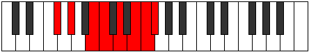
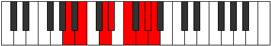

# Mode Marian

## Links

- [Documentation](README.md)
- [Scales Index](Scales.md)
- [Modes Index](Modes.md)
- [Chords Index](Chords.md)

## Parent Scale

[Korian](ScaleKorian.md)

## Number

[3429](https://ianring.com/musictheory/scales/3429)

## Transposition

2, 3, 1, 2, 2, 1, 1

## Chord Pattern

II⁺, iii⁰, IVb5, v⁰, vii

## Perfection

- 3 Perfect notes
- 4 Perfect notes

## Perfection Profile

false, false, true, false, false, true, true

## Permutations

| Tonic | Notes | Signature | Illustration | Audio |
|-------|-------|-----------|--------------|-------|
| [C](ModeCNaturalMarian.md) | **C**, **D**, E#, **F#**, **G#**, A#, B, **C** | C |  | [midi](https://github.com/edipermadi/music/blob/main/docs/ModeCNaturalMarian.mid?raw=true) |
| [C#](ModeCSharpMarian.md) | **C#**, **D#**, E##, **F##**, **G##**, A##, B#, **C#** | C |  | [midi](https://github.com/edipermadi/music/blob/main/docs/ModeCSharpMarian.mid?raw=true) |
| [Db](ModeDFlatMarian.md) | **Db**, **Eb**, F#, **G**, **A**, B, C, **Db** | C |  | [midi](https://github.com/edipermadi/music/blob/main/docs/ModeDFlatMarian.mid?raw=true) |
| [D](ModeDNaturalMarian.md) | **D**, **E**, F##, **G#**, **A#**, B#, C#, **D** | C |  | [midi](https://github.com/edipermadi/music/blob/main/docs/ModeDNaturalMarian.mid?raw=true) |
| [D#](ModeDSharpMarian.md) | **D#**, **E#**, F###, **G##**, **A##**, B##, C##, **D#** | C |  | [midi](https://github.com/edipermadi/music/blob/main/docs/ModeDSharpMarian.mid?raw=true) |
| [Eb](ModeEFlatMarian.md) | **Eb**, **F**, G#, **A**, **B**, C#, D, **Eb** | C |  | [midi](https://github.com/edipermadi/music/blob/main/docs/ModeEFlatMarian.mid?raw=true) |
| [E](ModeENaturalMarian.md) | **E**, **F#**, G##, **A#**, **B#**, C##, D#, **E** | C |  | [midi](https://github.com/edipermadi/music/blob/main/docs/ModeENaturalMarian.mid?raw=true) |
| [F](ModeFNaturalMarian.md) | **F**, **G**, A#, **B**, **C#**, D#, E, **F** | C |  | [midi](https://github.com/edipermadi/music/blob/main/docs/ModeFNaturalMarian.mid?raw=true) |
| [F#](ModeFSharpMarian.md) | **F#**, **G#**, A##, **B#**, **C##**, D##, E#, **F#** | C |  | [midi](https://github.com/edipermadi/music/blob/main/docs/ModeFSharpMarian.mid?raw=true) |
| [Gb](ModeGFlatMarian.md) | **Gb**, **Ab**, B, **C**, **D**, E, F, **Gb** | C |  | [midi](https://github.com/edipermadi/music/blob/main/docs/ModeGFlatMarian.mid?raw=true) |
| [G](ModeGNaturalMarian.md) | **G**, **A**, B#, **C#**, **D#**, E#, F#, **G** | C |  | [midi](https://github.com/edipermadi/music/blob/main/docs/ModeGNaturalMarian.mid?raw=true) |
| [G#](ModeGSharpMarian.md) | **G#**, **A#**, B##, **C##**, **D##**, E##, F##, **G#** | C |  | [midi](https://github.com/edipermadi/music/blob/main/docs/ModeGSharpMarian.mid?raw=true) |
| [Ab](ModeAFlatMarian.md) | **Ab**, **Bb**, C#, **D**, **E**, F#, G, **Ab** | C |  | [midi](https://github.com/edipermadi/music/blob/main/docs/ModeAFlatMarian.mid?raw=true) |
| [A](ModeANaturalMarian.md) | **A**, **B**, C##, **D#**, **E#**, F##, G#, **A** | C |  | [midi](https://github.com/edipermadi/music/blob/main/docs/ModeANaturalMarian.mid?raw=true) |
| [A#](ModeASharpMarian.md) | **A#**, **B#**, C###, **D##**, **E##**, F###, G##, **A#** | C |  | [midi](https://github.com/edipermadi/music/blob/main/docs/ModeASharpMarian.mid?raw=true) |
| [Bb](ModeBFlatMarian.md) | **Bb**, **C**, D#, **E**, **F#**, G#, A, **Bb** | C |  | [midi](https://github.com/edipermadi/music/blob/main/docs/ModeBFlatMarian.mid?raw=true) |
| [B](ModeBNaturalMarian.md) | **B**, **C#**, D##, **E#**, **F##**, G##, A#, **B** | C |  | [midi](https://github.com/edipermadi/music/blob/main/docs/ModeBNaturalMarian.mid?raw=true) |
