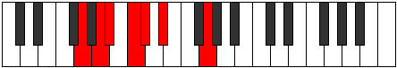

# Mode Marimic

## Links

- [Documentation](README.md)
- [Scales Index](Scales.md)
- [Modes Index](Modes.md)
- [Chords Index](Chords.md)

## Parent Scale

[Manimic](ScaleManimic.md)

## Number

[365](https://ianring.com/musictheory/scales/365)

## Luminosity

5

## Transposition

2, 1, 2, 1, 2, 4

## Chord Pattern

i⁰, ii⁰

## Perfection

- 2 Perfect notes
- 4 Perfect notes

## Perfection Profile

false, false, false, true, false, true

## Permutations

| Tonic | Notes | Signature | Illustration | Audio |
|-------|-------|-----------|--------------|-------|
| [C](ModeCNaturalMarimic.md) | **C**, **D**, **Eb**, F, **Gb**, Ab, **C** | C |  | [midi](https://github.com/edipermadi/music/blob/main/docs/ModeCNaturalMarimic.mid?raw=true) |
| [C#](ModeCSharpMarimic.md) | **C#**, **D#**, **E**, F#, **G**, A, **C#** | C |  | [midi](https://github.com/edipermadi/music/blob/main/docs/ModeCSharpMarimic.mid?raw=true) |
| [Db](ModeDFlatMarimic.md) | **Db**, **Eb**, **Fb**, Gb, **Abb**, Bbb, **Db** | C |  | [midi](https://github.com/edipermadi/music/blob/main/docs/ModeDFlatMarimic.mid?raw=true) |
| [D](ModeDNaturalMarimic.md) | **D**, **E**, **F**, G, **Ab**, Bb, **D** | C |  | [midi](https://github.com/edipermadi/music/blob/main/docs/ModeDNaturalMarimic.mid?raw=true) |
| [D#](ModeDSharpMarimic.md) | **D#**, **E#**, **F#**, G#, **A**, B, **D#** | C |  | [midi](https://github.com/edipermadi/music/blob/main/docs/ModeDSharpMarimic.mid?raw=true) |
| [Eb](ModeEFlatMarimic.md) | **Eb**, **F**, **Gb**, Ab, **Bbb**, Cb, **Eb** | C |  | [midi](https://github.com/edipermadi/music/blob/main/docs/ModeEFlatMarimic.mid?raw=true) |
| [E](ModeENaturalMarimic.md) | **E**, **F#**, **G**, A, **Bb**, C, **E** | C |  | [midi](https://github.com/edipermadi/music/blob/main/docs/ModeENaturalMarimic.mid?raw=true) |
| [F](ModeFNaturalMarimic.md) | **F**, **G**, **Ab**, Bb, **Cb**, Db, **F** | C |  | [midi](https://github.com/edipermadi/music/blob/main/docs/ModeFNaturalMarimic.mid?raw=true) |
| [F#](ModeFSharpMarimic.md) | **F#**, **G#**, **A**, B, **C**, D, **F#** | C |  | [midi](https://github.com/edipermadi/music/blob/main/docs/ModeFSharpMarimic.mid?raw=true) |
| [Gb](ModeGFlatMarimic.md) | **Gb**, **Ab**, **Bbb**, Cb, **Dbb**, Ebb, **Gb** | C |  | [midi](https://github.com/edipermadi/music/blob/main/docs/ModeGFlatMarimic.mid?raw=true) |
| [G](ModeGNaturalMarimic.md) | **G**, **A**, **Bb**, C, **Db**, Eb, **G** | C |  | [midi](https://github.com/edipermadi/music/blob/main/docs/ModeGNaturalMarimic.mid?raw=true) |
| [G#](ModeGSharpMarimic.md) | **G#**, **A#**, **B**, C#, **D**, E, **G#** | C |  | [midi](https://github.com/edipermadi/music/blob/main/docs/ModeGSharpMarimic.mid?raw=true) |
| [Ab](ModeAFlatMarimic.md) | **Ab**, **Bb**, **Cb**, Db, **Ebb**, Fb, **Ab** | C |  | [midi](https://github.com/edipermadi/music/blob/main/docs/ModeAFlatMarimic.mid?raw=true) |
| [A](ModeANaturalMarimic.md) | **A**, **B**, **C**, D, **Eb**, F, **A** | C |  | [midi](https://github.com/edipermadi/music/blob/main/docs/ModeANaturalMarimic.mid?raw=true) |
| [A#](ModeASharpMarimic.md) | **A#**, **B#**, **C#**, D#, **E**, F#, **A#** | C |  | [midi](https://github.com/edipermadi/music/blob/main/docs/ModeASharpMarimic.mid?raw=true) |
| [Bb](ModeBFlatMarimic.md) | **Bb**, **C**, **Db**, Eb, **Fb**, Gb, **Bb** | C |  | [midi](https://github.com/edipermadi/music/blob/main/docs/ModeBFlatMarimic.mid?raw=true) |
| [B](ModeBNaturalMarimic.md) | **B**, **C#**, **D**, E, **F**, G, **B** | C |  | [midi](https://github.com/edipermadi/music/blob/main/docs/ModeBNaturalMarimic.mid?raw=true) |
