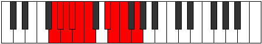

# Mode Marygic

## Links

- [Documentation](index.md)
- [Scales Index](Scales.md)
- [Modes Index](Modes.md)
- [Chords Index](Chords.md)

## Parent Scale

[Kalygic](ScaleKalygic.md)

## Number

[1855](https://ianring.com/musictheory/scales/1855)

## Perfection

- 7 Perfect notes
- 2 Perfect notes

## Perfection Profile

[false true true true false true true true true]

## Permutations

| Tonic | Notes | Signature | Illustration | Audio |
|-------|-------|-----------|--------------|-------|
| [C](ModeCNaturalMarygic.md) | **C**, C#, D, D#, **E**, F, G#, A, A#, **C** | C |  | [midi](ModeCNaturalMarygic.mid) [ogg](ModeCNaturalMarygic.ogg) |
| [C#](ModeCSharpMarygic.md) | **C#**, D, D#, E, **F**, F#, A, A#, B, **C#** | C |  | [midi](ModeCSharpMarygic.mid) [ogg](ModeCSharpMarygic.ogg) |
| [Db](ModeDFlatMarygic.md) | **Db**, D, Eb, E, **F**, Gb, A, Bb, B, **Db** | C |  | [midi](ModeDFlatMarygic.mid) [ogg](ModeDFlatMarygic.ogg) |
| [D](ModeDNaturalMarygic.md) | **D**, D#, E, F, **F#**, G, A#, B, C, **D** | C |  | [midi](ModeDNaturalMarygic.mid) [ogg](ModeDNaturalMarygic.ogg) |
| [D#](ModeDSharpMarygic.md) | **D#**, E, F, F#, **G**, G#, B, C, C#, **D#** | C |  | [midi](ModeDSharpMarygic.mid) [ogg](ModeDSharpMarygic.ogg) |
| [Eb](ModeEFlatMarygic.md) | **Eb**, E, F, Gb, **G**, Ab, B, C, Db, **Eb** | C |  | [midi](ModeEFlatMarygic.mid) [ogg](ModeEFlatMarygic.ogg) |
| [E](ModeENaturalMarygic.md) | **E**, F, F#, G, **G#**, A, C, C#, D, **E** | C |  | [midi](ModeENaturalMarygic.mid) [ogg](ModeENaturalMarygic.ogg) |
| [F](ModeFNaturalMarygic.md) | **F**, F#, G, G#, **A**, A#, C#, D, D#, **F** | C |  | [midi](ModeFNaturalMarygic.mid) [ogg](ModeFNaturalMarygic.ogg) |
| [F#](ModeFSharpMarygic.md) | **F#**, G, G#, A, **A#**, B, D, D#, E, **F#** | C |  | [midi](ModeFSharpMarygic.mid) [ogg](ModeFSharpMarygic.ogg) |
| [Gb](ModeGFlatMarygic.md) | **Gb**, G, Ab, A, **Bb**, B, D, Eb, E, **Gb** | C |  | [midi](ModeGFlatMarygic.mid) [ogg](ModeGFlatMarygic.ogg) |
| [G](ModeGNaturalMarygic.md) | **G**, G#, A, A#, **B**, C, D#, E, F, **G** | C |  | [midi](ModeGNaturalMarygic.mid) [ogg](ModeGNaturalMarygic.ogg) |
| [G#](ModeGSharpMarygic.md) | **G#**, A, A#, B, **C**, C#, E, F, F#, **G#** | C |  | [midi](ModeGSharpMarygic.mid) [ogg](ModeGSharpMarygic.ogg) |
| [Ab](ModeAFlatMarygic.md) | **Ab**, A, Bb, B, **C**, Db, E, F, Gb, **Ab** | C |  | [midi](ModeAFlatMarygic.mid) [ogg](ModeAFlatMarygic.ogg) |
| [A](ModeANaturalMarygic.md) | **A**, A#, B, C, **C#**, D, F, F#, G, **A** | C |  | [midi](ModeANaturalMarygic.mid) [ogg](ModeANaturalMarygic.ogg) |
| [A#](ModeASharpMarygic.md) | **A#**, B, C, C#, **D**, D#, F#, G, G#, **A#** | C |  | [midi](ModeASharpMarygic.mid) [ogg](ModeASharpMarygic.ogg) |
| [Bb](ModeBFlatMarygic.md) | **Bb**, B, C, Db, **D**, Eb, Gb, G, Ab, **Bb** | C |  | [midi](ModeBFlatMarygic.mid) [ogg](ModeBFlatMarygic.ogg) |
| [B](ModeBNaturalMarygic.md) | **B**, C, C#, D, **D#**, E, G, G#, A, **B** | C |  | [midi](ModeBNaturalMarygic.mid) [ogg](ModeBNaturalMarygic.ogg) |
