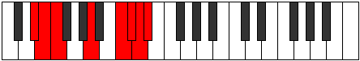

# Mode Mathian

## Links

- [Documentation](README.md)
- [Scales Index](Scales.md)
- [Modes Index](Modes.md)
- [Chords Index](Chords.md)

## Parent Scale

[Thadian](ScaleThadian.md)

## Number

[3655](https://ianring.com/musictheory/scales/3655)

## Interval Pattern

1, 1, 4, 3, 1, 1, 1

## Chord Pattern

IVb5

## Perfection

- 3 Perfect notes
- 4 Perfect notes

## Perfection Profile

[false false true true false false true]

## Permutations

| Tonic | Notes | Signature | Illustration | Audio |
|-------|-------|-----------|--------------|-------|
| [C](ModeCNaturalMathian.md) | **C**, **Db**, Ebb, F#, **G##**, **A#**, B, **C** | C |  | [midi](https://github.com/edipermadi/music/blob/main/docs/ModeCNaturalMathian.mid?raw=true) |
| [C#](ModeCSharpMathian.md) | **C#**, **D**, Eb, F##, **G###**, **A##**, B#, **C#** | C |  | [midi](https://github.com/edipermadi/music/blob/main/docs/ModeCSharpMathian.mid?raw=true) |
| [Db](ModeDFlatMathian.md) | **Db**, **Ebb**, Fbb, G, **A#**, **B**, C, **Db** | C |  | [midi](https://github.com/edipermadi/music/blob/main/docs/ModeDFlatMathian.mid?raw=true) |
| [D](ModeDNaturalMathian.md) | **D**, **Eb**, Fb, G#, **A##**, **B#**, C#, **D** | C |  | [midi](https://github.com/edipermadi/music/blob/main/docs/ModeDNaturalMathian.mid?raw=true) |
| [D#](ModeDSharpMathian.md) | **D#**, **E**, F, G##, **A###**, **B##**, C##, **D#** | C |  | [midi](https://github.com/edipermadi/music/blob/main/docs/ModeDSharpMathian.mid?raw=true) |
| [Eb](ModeEFlatMathian.md) | **Eb**, **Fb**, Gbb, A, **B#**, **C#**, D, **Eb** | C |  | [midi](https://github.com/edipermadi/music/blob/main/docs/ModeEFlatMathian.mid?raw=true) |
| [E](ModeENaturalMathian.md) | **E**, **F**, Gb, A#, **B##**, **C##**, D#, **E** | C |  | [midi](https://github.com/edipermadi/music/blob/main/docs/ModeENaturalMathian.mid?raw=true) |
| [F](ModeFNaturalMathian.md) | **F**, **Gb**, Abb, B, **C##**, **D#**, E, **F** | C |  | [midi](https://github.com/edipermadi/music/blob/main/docs/ModeFNaturalMathian.mid?raw=true) |
| [F#](ModeFSharpMathian.md) | **F#**, **G**, Ab, B#, **C###**, **D##**, E#, **F#** | C |  | [midi](https://github.com/edipermadi/music/blob/main/docs/ModeFSharpMathian.mid?raw=true) |
| [Gb](ModeGFlatMathian.md) | **Gb**, **Abb**, Bbbb, C, **D#**, **E**, F, **Gb** | C |  | [midi](https://github.com/edipermadi/music/blob/main/docs/ModeGFlatMathian.mid?raw=true) |
| [G](ModeGNaturalMathian.md) | **G**, **Ab**, Bbb, C#, **D##**, **E#**, F#, **G** | C |  | [midi](https://github.com/edipermadi/music/blob/main/docs/ModeGNaturalMathian.mid?raw=true) |
| [G#](ModeGSharpMathian.md) | **G#**, **A**, Bb, C##, **D###**, **E##**, F##, **G#** | C |  | [midi](https://github.com/edipermadi/music/blob/main/docs/ModeGSharpMathian.mid?raw=true) |
| [Ab](ModeAFlatMathian.md) | **Ab**, **Bbb**, Cbb, D, **E#**, **F#**, G, **Ab** | C |  | [midi](https://github.com/edipermadi/music/blob/main/docs/ModeAFlatMathian.mid?raw=true) |
| [A](ModeANaturalMathian.md) | **A**, **Bb**, Cb, D#, **E##**, **F##**, G#, **A** | C |  | [midi](https://github.com/edipermadi/music/blob/main/docs/ModeANaturalMathian.mid?raw=true) |
| [A#](ModeASharpMathian.md) | **A#**, **B**, C, D##, **E###**, **F###**, G##, **A#** | C |  | [midi](https://github.com/edipermadi/music/blob/main/docs/ModeASharpMathian.mid?raw=true) |
| [Bb](ModeBFlatMathian.md) | **Bb**, **Cb**, Dbb, E, **F##**, **G#**, A, **Bb** | C |  | [midi](https://github.com/edipermadi/music/blob/main/docs/ModeBFlatMathian.mid?raw=true) |
| [B](ModeBNaturalMathian.md) | **B**, **C**, Db, E#, **F###**, **G##**, A#, **B** | C |  | [midi](https://github.com/edipermadi/music/blob/main/docs/ModeBNaturalMathian.mid?raw=true) |
