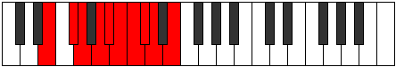

# Mode Mathygic

## Links

- [Documentation](index.md)
- [Scales Index](Scales.md)
- [Modes Index](Modes.md)
- [Chords Index](Chords.md)

## Parent Scale

[Bagygic](ScaleBagygic.md)

## Number

[2029](https://ianring.com/musictheory/scales/2029)

## Interval Pattern

2, 1, 2, 1, 1, 1, 1, 1, 2

## Chord Pattern

i⁰, i, ii⁰, ii, II, II⁺, iii⁰, iii, III, iv, IV, v⁰, V⁺, vi, VII, viii⁰, IX, IX⁺

## Perfection

- 7 Perfect notes
- 2 Perfect notes

## Perfection Profile

[true true true true false true true false true]

## Permutations

| Tonic | Notes | Signature | Illustration | Audio |
|-------|-------|-----------|--------------|-------|
| [C](ModeCNaturalMathygic.md) | C, D, D#, F, **F#**, G, G#, **A**, A#, C | C |  | [midi](https://github.com/edipermadi/music/blob/main/docs/ModeCNaturalMathygic.mid?raw=true) |
| [C#](ModeCSharpMathygic.md) | C#, D#, E, F#, **G**, G#, A, **A#**, B, C# | C |  | [midi](https://github.com/edipermadi/music/blob/main/docs/ModeCSharpMathygic.mid?raw=true) |
| [Db](ModeDFlatMathygic.md) | Db, Eb, E, Gb, **G**, Ab, A, **Bb**, B, Db | C |  | [midi](https://github.com/edipermadi/music/blob/main/docs/ModeDFlatMathygic.mid?raw=true) |
| [D](ModeDNaturalMathygic.md) | D, E, F, G, **G#**, A, A#, **B**, C, D | C |  | [midi](https://github.com/edipermadi/music/blob/main/docs/ModeDNaturalMathygic.mid?raw=true) |
| [D#](ModeDSharpMathygic.md) | D#, F, F#, G#, **A**, A#, B, **C**, C#, D# | C |  | [midi](https://github.com/edipermadi/music/blob/main/docs/ModeDSharpMathygic.mid?raw=true) |
| [Eb](ModeEFlatMathygic.md) | Eb, F, Gb, Ab, **A**, Bb, B, **C**, Db, Eb | C |  | [midi](https://github.com/edipermadi/music/blob/main/docs/ModeEFlatMathygic.mid?raw=true) |
| [E](ModeENaturalMathygic.md) | E, F#, G, A, **A#**, B, C, **C#**, D, E | C |  | [midi](https://github.com/edipermadi/music/blob/main/docs/ModeENaturalMathygic.mid?raw=true) |
| [F](ModeFNaturalMathygic.md) | F, G, G#, A#, **B**, C, C#, **D**, D#, F | C |  | [midi](https://github.com/edipermadi/music/blob/main/docs/ModeFNaturalMathygic.mid?raw=true) |
| [F#](ModeFSharpMathygic.md) | F#, G#, A, B, **C**, C#, D, **D#**, E, F# | C |  | [midi](https://github.com/edipermadi/music/blob/main/docs/ModeFSharpMathygic.mid?raw=true) |
| [Gb](ModeGFlatMathygic.md) | Gb, Ab, A, B, **C**, Db, D, **Eb**, E, Gb | C |  | [midi](https://github.com/edipermadi/music/blob/main/docs/ModeGFlatMathygic.mid?raw=true) |
| [G](ModeGNaturalMathygic.md) | G, A, A#, C, **C#**, D, D#, **E**, F, G | C |  | [midi](https://github.com/edipermadi/music/blob/main/docs/ModeGNaturalMathygic.mid?raw=true) |
| [G#](ModeGSharpMathygic.md) | G#, A#, B, C#, **D**, D#, E, **F**, F#, G# | C |  | [midi](https://github.com/edipermadi/music/blob/main/docs/ModeGSharpMathygic.mid?raw=true) |
| [Ab](ModeAFlatMathygic.md) | Ab, Bb, B, Db, **D**, Eb, E, **F**, Gb, Ab | C |  | [midi](https://github.com/edipermadi/music/blob/main/docs/ModeAFlatMathygic.mid?raw=true) |
| [A](ModeANaturalMathygic.md) | A, B, C, D, **D#**, E, F, **F#**, G, A | C |  | [midi](https://github.com/edipermadi/music/blob/main/docs/ModeANaturalMathygic.mid?raw=true) |
| [A#](ModeASharpMathygic.md) | A#, C, C#, D#, **E**, F, F#, **G**, G#, A# | C |  | [midi](https://github.com/edipermadi/music/blob/main/docs/ModeASharpMathygic.mid?raw=true) |
| [Bb](ModeBFlatMathygic.md) | Bb, C, Db, Eb, **E**, F, Gb, **G**, Ab, Bb | C |  | [midi](https://github.com/edipermadi/music/blob/main/docs/ModeBFlatMathygic.mid?raw=true) |
| [B](ModeBNaturalMathygic.md) | B, C#, D, E, **F**, F#, G, **G#**, A, B | C |  | [midi](https://github.com/edipermadi/music/blob/main/docs/ModeBNaturalMathygic.mid?raw=true) |
