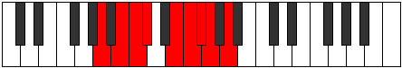

# Mode Mathyllic

## Links

- [Documentation](index.md)
- [Scales Index](Scales.md)
- [Modes Index](Modes.md)
- [Chords Index](Chords.md)

## Parent Scale

[Bacryllic](ScaleBacryllic.md)

## Number

[1949](https://ianring.com/musictheory/scales/1949)

## Interval Pattern

2, 1, 1, 3, 1, 1, 1, 2

## Chord Pattern

i, vii⁰

## Perfection

- 6 Perfect notes
- 2 Perfect notes

## Perfection Profile

[true true true false true true true false]

## Permutations

| Tonic | Notes | Signature | Illustration | Audio |
|-------|-------|-----------|--------------|-------|
| [C](ModeCNaturalMathyllic.md) | C, D, D#, **E**, G, G#, A, **A#**, C | C |  | [midi](https://github.com/edipermadi/music/blob/main/docs/ModeCNaturalMathyllic.mid?raw=true) |
| [C#](ModeCSharpMathyllic.md) | C#, D#, E, **F**, G#, A, A#, **B**, C# | C |  | [midi](https://github.com/edipermadi/music/blob/main/docs/ModeCSharpMathyllic.mid?raw=true) |
| [Db](ModeDFlatMathyllic.md) | Db, Eb, E, **F**, Ab, A, Bb, **B**, Db | C |  | [midi](https://github.com/edipermadi/music/blob/main/docs/ModeDFlatMathyllic.mid?raw=true) |
| [D](ModeDNaturalMathyllic.md) | D, E, F, **F#**, A, A#, B, **C**, D | C |  | [midi](https://github.com/edipermadi/music/blob/main/docs/ModeDNaturalMathyllic.mid?raw=true) |
| [D#](ModeDSharpMathyllic.md) | D#, F, F#, **G**, A#, B, C, **C#**, D# | C |  | [midi](https://github.com/edipermadi/music/blob/main/docs/ModeDSharpMathyllic.mid?raw=true) |
| [Eb](ModeEFlatMathyllic.md) | Eb, F, Gb, **G**, Bb, B, C, **Db**, Eb | C |  | [midi](https://github.com/edipermadi/music/blob/main/docs/ModeEFlatMathyllic.mid?raw=true) |
| [E](ModeENaturalMathyllic.md) | E, F#, G, **G#**, B, C, C#, **D**, E | C |  | [midi](https://github.com/edipermadi/music/blob/main/docs/ModeENaturalMathyllic.mid?raw=true) |
| [F](ModeFNaturalMathyllic.md) | F, G, G#, **A**, C, C#, D, **D#**, F | C |  | [midi](https://github.com/edipermadi/music/blob/main/docs/ModeFNaturalMathyllic.mid?raw=true) |
| [F#](ModeFSharpMathyllic.md) | F#, G#, A, **A#**, C#, D, D#, **E**, F# | C |  | [midi](https://github.com/edipermadi/music/blob/main/docs/ModeFSharpMathyllic.mid?raw=true) |
| [Gb](ModeGFlatMathyllic.md) | Gb, Ab, A, **Bb**, Db, D, Eb, **E**, Gb | C |  | [midi](https://github.com/edipermadi/music/blob/main/docs/ModeGFlatMathyllic.mid?raw=true) |
| [G](ModeGNaturalMathyllic.md) | G, A, A#, **B**, D, D#, E, **F**, G | C |  | [midi](https://github.com/edipermadi/music/blob/main/docs/ModeGNaturalMathyllic.mid?raw=true) |
| [G#](ModeGSharpMathyllic.md) | G#, A#, B, **C**, D#, E, F, **F#**, G# | C |  | [midi](https://github.com/edipermadi/music/blob/main/docs/ModeGSharpMathyllic.mid?raw=true) |
| [Ab](ModeAFlatMathyllic.md) | Ab, Bb, B, **C**, Eb, E, F, **Gb**, Ab | C |  | [midi](https://github.com/edipermadi/music/blob/main/docs/ModeAFlatMathyllic.mid?raw=true) |
| [A](ModeANaturalMathyllic.md) | A, B, C, **C#**, E, F, F#, **G**, A | C |  | [midi](https://github.com/edipermadi/music/blob/main/docs/ModeANaturalMathyllic.mid?raw=true) |
| [A#](ModeASharpMathyllic.md) | A#, C, C#, **D**, F, F#, G, **G#**, A# | C |  | [midi](https://github.com/edipermadi/music/blob/main/docs/ModeASharpMathyllic.mid?raw=true) |
| [Bb](ModeBFlatMathyllic.md) | Bb, C, Db, **D**, F, Gb, G, **Ab**, Bb | C |  | [midi](https://github.com/edipermadi/music/blob/main/docs/ModeBFlatMathyllic.mid?raw=true) |
| [B](ModeBNaturalMathyllic.md) | B, C#, D, **D#**, F#, G, G#, **A**, B | C |  | [midi](https://github.com/edipermadi/music/blob/main/docs/ModeBNaturalMathyllic.mid?raw=true) |
