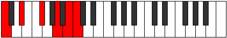
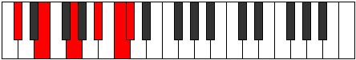
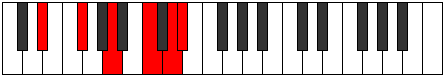

# Mode Mixitonic

## Links

- [Documentation](index.md)
- [Scales Index](Scales.md)
- [Modes Index](Modes.md)
- [Chords Index](Chords.md)

## Parent Scale

[Mixitonic](ScaleMixitonic.md)

## Number

[2633](https://ianring.com/musictheory/scales/2633)

## Interval Pattern

3, 3, 3, 2, 1

## Chord Pattern

i⁰, ii⁰, iii⁰, iv⁰, V

## Perfection

- 1 Perfect notes
- 4 Perfect notes

## Perfection Profile

[false false false false true]

## Permutations

| Tonic | Notes | Signature | Illustration | Audio |
|-------|-------|-----------|--------------|-------|
| [C](ModeCNaturalMixitonic.md) | **C**, **D#**, **F#**, **A**, B, **C** | C |  | [midi](https://github.com/edipermadi/music/blob/main/docs/ModeCNaturalMixitonic.mid?raw=true) |
| [C#](ModeCSharpMixitonic.md) | **C#**, **E**, **G**, **A#**, C, **C#** | C |  | [midi](https://github.com/edipermadi/music/blob/main/docs/ModeCSharpMixitonic.mid?raw=true) |
| [Db](ModeDFlatMixitonic.md) | **Db**, **E**, **G**, **Bb**, C, **Db** | C |  | [midi](https://github.com/edipermadi/music/blob/main/docs/ModeDFlatMixitonic.mid?raw=true) |
| [D](ModeDNaturalMixitonic.md) | **D**, **F**, **G#**, **B**, C#, **D** | C |  | [midi](https://github.com/edipermadi/music/blob/main/docs/ModeDNaturalMixitonic.mid?raw=true) |
| [D#](ModeDSharpMixitonic.md) | **D#**, **F#**, **A**, **C**, D, **D#** | C |  | [midi](https://github.com/edipermadi/music/blob/main/docs/ModeDSharpMixitonic.mid?raw=true) |
| [Eb](ModeEFlatMixitonic.md) | **Eb**, **Gb**, **A**, **C**, D, **Eb** | C |  | [midi](https://github.com/edipermadi/music/blob/main/docs/ModeEFlatMixitonic.mid?raw=true) |
| [E](ModeENaturalMixitonic.md) | **E**, **G**, **A#**, **C#**, D#, **E** | C |  | [midi](https://github.com/edipermadi/music/blob/main/docs/ModeENaturalMixitonic.mid?raw=true) |
| [F](ModeFNaturalMixitonic.md) | **F**, **G#**, **B**, **D**, E, **F** | C |  | [midi](https://github.com/edipermadi/music/blob/main/docs/ModeFNaturalMixitonic.mid?raw=true) |
| [F#](ModeFSharpMixitonic.md) | **F#**, **A**, **C**, **D#**, F, **F#** | C |  | [midi](https://github.com/edipermadi/music/blob/main/docs/ModeFSharpMixitonic.mid?raw=true) |
| [Gb](ModeGFlatMixitonic.md) | **Gb**, **A**, **C**, **Eb**, F, **Gb** | C |  | [midi](https://github.com/edipermadi/music/blob/main/docs/ModeGFlatMixitonic.mid?raw=true) |
| [G](ModeGNaturalMixitonic.md) | **G**, **A#**, **C#**, **E**, F#, **G** | C |  | [midi](https://github.com/edipermadi/music/blob/main/docs/ModeGNaturalMixitonic.mid?raw=true) |
| [G#](ModeGSharpMixitonic.md) | **G#**, **B**, **D**, **F**, G, **G#** | C |  | [midi](https://github.com/edipermadi/music/blob/main/docs/ModeGSharpMixitonic.mid?raw=true) |
| [Ab](ModeAFlatMixitonic.md) | **Ab**, **B**, **D**, **F**, G, **Ab** | C |  | [midi](https://github.com/edipermadi/music/blob/main/docs/ModeAFlatMixitonic.mid?raw=true) |
| [A](ModeANaturalMixitonic.md) | **A**, **C**, **D#**, **F#**, G#, **A** | C |  | [midi](https://github.com/edipermadi/music/blob/main/docs/ModeANaturalMixitonic.mid?raw=true) |
| [A#](ModeASharpMixitonic.md) | **A#**, **C#**, **E**, **G**, A, **A#** | C |  | [midi](https://github.com/edipermadi/music/blob/main/docs/ModeASharpMixitonic.mid?raw=true) |
| [Bb](ModeBFlatMixitonic.md) | **Bb**, **Db**, **E**, **G**, A, **Bb** | C |  | [midi](https://github.com/edipermadi/music/blob/main/docs/ModeBFlatMixitonic.mid?raw=true) |
| [B](ModeBNaturalMixitonic.md) | **B**, **D**, **F**, **G#**, A#, **B** | C |  | [midi](https://github.com/edipermadi/music/blob/main/docs/ModeBNaturalMixitonic.mid?raw=true) |
