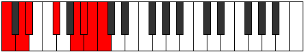

# Mode Mixodorian

## Links

- [Documentation](README.md)
- [Scales Index](Scales.md)
- [Modes Index](Modes.md)
- [Chords Index](Chords.md)

## Parent Scale

[Gacrian](ScaleGacrian.md)

## Number

[3661](https://ianring.com/musictheory/scales/3661)

## Interval Pattern

2, 1, 3, 3, 1, 1, 1

## Chord Pattern

II⁺, vii

## Perfection

- 3 Perfect notes
- 4 Perfect notes

## Perfection Profile

[false true true false false false true]

## Permutations

| Tonic | Notes | Signature | Illustration | Audio |
|-------|-------|-----------|--------------|-------|
| [C](ModeCNaturalMixodorian.md) | **C**, D, Eb, **F#**, **G##**, **A#**, B, **C** | C |  | [midi](https://github.com/edipermadi/music/blob/main/docs/ModeCNaturalMixodorian.mid?raw=true) |
| [C#](ModeCSharpMixodorian.md) | **C#**, D#, E, **F##**, **G###**, **A##**, B#, **C#** | C |  | [midi](https://github.com/edipermadi/music/blob/main/docs/ModeCSharpMixodorian.mid?raw=true) |
| [Db](ModeDFlatMixodorian.md) | **Db**, Eb, Fb, **G**, **A#**, **B**, C, **Db** | C |  | [midi](https://github.com/edipermadi/music/blob/main/docs/ModeDFlatMixodorian.mid?raw=true) |
| [D](ModeDNaturalMixodorian.md) | **D**, E, F, **G#**, **A##**, **B#**, C#, **D** | C |  | [midi](https://github.com/edipermadi/music/blob/main/docs/ModeDNaturalMixodorian.mid?raw=true) |
| [D#](ModeDSharpMixodorian.md) | **D#**, E#, F#, **G##**, **A###**, **B##**, C##, **D#** | C |  | [midi](https://github.com/edipermadi/music/blob/main/docs/ModeDSharpMixodorian.mid?raw=true) |
| [Eb](ModeEFlatMixodorian.md) | **Eb**, F, Gb, **A**, **B#**, **C#**, D, **Eb** | C |  | [midi](https://github.com/edipermadi/music/blob/main/docs/ModeEFlatMixodorian.mid?raw=true) |
| [E](ModeENaturalMixodorian.md) | **E**, F#, G, **A#**, **B##**, **C##**, D#, **E** | C |  | [midi](https://github.com/edipermadi/music/blob/main/docs/ModeENaturalMixodorian.mid?raw=true) |
| [F](ModeFNaturalMixodorian.md) | **F**, G, Ab, **B**, **C##**, **D#**, E, **F** | C |  | [midi](https://github.com/edipermadi/music/blob/main/docs/ModeFNaturalMixodorian.mid?raw=true) |
| [F#](ModeFSharpMixodorian.md) | **F#**, G#, A, **B#**, **C###**, **D##**, E#, **F#** | C |  | [midi](https://github.com/edipermadi/music/blob/main/docs/ModeFSharpMixodorian.mid?raw=true) |
| [Gb](ModeGFlatMixodorian.md) | **Gb**, Ab, Bbb, **C**, **D#**, **E**, F, **Gb** | C |  | [midi](https://github.com/edipermadi/music/blob/main/docs/ModeGFlatMixodorian.mid?raw=true) |
| [G](ModeGNaturalMixodorian.md) | **G**, A, Bb, **C#**, **D##**, **E#**, F#, **G** | C |  | [midi](https://github.com/edipermadi/music/blob/main/docs/ModeGNaturalMixodorian.mid?raw=true) |
| [G#](ModeGSharpMixodorian.md) | **G#**, A#, B, **C##**, **D###**, **E##**, F##, **G#** | C |  | [midi](https://github.com/edipermadi/music/blob/main/docs/ModeGSharpMixodorian.mid?raw=true) |
| [Ab](ModeAFlatMixodorian.md) | **Ab**, Bb, Cb, **D**, **E#**, **F#**, G, **Ab** | C |  | [midi](https://github.com/edipermadi/music/blob/main/docs/ModeAFlatMixodorian.mid?raw=true) |
| [A](ModeANaturalMixodorian.md) | **A**, B, C, **D#**, **E##**, **F##**, G#, **A** | C |  | [midi](https://github.com/edipermadi/music/blob/main/docs/ModeANaturalMixodorian.mid?raw=true) |
| [A#](ModeASharpMixodorian.md) | **A#**, B#, C#, **D##**, **E###**, **F###**, G##, **A#** | C |  | [midi](https://github.com/edipermadi/music/blob/main/docs/ModeASharpMixodorian.mid?raw=true) |
| [Bb](ModeBFlatMixodorian.md) | **Bb**, C, Db, **E**, **F##**, **G#**, A, **Bb** | C |  | [midi](https://github.com/edipermadi/music/blob/main/docs/ModeBFlatMixodorian.mid?raw=true) |
| [B](ModeBNaturalMixodorian.md) | **B**, C#, D, **E#**, **F###**, **G##**, A#, **B** | C |  | [midi](https://github.com/edipermadi/music/blob/main/docs/ModeBNaturalMixodorian.mid?raw=true) |
