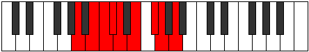

# Mode Mixodyllic

## Links

- [Documentation](README.md)
- [Scales Index](Scales.md)
- [Modes Index](Modes.md)
- [Chords Index](Chords.md)

## Parent Scale

[Aerycryllic](ScaleAerycryllic.md)

## Number

[1725](https://ianring.com/musictheory/scales/1725)

## Transposition

2, 1, 1, 1, 2, 2, 1, 2

## Chord Pattern

iii⁰b3, iv⁰, V, vi, vii⁰, VIIIb5

## Perfection

- 7 Perfect notes
- 1 Perfect notes

## Perfection Profile

[true true true false true true true true]

## Permutations

| Tonic | Notes | Signature | Illustration | Audio |
|-------|-------|-----------|--------------|-------|
| [C](ModeCNaturalMixodyllic.md) | C, D, D#, **E**, F, G, A, A#, C | C |  | [midi](https://github.com/edipermadi/music/blob/main/docs/ModeCNaturalMixodyllic.mid?raw=true) |
| [C#](ModeCSharpMixodyllic.md) | C#, D#, E, **F**, F#, G#, A#, B, C# | C |  | [midi](https://github.com/edipermadi/music/blob/main/docs/ModeCSharpMixodyllic.mid?raw=true) |
| [Db](ModeDFlatMixodyllic.md) | Db, Eb, E, **F**, Gb, Ab, Bb, B, Db | C |  | [midi](https://github.com/edipermadi/music/blob/main/docs/ModeDFlatMixodyllic.mid?raw=true) |
| [D](ModeDNaturalMixodyllic.md) | D, E, F, **F#**, G, A, B, C, D | C |  | [midi](https://github.com/edipermadi/music/blob/main/docs/ModeDNaturalMixodyllic.mid?raw=true) |
| [D#](ModeDSharpMixodyllic.md) | D#, F, F#, **G**, G#, A#, C, C#, D# | C |  | [midi](https://github.com/edipermadi/music/blob/main/docs/ModeDSharpMixodyllic.mid?raw=true) |
| [Eb](ModeEFlatMixodyllic.md) | Eb, F, Gb, **G**, Ab, Bb, C, Db, Eb | C |  | [midi](https://github.com/edipermadi/music/blob/main/docs/ModeEFlatMixodyllic.mid?raw=true) |
| [E](ModeENaturalMixodyllic.md) | E, F#, G, **G#**, A, B, C#, D, E | C |  | [midi](https://github.com/edipermadi/music/blob/main/docs/ModeENaturalMixodyllic.mid?raw=true) |
| [F](ModeFNaturalMixodyllic.md) | F, G, G#, **A**, A#, C, D, D#, F | C |  | [midi](https://github.com/edipermadi/music/blob/main/docs/ModeFNaturalMixodyllic.mid?raw=true) |
| [F#](ModeFSharpMixodyllic.md) | F#, G#, A, **A#**, B, C#, D#, E, F# | C |  | [midi](https://github.com/edipermadi/music/blob/main/docs/ModeFSharpMixodyllic.mid?raw=true) |
| [Gb](ModeGFlatMixodyllic.md) | Gb, Ab, A, **Bb**, B, Db, Eb, E, Gb | C |  | [midi](https://github.com/edipermadi/music/blob/main/docs/ModeGFlatMixodyllic.mid?raw=true) |
| [G](ModeGNaturalMixodyllic.md) | G, A, A#, **B**, C, D, E, F, G | C |  | [midi](https://github.com/edipermadi/music/blob/main/docs/ModeGNaturalMixodyllic.mid?raw=true) |
| [G#](ModeGSharpMixodyllic.md) | G#, A#, B, **C**, C#, D#, F, F#, G# | C |  | [midi](https://github.com/edipermadi/music/blob/main/docs/ModeGSharpMixodyllic.mid?raw=true) |
| [Ab](ModeAFlatMixodyllic.md) | Ab, Bb, B, **C**, Db, Eb, F, Gb, Ab | C |  | [midi](https://github.com/edipermadi/music/blob/main/docs/ModeAFlatMixodyllic.mid?raw=true) |
| [A](ModeANaturalMixodyllic.md) | A, B, C, **C#**, D, E, F#, G, A | C |  | [midi](https://github.com/edipermadi/music/blob/main/docs/ModeANaturalMixodyllic.mid?raw=true) |
| [A#](ModeASharpMixodyllic.md) | A#, C, C#, **D**, D#, F, G, G#, A# | C |  | [midi](https://github.com/edipermadi/music/blob/main/docs/ModeASharpMixodyllic.mid?raw=true) |
| [Bb](ModeBFlatMixodyllic.md) | Bb, C, Db, **D**, Eb, F, G, Ab, Bb | C |  | [midi](https://github.com/edipermadi/music/blob/main/docs/ModeBFlatMixodyllic.mid?raw=true) |
| [B](ModeBNaturalMixodyllic.md) | B, C#, D, **D#**, E, F#, G#, A, B | C |  | [midi](https://github.com/edipermadi/music/blob/main/docs/ModeBNaturalMixodyllic.mid?raw=true) |
