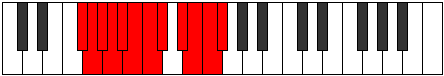
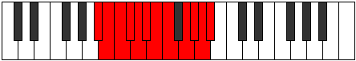

# Mode Mixolatic

## Links

- [Documentation](index.md)
- [Scales Index](Scales.md)
- [Modes Index](Modes.md)
- [Chords Index](Chords.md)

## Parent Scale

[Aerycratic](ScaleAerycratic.md)

## Number

[3839](https://ianring.com/musictheory/scales/3839)

## Perfection

- 10 Perfect notes
- 1 Perfect notes

## Perfection Profile

[true false true true true true true true true true true]

## Permutations

| Tonic | Notes | Signature | Illustration | Audio |
|-------|-------|-----------|--------------|-------|
| [C](ModeCNaturalMixolatic.md) | C, **C#**, D, D#, E, F, F#, G, A, A#, B, C | C |  | [midi](ModeCNaturalMixolatic.mid) [ogg](ModeCNaturalMixolatic.ogg) |
| [C#](ModeCSharpMixolatic.md) | C#, **D**, D#, E, F, F#, G, G#, A#, B, C, C# | C |  | [midi](ModeCSharpMixolatic.mid) [ogg](ModeCSharpMixolatic.ogg) |
| [Db](ModeDFlatMixolatic.md) | Db, **D**, Eb, E, F, Gb, G, Ab, Bb, B, C, Db | C |  | [midi](ModeDFlatMixolatic.mid) [ogg](ModeDFlatMixolatic.ogg) |
| [D](ModeDNaturalMixolatic.md) | D, **D#**, E, F, F#, G, G#, A, B, C, C#, D | C |  | [midi](ModeDNaturalMixolatic.mid) [ogg](ModeDNaturalMixolatic.ogg) |
| [D#](ModeDSharpMixolatic.md) | D#, **E**, F, F#, G, G#, A, A#, C, C#, D, D# | C |  | [midi](ModeDSharpMixolatic.mid) [ogg](ModeDSharpMixolatic.ogg) |
| [Eb](ModeEFlatMixolatic.md) | Eb, **E**, F, Gb, G, Ab, A, Bb, C, Db, D, Eb | C |  | [midi](ModeEFlatMixolatic.mid) [ogg](ModeEFlatMixolatic.ogg) |
| [E](ModeENaturalMixolatic.md) | E, **F**, F#, G, G#, A, A#, B, C#, D, D#, E | C |  | [midi](ModeENaturalMixolatic.mid) [ogg](ModeENaturalMixolatic.ogg) |
| [F](ModeFNaturalMixolatic.md) | F, **F#**, G, G#, A, A#, B, C, D, D#, E, F | C |  | [midi](ModeFNaturalMixolatic.mid) [ogg](ModeFNaturalMixolatic.ogg) |
| [F#](ModeFSharpMixolatic.md) | F#, **G**, G#, A, A#, B, C, C#, D#, E, F, F# | C |  | [midi](ModeFSharpMixolatic.mid) [ogg](ModeFSharpMixolatic.ogg) |
| [Gb](ModeGFlatMixolatic.md) | Gb, **G**, Ab, A, Bb, B, C, Db, Eb, E, F, Gb | C |  | [midi](ModeGFlatMixolatic.mid) [ogg](ModeGFlatMixolatic.ogg) |
| [G](ModeGNaturalMixolatic.md) | G, **G#**, A, A#, B, C, C#, D, E, F, F#, G | C |  | [midi](ModeGNaturalMixolatic.mid) [ogg](ModeGNaturalMixolatic.ogg) |
| [G#](ModeGSharpMixolatic.md) | G#, **A**, A#, B, C, C#, D, D#, F, F#, G, G# | C |  | [midi](ModeGSharpMixolatic.mid) [ogg](ModeGSharpMixolatic.ogg) |
| [Ab](ModeAFlatMixolatic.md) | Ab, **A**, Bb, B, C, Db, D, Eb, F, Gb, G, Ab | C |  | [midi](ModeAFlatMixolatic.mid) [ogg](ModeAFlatMixolatic.ogg) |
| [A](ModeANaturalMixolatic.md) | A, **A#**, B, C, C#, D, D#, E, F#, G, G#, A | C |  | [midi](ModeANaturalMixolatic.mid) [ogg](ModeANaturalMixolatic.ogg) |
| [A#](ModeASharpMixolatic.md) | A#, **B**, C, C#, D, D#, E, F, G, G#, A, A# | C |  | [midi](ModeASharpMixolatic.mid) [ogg](ModeASharpMixolatic.ogg) |
| [Bb](ModeBFlatMixolatic.md) | Bb, **B**, C, Db, D, Eb, E, F, G, Ab, A, Bb | C |  | [midi](ModeBFlatMixolatic.mid) [ogg](ModeBFlatMixolatic.ogg) |
| [B](ModeBNaturalMixolatic.md) | B, **C**, C#, D, D#, E, F, F#, G#, A, A#, B | C |  | [midi](ModeBNaturalMixolatic.mid) [ogg](ModeBNaturalMixolatic.ogg) |
