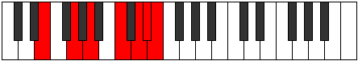

# Mode Mixolimic

## Links

- [Documentation](index.md)
- [Scales Index](Scales.md)
- [Modes Index](Modes.md)
- [Chords Index](Chords.md)

## Parent Scale

[Mixolimic](ScaleMixolimic.md)

## Number

[3369](https://ianring.com/musictheory/scales/3369)

## Perfection

- 4 Perfect notes
- 2 Perfect notes

## Perfection Profile

[false true true true true false]

## Permutations

| Tonic | Notes | Signature | Illustration | Audio |
|-------|-------|-----------|--------------|-------|
| [C](ModeCNaturalMixolimic.md) | **C**, D#, E#, F###, G###, **A##**, **C** | C |  | [midi](ModeCNaturalMixolimic.mid) [ogg](ModeCNaturalMixolimic.ogg) |
| [C#](ModeCSharpMixolimic.md) | **C#**, D##, E##, Cbbb, Dbbb, **Dbb**, **C#** | C |  | [midi](ModeCSharpMixolimic.mid) [ogg](ModeCSharpMixolimic.ogg) |
| [Db](ModeDFlatMixolimic.md) | **Db**, E, F#, G##, A##, **B#**, **Db** | C |  | [midi](ModeDFlatMixolimic.mid) [ogg](ModeDFlatMixolimic.ogg) |
| [D](ModeDNaturalMixolimic.md) | **D**, E#, F##, G###, A###, **B##**, **D** | C |  | [midi](ModeDNaturalMixolimic.mid) [ogg](ModeDNaturalMixolimic.ogg) |
| [D#](ModeDSharpMixolimic.md) | **D#**, E##, F###, Cb, Db, **Ebb**, **D#** | C |  | [midi](ModeDSharpMixolimic.mid) [ogg](ModeDSharpMixolimic.ogg) |
| [Eb](ModeEFlatMixolimic.md) | **Eb**, F#, G#, A##, B##, **C##**, **Eb** | C |  | [midi](ModeEFlatMixolimic.mid) [ogg](ModeEFlatMixolimic.ogg) |
| [E](ModeENaturalMixolimic.md) | **E**, F##, G##, A###, B###, **C###**, **E** | C |  | [midi](ModeENaturalMixolimic.mid) [ogg](ModeENaturalMixolimic.ogg) |
| [F](ModeFNaturalMixolimic.md) | **F**, G#, A#, B##, C###, **D##**, **F** | C |  | [midi](ModeFNaturalMixolimic.mid) [ogg](ModeFNaturalMixolimic.ogg) |
| [F#](ModeFSharpMixolimic.md) | **F#**, G##, A##, B###, D##, **E#**, **F#** | C |  | [midi](ModeFSharpMixolimic.mid) [ogg](ModeFSharpMixolimic.ogg) |
| [Gb](ModeGFlatMixolimic.md) | **Gb**, A, B, C##, D##, **E#**, **Gb** | C |  | [midi](ModeGFlatMixolimic.mid) [ogg](ModeGFlatMixolimic.ogg) |
| [G](ModeGNaturalMixolimic.md) | **G**, A#, B#, C###, D###, **E##**, **G** | C |  | [midi](ModeGNaturalMixolimic.mid) [ogg](ModeGNaturalMixolimic.ogg) |
| [G#](ModeGSharpMixolimic.md) | **G#**, A##, B##, D##, E##, **F##**, **G#** | C |  | [midi](ModeGSharpMixolimic.mid) [ogg](ModeGSharpMixolimic.ogg) |
| [Ab](ModeAFlatMixolimic.md) | **Ab**, B, C#, D##, E##, **F##**, **Ab** | C |  | [midi](ModeAFlatMixolimic.mid) [ogg](ModeAFlatMixolimic.ogg) |
| [A](ModeANaturalMixolimic.md) | **A**, B#, C##, D###, E###, **F###**, **A** | C |  | [midi](ModeANaturalMixolimic.mid) [ogg](ModeANaturalMixolimic.ogg) |
| [A#](ModeASharpMixolimic.md) | **A#**, B##, C###, E##, F###, **G##**, **A#** | C |  | [midi](ModeASharpMixolimic.mid) [ogg](ModeASharpMixolimic.ogg) |
| [Bb](ModeBFlatMixolimic.md) | **Bb**, C#, D#, E##, F###, **G##**, **Bb** | C |  | [midi](ModeBFlatMixolimic.mid) [ogg](ModeBFlatMixolimic.ogg) |
| [B](ModeBNaturalMixolimic.md) | **B**, C##, D##, E###, Cbbb, **Cbb**, **B** | C |  | [midi](ModeBNaturalMixolimic.mid) [ogg](ModeBNaturalMixolimic.ogg) |
