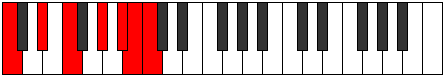

# Mode Mixolimic

## Links

- [Documentation](README.md)
- [Scales Index](Scales.md)
- [Modes Index](Modes.md)
- [Chords Index](Chords.md)

## Parent Scale

[Mixolimic](ScaleMixolimic.md)

## Number

[3369](https://ianring.com/musictheory/scales/3369)

## Transposition

3, 2, 3, 2, 1, 1

## Chord Pattern

iv

## Perfection

- 4 Perfect notes
- 2 Perfect notes

## Perfection Profile

false, true, true, true, true, false

## Permutations

| Tonic | Notes | Signature | Illustration | Audio |
|-------|-------|-----------|--------------|-------|
| [C](ModeCNaturalMixolimic.md) | **C**, D#, E#, F###, G###, **A##**, **C** | C |  | [midi](https://github.com/edipermadi/music/blob/main/docs/ModeCNaturalMixolimic.mid?raw=true) |
| [C#](ModeCSharpMixolimic.md) | **C#**, D##, E##, Cbbb, Dbbb, **Dbb**, **C#** | C |  | [midi](https://github.com/edipermadi/music/blob/main/docs/ModeCSharpMixolimic.mid?raw=true) |
| [Db](ModeDFlatMixolimic.md) | **Db**, E, F#, G##, A##, **B#**, **Db** | C |  | [midi](https://github.com/edipermadi/music/blob/main/docs/ModeDFlatMixolimic.mid?raw=true) |
| [D](ModeDNaturalMixolimic.md) | **D**, E#, F##, G###, A###, **B##**, **D** | C |  | [midi](https://github.com/edipermadi/music/blob/main/docs/ModeDNaturalMixolimic.mid?raw=true) |
| [D#](ModeDSharpMixolimic.md) | **D#**, E##, F###, Cb, Db, **Ebb**, **D#** | C |  | [midi](https://github.com/edipermadi/music/blob/main/docs/ModeDSharpMixolimic.mid?raw=true) |
| [Eb](ModeEFlatMixolimic.md) | **Eb**, F#, G#, A##, B##, **C##**, **Eb** | C |  | [midi](https://github.com/edipermadi/music/blob/main/docs/ModeEFlatMixolimic.mid?raw=true) |
| [E](ModeENaturalMixolimic.md) | **E**, F##, G##, A###, B###, **C###**, **E** | C |  | [midi](https://github.com/edipermadi/music/blob/main/docs/ModeENaturalMixolimic.mid?raw=true) |
| [F](ModeFNaturalMixolimic.md) | **F**, G#, A#, B##, C###, **D##**, **F** | C |  | [midi](https://github.com/edipermadi/music/blob/main/docs/ModeFNaturalMixolimic.mid?raw=true) |
| [F#](ModeFSharpMixolimic.md) | **F#**, G##, A##, B###, D##, **E#**, **F#** | C |  | [midi](https://github.com/edipermadi/music/blob/main/docs/ModeFSharpMixolimic.mid?raw=true) |
| [Gb](ModeGFlatMixolimic.md) | **Gb**, A, B, C##, D##, **E#**, **Gb** | C |  | [midi](https://github.com/edipermadi/music/blob/main/docs/ModeGFlatMixolimic.mid?raw=true) |
| [G](ModeGNaturalMixolimic.md) | **G**, A#, B#, C###, D###, **E##**, **G** | C |  | [midi](https://github.com/edipermadi/music/blob/main/docs/ModeGNaturalMixolimic.mid?raw=true) |
| [G#](ModeGSharpMixolimic.md) | **G#**, A##, B##, D##, E##, **F##**, **G#** | C |  | [midi](https://github.com/edipermadi/music/blob/main/docs/ModeGSharpMixolimic.mid?raw=true) |
| [Ab](ModeAFlatMixolimic.md) | **Ab**, B, C#, D##, E##, **F##**, **Ab** | C |  | [midi](https://github.com/edipermadi/music/blob/main/docs/ModeAFlatMixolimic.mid?raw=true) |
| [A](ModeANaturalMixolimic.md) | **A**, B#, C##, D###, E###, **F###**, **A** | C |  | [midi](https://github.com/edipermadi/music/blob/main/docs/ModeANaturalMixolimic.mid?raw=true) |
| [A#](ModeASharpMixolimic.md) | **A#**, B##, C###, E##, F###, **G##**, **A#** | C |  | [midi](https://github.com/edipermadi/music/blob/main/docs/ModeASharpMixolimic.mid?raw=true) |
| [Bb](ModeBFlatMixolimic.md) | **Bb**, C#, D#, E##, F###, **G##**, **Bb** | C |  | [midi](https://github.com/edipermadi/music/blob/main/docs/ModeBFlatMixolimic.mid?raw=true) |
| [B](ModeBNaturalMixolimic.md) | **B**, C##, D##, E###, Cbbb, **Cbb**, **B** | C |  | [midi](https://github.com/edipermadi/music/blob/main/docs/ModeBNaturalMixolimic.mid?raw=true) |
