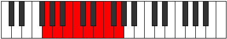

# Mode Mixolydian

## Links

- [Documentation](README.md)
- [Scales Index](Scales.md)
- [Modes Index](Modes.md)
- [Chords Index](Chords.md)

## Parent Scale

[Lydian](ScaleLydian.md)

## Number

[1717](https://ianring.com/musictheory/scales/1717)

## Interval Pattern

2, 2, 1, 2, 2, 1, 2

## Chord Pattern

I, ii, iii⁰, IV, v, vi, VII

## Perfection

- 6 Perfect notes
- 1 Perfect notes

## Perfection Profile

[true true false true true true true]

## Permutations

| Tonic | Notes | Signature | Illustration | Audio |
|-------|-------|-----------|--------------|-------|
| [C](ModeCNaturalMixolydian.md) | C, D, **E**, F, G, A, Bb, C | F |  | [midi](https://github.com/edipermadi/music/blob/main/docs/ModeCNaturalMixolydian.mid?raw=true) |
| [C#](ModeCSharpMixolydian.md) | C#, D#, **E#**, F#, G#, A#, B, C# | F#, Gb |  | [midi](https://github.com/edipermadi/music/blob/main/docs/ModeCSharpMixolydian.mid?raw=true) |
| [Db](ModeDFlatMixolydian.md) | Db, Eb, **F**, Gb, Ab, Bb, Cb, Db | F#, Gb |  | [midi](https://github.com/edipermadi/music/blob/main/docs/ModeDFlatMixolydian.mid?raw=true) |
| [D](ModeDNaturalMixolydian.md) | D, E, **F#**, G, A, B, C, D | G |  | [midi](https://github.com/edipermadi/music/blob/main/docs/ModeDNaturalMixolydian.mid?raw=true) |
| [D#](ModeDSharpMixolydian.md) | D#, E#, **F##**, G#, A#, B#, C#, D# | Ab |  | [midi](https://github.com/edipermadi/music/blob/main/docs/ModeDSharpMixolydian.mid?raw=true) |
| [Eb](ModeEFlatMixolydian.md) | Eb, F, **G**, Ab, Bb, C, Db, Eb | Ab |  | [midi](https://github.com/edipermadi/music/blob/main/docs/ModeEFlatMixolydian.mid?raw=true) |
| [E](ModeENaturalMixolydian.md) | E, F#, **G#**, A, B, C#, D, E | A |  | [midi](https://github.com/edipermadi/music/blob/main/docs/ModeENaturalMixolydian.mid?raw=true) |
| [F](ModeFNaturalMixolydian.md) | F, G, **A**, Bb, C, D, Eb, F | Bb |  | [midi](https://github.com/edipermadi/music/blob/main/docs/ModeFNaturalMixolydian.mid?raw=true) |
| [F#](ModeFSharpMixolydian.md) | F#, G#, **A#**, B, C#, D#, E, F# | B |  | [midi](https://github.com/edipermadi/music/blob/main/docs/ModeFSharpMixolydian.mid?raw=true) |
| [Gb](ModeGFlatMixolydian.md) | Gb, Ab, **Bb**, Cb, Db, Eb, Fb, Gb | B |  | [midi](https://github.com/edipermadi/music/blob/main/docs/ModeGFlatMixolydian.mid?raw=true) |
| [G](ModeGNaturalMixolydian.md) | G, A, **B**, C, D, E, F, G | C |  | [midi](https://github.com/edipermadi/music/blob/main/docs/ModeGNaturalMixolydian.mid?raw=true) |
| [G#](ModeGSharpMixolydian.md) | G#, A#, **B#**, C#, D#, E#, F#, G# | Db, C# |  | [midi](https://github.com/edipermadi/music/blob/main/docs/ModeGSharpMixolydian.mid?raw=true) |
| [Ab](ModeAFlatMixolydian.md) | Ab, Bb, **C**, Db, Eb, F, Gb, Ab | Db, C# |  | [midi](https://github.com/edipermadi/music/blob/main/docs/ModeAFlatMixolydian.mid?raw=true) |
| [A](ModeANaturalMixolydian.md) | A, B, **C#**, D, E, F#, G, A | D |  | [midi](https://github.com/edipermadi/music/blob/main/docs/ModeANaturalMixolydian.mid?raw=true) |
| [A#](ModeASharpMixolydian.md) | A#, B#, **C##**, D#, E#, F##, G#, A# | Eb |  | [midi](https://github.com/edipermadi/music/blob/main/docs/ModeASharpMixolydian.mid?raw=true) |
| [Bb](ModeBFlatMixolydian.md) | Bb, C, **D**, Eb, F, G, Ab, Bb | Eb |  | [midi](https://github.com/edipermadi/music/blob/main/docs/ModeBFlatMixolydian.mid?raw=true) |
| [B](ModeBNaturalMixolydian.md) | B, C#, **D#**, E, F#, G#, A, B | E |  | [midi](https://github.com/edipermadi/music/blob/main/docs/ModeBNaturalMixolydian.mid?raw=true) |
