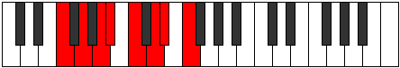

# Mode Mixolydian

## Links

- [Documentation](index.md)
- [Scales Index](Scales.md)
- [Modes Index](Modes.md)
- [Chords Index](Chords.md)

## Parent Scale

[Lydian](ScaleLydian.md)

## Number

[1717](https://ianring.com/musictheory/scales/1717)

## Perfection

- 6 Perfect notes
- 1 Perfect notes

## Perfection Profile

[true true false true true true true]

## Permutations

| Tonic | Notes | Signature | Illustration | Audio |
|-------|-------|-----------|--------------|-------|
| [C](ModeCNaturalMixolydian.md) | C, D, **E**, F, G, A, Bb, C | F |  | [midi](ModeCNaturalMixolydian.mid) [ogg](ModeCNaturalMixolydian.ogg) |
| [C#](ModeCSharpMixolydian.md) | C#, D#, **E#**, F#, G#, A#, B, C# | F#, Gb |  | [midi](ModeCSharpMixolydian.mid) [ogg](ModeCSharpMixolydian.ogg) |
| [Db](ModeDFlatMixolydian.md) | Db, Eb, **F**, Gb, Ab, Bb, Cb, Db | F#, Gb |  | [midi](ModeDFlatMixolydian.mid) [ogg](ModeDFlatMixolydian.ogg) |
| [D](ModeDNaturalMixolydian.md) | D, E, **F#**, G, A, B, C, D | G |  | [midi](ModeDNaturalMixolydian.mid) [ogg](ModeDNaturalMixolydian.ogg) |
| [D#](ModeDSharpMixolydian.md) | D#, E#, **F##**, G#, A#, B#, C#, D# | Ab |  | [midi](ModeDSharpMixolydian.mid) [ogg](ModeDSharpMixolydian.ogg) |
| [Eb](ModeEFlatMixolydian.md) | Eb, F, **G**, Ab, Bb, C, Db, Eb | Ab |  | [midi](ModeEFlatMixolydian.mid) [ogg](ModeEFlatMixolydian.ogg) |
| [E](ModeENaturalMixolydian.md) | E, F#, **G#**, A, B, C#, D, E | A |  | [midi](ModeENaturalMixolydian.mid) [ogg](ModeENaturalMixolydian.ogg) |
| [F](ModeFNaturalMixolydian.md) | F, G, **A**, Bb, C, D, Eb, F | Bb |  | [midi](ModeFNaturalMixolydian.mid) [ogg](ModeFNaturalMixolydian.ogg) |
| [F#](ModeFSharpMixolydian.md) | F#, G#, **A#**, B, C#, D#, E, F# | B |  | [midi](ModeFSharpMixolydian.mid) [ogg](ModeFSharpMixolydian.ogg) |
| [Gb](ModeGFlatMixolydian.md) | Gb, Ab, **Bb**, Cb, Db, Eb, Fb, Gb | B |  | [midi](ModeGFlatMixolydian.mid) [ogg](ModeGFlatMixolydian.ogg) |
| [G](ModeGNaturalMixolydian.md) | G, A, **B**, C, D, E, F, G | C |  | [midi](ModeGNaturalMixolydian.mid) [ogg](ModeGNaturalMixolydian.ogg) |
| [G#](ModeGSharpMixolydian.md) | G#, A#, **B#**, C#, D#, E#, F#, G# | Db, C# |  | [midi](ModeGSharpMixolydian.mid) [ogg](ModeGSharpMixolydian.ogg) |
| [Ab](ModeAFlatMixolydian.md) | Ab, Bb, **C**, Db, Eb, F, Gb, Ab | Db, C# |  | [midi](ModeAFlatMixolydian.mid) [ogg](ModeAFlatMixolydian.ogg) |
| [A](ModeANaturalMixolydian.md) | A, B, **C#**, D, E, F#, G, A | D |  | [midi](ModeANaturalMixolydian.mid) [ogg](ModeANaturalMixolydian.ogg) |
| [A#](ModeASharpMixolydian.md) | A#, B#, **C##**, D#, E#, F##, G#, A# | Eb |  | [midi](ModeASharpMixolydian.mid) [ogg](ModeASharpMixolydian.ogg) |
| [Bb](ModeBFlatMixolydian.md) | Bb, C, **D**, Eb, F, G, Ab, Bb | Eb |  | [midi](ModeBFlatMixolydian.mid) [ogg](ModeBFlatMixolydian.ogg) |
| [B](ModeBNaturalMixolydian.md) | B, C#, **D#**, E, F#, G#, A, B | E |  | [midi](ModeBNaturalMixolydian.mid) [ogg](ModeBNaturalMixolydian.ogg) |
