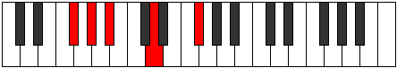
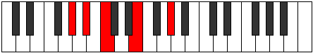
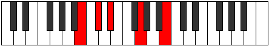

# Mode Mixolyric

## Links

- [Documentation](index.md)
- [Scales Index](Scales.md)
- [Modes Index](Modes.md)
- [Chords Index](Chords.md)

## Parent Scale

[Aeolic](ScaleAeolic.md)

## Number

[277](https://ianring.com/musictheory/scales/277)

## Perfection

- 0 Perfect notes
- 4 Perfect notes

## Perfection Profile

[false false false false]

## Permutations

| Tonic | Notes | Signature | Illustration | Audio |
|-------|-------|-----------|--------------|-------|
| [C](ModeCNaturalMixolyric.md) | **C**, **D**, **E**, **G#**, **C** | C |  | [midi](ModeCNaturalMixolyric.mid) [ogg](ModeCNaturalMixolyric.ogg) |
| [C#](ModeCSharpMixolyric.md) | **C#**, **D#**, **F**, **A**, **C#** | C |  | [midi](ModeCSharpMixolyric.mid) [ogg](ModeCSharpMixolyric.ogg) |
| [Db](ModeDFlatMixolyric.md) | **Db**, **Eb**, **F**, **A**, **Db** | C |  | [midi](ModeDFlatMixolyric.mid) [ogg](ModeDFlatMixolyric.ogg) |
| [D](ModeDNaturalMixolyric.md) | **D**, **E**, **F#**, **A#**, **D** | C |  | [midi](ModeDNaturalMixolyric.mid) [ogg](ModeDNaturalMixolyric.ogg) |
| [D#](ModeDSharpMixolyric.md) | **D#**, **F**, **G**, **B**, **D#** | C |  | [midi](ModeDSharpMixolyric.mid) [ogg](ModeDSharpMixolyric.ogg) |
| [Eb](ModeEFlatMixolyric.md) | **Eb**, **F**, **G**, **B**, **Eb** | C |  | [midi](ModeEFlatMixolyric.mid) [ogg](ModeEFlatMixolyric.ogg) |
| [E](ModeENaturalMixolyric.md) | **E**, **F#**, **G#**, **C**, **E** | C |  | [midi](ModeENaturalMixolyric.mid) [ogg](ModeENaturalMixolyric.ogg) |
| [F](ModeFNaturalMixolyric.md) | **F**, **G**, **A**, **C#**, **F** | C |  | [midi](ModeFNaturalMixolyric.mid) [ogg](ModeFNaturalMixolyric.ogg) |
| [F#](ModeFSharpMixolyric.md) | **F#**, **G#**, **A#**, **D**, **F#** | C |  | [midi](ModeFSharpMixolyric.mid) [ogg](ModeFSharpMixolyric.ogg) |
| [Gb](ModeGFlatMixolyric.md) | **Gb**, **Ab**, **Bb**, **D**, **Gb** | C |  | [midi](ModeGFlatMixolyric.mid) [ogg](ModeGFlatMixolyric.ogg) |
| [G](ModeGNaturalMixolyric.md) | **G**, **A**, **B**, **D#**, **G** | C |  | [midi](ModeGNaturalMixolyric.mid) [ogg](ModeGNaturalMixolyric.ogg) |
| [G#](ModeGSharpMixolyric.md) | **G#**, **A#**, **C**, **E**, **G#** | C |  | [midi](ModeGSharpMixolyric.mid) [ogg](ModeGSharpMixolyric.ogg) |
| [Ab](ModeAFlatMixolyric.md) | **Ab**, **Bb**, **C**, **E**, **Ab** | C |  | [midi](ModeAFlatMixolyric.mid) [ogg](ModeAFlatMixolyric.ogg) |
| [A](ModeANaturalMixolyric.md) | **A**, **B**, **C#**, **F**, **A** | C |  | [midi](ModeANaturalMixolyric.mid) [ogg](ModeANaturalMixolyric.ogg) |
| [A#](ModeASharpMixolyric.md) | **A#**, **C**, **D**, **F#**, **A#** | C |  | [midi](ModeASharpMixolyric.mid) [ogg](ModeASharpMixolyric.ogg) |
| [Bb](ModeBFlatMixolyric.md) | **Bb**, **C**, **D**, **Gb**, **Bb** | C |  | [midi](ModeBFlatMixolyric.mid) [ogg](ModeBFlatMixolyric.ogg) |
| [B](ModeBNaturalMixolyric.md) | **B**, **C#**, **D#**, **G**, **B** | C |  | [midi](ModeBNaturalMixolyric.mid) [ogg](ModeBNaturalMixolyric.ogg) |
