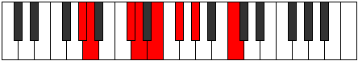
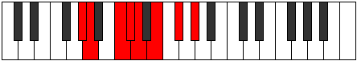
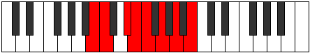

# Mode Mixonorian

## Links

- [Documentation](index.md)
- [Scales Index](Scales.md)
- [Modes Index](Modes.md)
- [Chords Index](Chords.md)

## Parent Scale

[Dolian](ScaleDolian.md)

## Number

[1395](https://ianring.com/musictheory/scales/1395)

## Perfection

- 4 Perfect notes
- 3 Perfect notes

## Interval Pattern

1, 3, 1, 1, 2, 2, 2

## Perfection Profile

[false true false true true false true]

## Permutations

| Tonic | Notes | Signature | Illustration | Audio |
|-------|-------|-----------|--------------|-------|
| [C](ModeCNaturalMixonorian.md) | **C**, Db, **E**, F, Gb, **Ab**, Bb, **C** | C |  | [midi](https://github.com/edipermadi/music/blob/main/docs/ModeCNaturalMixonorian.mid?raw=true) |
| [C#](ModeCSharpMixonorian.md) | **C#**, D, **E#**, F#, G, **A**, B, **C#** | C |  | [midi](https://github.com/edipermadi/music/blob/main/docs/ModeCSharpMixonorian.mid?raw=true) |
| [Db](ModeDFlatMixonorian.md) | **Db**, Ebb, **F**, Gb, Abb, **Bbb**, Cb, **Db** | C |  | [midi](https://github.com/edipermadi/music/blob/main/docs/ModeDFlatMixonorian.mid?raw=true) |
| [D](ModeDNaturalMixonorian.md) | **D**, Eb, **F#**, G, Ab, **Bb**, C, **D** | C |  | [midi](https://github.com/edipermadi/music/blob/main/docs/ModeDNaturalMixonorian.mid?raw=true) |
| [D#](ModeDSharpMixonorian.md) | **D#**, E, **F##**, G#, A, **B**, C#, **D#** | C |  | [midi](https://github.com/edipermadi/music/blob/main/docs/ModeDSharpMixonorian.mid?raw=true) |
| [Eb](ModeEFlatMixonorian.md) | **Eb**, Fb, **G**, Ab, Bbb, **Cb**, Db, **Eb** | C |  | [midi](https://github.com/edipermadi/music/blob/main/docs/ModeEFlatMixonorian.mid?raw=true) |
| [E](ModeENaturalMixonorian.md) | **E**, F, **G#**, A, Bb, **C**, D, **E** | C |  | [midi](https://github.com/edipermadi/music/blob/main/docs/ModeENaturalMixonorian.mid?raw=true) |
| [F](ModeFNaturalMixonorian.md) | **F**, Gb, **A**, Bb, Cb, **Db**, Eb, **F** | C |  | [midi](https://github.com/edipermadi/music/blob/main/docs/ModeFNaturalMixonorian.mid?raw=true) |
| [F#](ModeFSharpMixonorian.md) | **F#**, G, **A#**, B, C, **D**, E, **F#** | C |  | [midi](https://github.com/edipermadi/music/blob/main/docs/ModeFSharpMixonorian.mid?raw=true) |
| [Gb](ModeGFlatMixonorian.md) | **Gb**, Abb, **Bb**, Cb, Dbb, **Ebb**, Fb, **Gb** | C |  | [midi](https://github.com/edipermadi/music/blob/main/docs/ModeGFlatMixonorian.mid?raw=true) |
| [G](ModeGNaturalMixonorian.md) | **G**, Ab, **B**, C, Db, **Eb**, F, **G** | C |  | [midi](https://github.com/edipermadi/music/blob/main/docs/ModeGNaturalMixonorian.mid?raw=true) |
| [G#](ModeGSharpMixonorian.md) | **G#**, A, **B#**, C#, D, **E**, F#, **G#** | C |  | [midi](https://github.com/edipermadi/music/blob/main/docs/ModeGSharpMixonorian.mid?raw=true) |
| [Ab](ModeAFlatMixonorian.md) | **Ab**, Bbb, **C**, Db, Ebb, **Fb**, Gb, **Ab** | C |  | [midi](https://github.com/edipermadi/music/blob/main/docs/ModeAFlatMixonorian.mid?raw=true) |
| [A](ModeANaturalMixonorian.md) | **A**, Bb, **C#**, D, Eb, **F**, G, **A** | C |  | [midi](https://github.com/edipermadi/music/blob/main/docs/ModeANaturalMixonorian.mid?raw=true) |
| [A#](ModeASharpMixonorian.md) | **A#**, B, **C##**, D#, E, **F#**, G#, **A#** | C |  | [midi](https://github.com/edipermadi/music/blob/main/docs/ModeASharpMixonorian.mid?raw=true) |
| [Bb](ModeBFlatMixonorian.md) | **Bb**, Cb, **D**, Eb, Fb, **Gb**, Ab, **Bb** | C |  | [midi](https://github.com/edipermadi/music/blob/main/docs/ModeBFlatMixonorian.mid?raw=true) |
| [B](ModeBNaturalMixonorian.md) | **B**, C, **D#**, E, F, **G**, A, **B** | C |  | [midi](https://github.com/edipermadi/music/blob/main/docs/ModeBNaturalMixonorian.mid?raw=true) |
