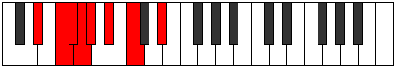

# Mode Mixonyphian

## Links

- [Documentation](index.md)
- [Scales Index](Scales.md)
- [Modes Index](Modes.md)
- [Chords Index](Chords.md)

## Parent Scale

[Stathian](ScaleStathian.md)

## Number

[701](https://ianring.com/musictheory/scales/701)

## Interval Pattern

2, 1, 1, 1, 2, 2, 3

## Chord Pattern

i, I, ii, V, vii⁰, vii

## Perfection

- 5 Perfect notes
- 2 Perfect notes

## Perfection Profile

[true true false false true true true]

## Permutations

| Tonic | Notes | Signature | Illustration | Audio |
|-------|-------|-----------|--------------|-------|
| [C](ModeCNaturalMixonyphian.md) | C, D, **Eb**, **Fb**, Gbb, Abb, Bbb, C | C |  | [midi](https://github.com/edipermadi/music/blob/main/docs/ModeCNaturalMixonyphian.mid?raw=true) |
| [C#](ModeCSharpMixonyphian.md) | C#, D#, **E**, **F**, Gb, Ab, Bb, C# | C |  | [midi](https://github.com/edipermadi/music/blob/main/docs/ModeCSharpMixonyphian.mid?raw=true) |
| [Db](ModeDFlatMixonyphian.md) | Db, Eb, **Fb**, **Gbb**, Abbb, Bbbb, Cbb, Db | C |  | [midi](https://github.com/edipermadi/music/blob/main/docs/ModeDFlatMixonyphian.mid?raw=true) |
| [D](ModeDNaturalMixonyphian.md) | D, E, **F**, **Gb**, Abb, Bbb, Cb, D | C |  | [midi](https://github.com/edipermadi/music/blob/main/docs/ModeDNaturalMixonyphian.mid?raw=true) |
| [D#](ModeDSharpMixonyphian.md) | D#, E#, **F#**, **G**, Ab, Bb, C, D# | C |  | [midi](https://github.com/edipermadi/music/blob/main/docs/ModeDSharpMixonyphian.mid?raw=true) |
| [Eb](ModeEFlatMixonyphian.md) | Eb, F, **Gb**, **Abb**, Bbbb, Cbb, Dbb, Eb | C |  | [midi](https://github.com/edipermadi/music/blob/main/docs/ModeEFlatMixonyphian.mid?raw=true) |
| [E](ModeENaturalMixonyphian.md) | E, F#, **G**, **Ab**, Bbb, Cb, Db, E | C |  | [midi](https://github.com/edipermadi/music/blob/main/docs/ModeENaturalMixonyphian.mid?raw=true) |
| [F](ModeFNaturalMixonyphian.md) | F, G, **Ab**, **Bbb**, Cbb, Dbb, Ebb, F | C |  | [midi](https://github.com/edipermadi/music/blob/main/docs/ModeFNaturalMixonyphian.mid?raw=true) |
| [F#](ModeFSharpMixonyphian.md) | F#, G#, **A**, **Bb**, Cb, Db, Eb, F# | C |  | [midi](https://github.com/edipermadi/music/blob/main/docs/ModeFSharpMixonyphian.mid?raw=true) |
| [Gb](ModeGFlatMixonyphian.md) | Gb, Ab, **Bbb**, **Cbb**, Dbbb, Ebbb, Fbb, Gb | C |  | [midi](https://github.com/edipermadi/music/blob/main/docs/ModeGFlatMixonyphian.mid?raw=true) |
| [G](ModeGNaturalMixonyphian.md) | G, A, **Bb**, **Cb**, Dbb, Ebb, Fb, G | C |  | [midi](https://github.com/edipermadi/music/blob/main/docs/ModeGNaturalMixonyphian.mid?raw=true) |
| [G#](ModeGSharpMixonyphian.md) | G#, A#, **B**, **C**, Db, Eb, F, G# | C |  | [midi](https://github.com/edipermadi/music/blob/main/docs/ModeGSharpMixonyphian.mid?raw=true) |
| [Ab](ModeAFlatMixonyphian.md) | Ab, Bb, **Cb**, **Dbb**, Ebbb, Fbb, Gbb, Ab | C |  | [midi](https://github.com/edipermadi/music/blob/main/docs/ModeAFlatMixonyphian.mid?raw=true) |
| [A](ModeANaturalMixonyphian.md) | A, B, **C**, **Db**, Ebb, Fb, Gb, A | C |  | [midi](https://github.com/edipermadi/music/blob/main/docs/ModeANaturalMixonyphian.mid?raw=true) |
| [A#](ModeASharpMixonyphian.md) | A#, B#, **C#**, **D**, Eb, F, G, A# | C |  | [midi](https://github.com/edipermadi/music/blob/main/docs/ModeASharpMixonyphian.mid?raw=true) |
| [Bb](ModeBFlatMixonyphian.md) | Bb, C, **Db**, **Ebb**, Fbb, Gbb, Abb, Bb | C |  | [midi](https://github.com/edipermadi/music/blob/main/docs/ModeBFlatMixonyphian.mid?raw=true) |
| [B](ModeBNaturalMixonyphian.md) | B, C#, **D**, **Eb**, Fb, Gb, Ab, B | C |  | [midi](https://github.com/edipermadi/music/blob/main/docs/ModeBNaturalMixonyphian.mid?raw=true) |
