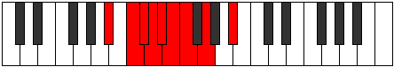

# Mode Mixonyphyllic

## Links

- [Documentation](README.md)
- [Scales Index](Scales.md)
- [Modes Index](Modes.md)
- [Chords Index](Chords.md)

## Parent Scale

[Mixolydyllic](ScaleMixolydyllic.md)

## Number

[765](https://ianring.com/musictheory/scales/765)

## Luminosity

7

## Transposition

2, 1, 1, 1, 1, 1, 2, 3

## Chord Pattern

## Perfection

- 5 Perfect notes
- 3 Perfect notes

## Perfection Profile

true, true, false, false, true, false, true, true

## Permutations

| Tonic | Notes | Signature | Illustration | Audio |
|-------|-------|-----------|--------------|-------|
| [C](ModeCNaturalMixonyphyllic.md) | C, D, **D#**, **E**, F, **F#**, G, A, C | C |  | [midi](https://github.com/edipermadi/music/blob/main/docs/ModeCNaturalMixonyphyllic.mid?raw=true) |
| [C#](ModeCSharpMixonyphyllic.md) | C#, D#, **E**, **F**, F#, **G**, G#, A#, C# | C |  | [midi](https://github.com/edipermadi/music/blob/main/docs/ModeCSharpMixonyphyllic.mid?raw=true) |
| [Db](ModeDFlatMixonyphyllic.md) | Db, Eb, **E**, **F**, Gb, **G**, Ab, Bb, Db | C |  | [midi](https://github.com/edipermadi/music/blob/main/docs/ModeDFlatMixonyphyllic.mid?raw=true) |
| [D](ModeDNaturalMixonyphyllic.md) | D, E, **F**, **F#**, G, **G#**, A, B, D | C |  | [midi](https://github.com/edipermadi/music/blob/main/docs/ModeDNaturalMixonyphyllic.mid?raw=true) |
| [D#](ModeDSharpMixonyphyllic.md) | D#, F, **F#**, **G**, G#, **A**, A#, C, D# | C |  | [midi](https://github.com/edipermadi/music/blob/main/docs/ModeDSharpMixonyphyllic.mid?raw=true) |
| [Eb](ModeEFlatMixonyphyllic.md) | Eb, F, **Gb**, **G**, Ab, **A**, Bb, C, Eb | C |  | [midi](https://github.com/edipermadi/music/blob/main/docs/ModeEFlatMixonyphyllic.mid?raw=true) |
| [E](ModeENaturalMixonyphyllic.md) | E, F#, **G**, **G#**, A, **A#**, B, C#, E | C |  | [midi](https://github.com/edipermadi/music/blob/main/docs/ModeENaturalMixonyphyllic.mid?raw=true) |
| [F](ModeFNaturalMixonyphyllic.md) | F, G, **G#**, **A**, A#, **B**, C, D, F | C |  | [midi](https://github.com/edipermadi/music/blob/main/docs/ModeFNaturalMixonyphyllic.mid?raw=true) |
| [F#](ModeFSharpMixonyphyllic.md) | F#, G#, **A**, **A#**, B, **C**, C#, D#, F# | C |  | [midi](https://github.com/edipermadi/music/blob/main/docs/ModeFSharpMixonyphyllic.mid?raw=true) |
| [Gb](ModeGFlatMixonyphyllic.md) | Gb, Ab, **A**, **Bb**, B, **C**, Db, Eb, Gb | C |  | [midi](https://github.com/edipermadi/music/blob/main/docs/ModeGFlatMixonyphyllic.mid?raw=true) |
| [G](ModeGNaturalMixonyphyllic.md) | G, A, **A#**, **B**, C, **C#**, D, E, G | C |  | [midi](https://github.com/edipermadi/music/blob/main/docs/ModeGNaturalMixonyphyllic.mid?raw=true) |
| [G#](ModeGSharpMixonyphyllic.md) | G#, A#, **B**, **C**, C#, **D**, D#, F, G# | C |  | [midi](https://github.com/edipermadi/music/blob/main/docs/ModeGSharpMixonyphyllic.mid?raw=true) |
| [Ab](ModeAFlatMixonyphyllic.md) | Ab, Bb, **B**, **C**, Db, **D**, Eb, F, Ab | C |  | [midi](https://github.com/edipermadi/music/blob/main/docs/ModeAFlatMixonyphyllic.mid?raw=true) |
| [A](ModeANaturalMixonyphyllic.md) | A, B, **C**, **C#**, D, **D#**, E, F#, A | C |  | [midi](https://github.com/edipermadi/music/blob/main/docs/ModeANaturalMixonyphyllic.mid?raw=true) |
| [A#](ModeASharpMixonyphyllic.md) | A#, C, **C#**, **D**, D#, **E**, F, G, A# | C |  | [midi](https://github.com/edipermadi/music/blob/main/docs/ModeASharpMixonyphyllic.mid?raw=true) |
| [Bb](ModeBFlatMixonyphyllic.md) | Bb, C, **Db**, **D**, Eb, **E**, F, G, Bb | C |  | [midi](https://github.com/edipermadi/music/blob/main/docs/ModeBFlatMixonyphyllic.mid?raw=true) |
| [B](ModeBNaturalMixonyphyllic.md) | B, C#, **D**, **D#**, E, **F**, F#, G#, B | C |  | [midi](https://github.com/edipermadi/music/blob/main/docs/ModeBNaturalMixonyphyllic.mid?raw=true) |
