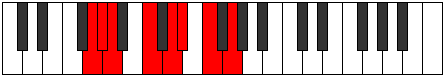

# Mode Mixopyrian

## Links

- [Documentation](index.md)
- [Scales Index](Scales.md)
- [Modes Index](Modes.md)
- [Chords Index](Chords.md)

## Parent Scale

[Thonian](ScaleThonian.md)

## Number

[1447](https://ianring.com/musictheory/scales/1447)

## Perfection

- 5 Perfect notes
- 2 Perfect notes

## Perfection Profile

[true true false true true false true]

## Permutations

| Tonic | Notes | Signature | Illustration | Audio |
|-------|-------|-----------|--------------|-------|
| [C](ModeCNaturalMixopyrian.md) | C, Db, **Ebb**, F, G, **Ab**, Bb, C | C |  | [midi](https://github.com/edipermadi/music/blob/main/docs/ModeCNaturalMixopyrian.mid?raw=true) |
| [C#](ModeCSharpMixopyrian.md) | C#, D, **Eb**, F#, G#, **A**, B, C# | C |  | [midi](https://github.com/edipermadi/music/blob/main/docs/ModeCSharpMixopyrian.mid?raw=true) |
| [Db](ModeDFlatMixopyrian.md) | Db, Ebb, **Fbb**, Gb, Ab, **Bbb**, Cb, Db | C |  | [midi](https://github.com/edipermadi/music/blob/main/docs/ModeDFlatMixopyrian.mid?raw=true) |
| [D](ModeDNaturalMixopyrian.md) | D, Eb, **Fb**, G, A, **Bb**, C, D | C |  | [midi](https://github.com/edipermadi/music/blob/main/docs/ModeDNaturalMixopyrian.mid?raw=true) |
| [D#](ModeDSharpMixopyrian.md) | D#, E, **F**, G#, A#, **B**, C#, D# | C |  | [midi](https://github.com/edipermadi/music/blob/main/docs/ModeDSharpMixopyrian.mid?raw=true) |
| [Eb](ModeEFlatMixopyrian.md) | Eb, Fb, **Gbb**, Ab, Bb, **Cb**, Db, Eb | C |  | [midi](https://github.com/edipermadi/music/blob/main/docs/ModeEFlatMixopyrian.mid?raw=true) |
| [E](ModeENaturalMixopyrian.md) | E, F, **Gb**, A, B, **C**, D, E | C |  | [midi](https://github.com/edipermadi/music/blob/main/docs/ModeENaturalMixopyrian.mid?raw=true) |
| [F](ModeFNaturalMixopyrian.md) | F, Gb, **Abb**, Bb, C, **Db**, Eb, F | C |  | [midi](https://github.com/edipermadi/music/blob/main/docs/ModeFNaturalMixopyrian.mid?raw=true) |
| [F#](ModeFSharpMixopyrian.md) | F#, G, **Ab**, B, C#, **D**, E, F# | C |  | [midi](https://github.com/edipermadi/music/blob/main/docs/ModeFSharpMixopyrian.mid?raw=true) |
| [Gb](ModeGFlatMixopyrian.md) | Gb, Abb, **Bbbb**, Cb, Db, **Ebb**, Fb, Gb | C |  | [midi](https://github.com/edipermadi/music/blob/main/docs/ModeGFlatMixopyrian.mid?raw=true) |
| [G](ModeGNaturalMixopyrian.md) | G, Ab, **Bbb**, C, D, **Eb**, F, G | C |  | [midi](https://github.com/edipermadi/music/blob/main/docs/ModeGNaturalMixopyrian.mid?raw=true) |
| [G#](ModeGSharpMixopyrian.md) | G#, A, **Bb**, C#, D#, **E**, F#, G# | C |  | [midi](https://github.com/edipermadi/music/blob/main/docs/ModeGSharpMixopyrian.mid?raw=true) |
| [Ab](ModeAFlatMixopyrian.md) | Ab, Bbb, **Cbb**, Db, Eb, **Fb**, Gb, Ab | C |  | [midi](https://github.com/edipermadi/music/blob/main/docs/ModeAFlatMixopyrian.mid?raw=true) |
| [A](ModeANaturalMixopyrian.md) | A, Bb, **Cb**, D, E, **F**, G, A | C |  | [midi](https://github.com/edipermadi/music/blob/main/docs/ModeANaturalMixopyrian.mid?raw=true) |
| [A#](ModeASharpMixopyrian.md) | A#, B, **C**, D#, E#, **F#**, G#, A# | C |  | [midi](https://github.com/edipermadi/music/blob/main/docs/ModeASharpMixopyrian.mid?raw=true) |
| [Bb](ModeBFlatMixopyrian.md) | Bb, Cb, **Dbb**, Eb, F, **Gb**, Ab, Bb | C |  | [midi](https://github.com/edipermadi/music/blob/main/docs/ModeBFlatMixopyrian.mid?raw=true) |
| [B](ModeBNaturalMixopyrian.md) | B, C, **Db**, E, F#, **G**, A, B | C |  | [midi](https://github.com/edipermadi/music/blob/main/docs/ModeBNaturalMixopyrian.mid?raw=true) |
