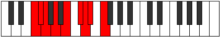

# Mode Mixoryllic

## Links

- [Documentation](README.md)
- [Scales Index](Scales.md)
- [Modes Index](Modes.md)
- [Chords Index](Chords.md)

## Parent Scale

[Racryllic](ScaleRacryllic.md)

## Number

[1879](https://ianring.com/musictheory/scales/1879)

## Transposition

1, 1, 2, 2, 2, 1, 1, 2

## Chord Pattern

i⁰b3, ii, III, IVb5, v⁰, viii⁰

## Perfection

- 4 Perfect notes
- 4 Perfect notes

## Perfection Profile

[false true true false true false true false]

## Permutations

| Tonic | Notes | Signature | Illustration | Audio |
|-------|-------|-----------|--------------|-------|
| [C](ModeCNaturalMixoryllic.md) | **C**, C#, D, **E**, F#, **G#**, A, **A#**, **C** | C |  | [midi](https://github.com/edipermadi/music/blob/main/docs/ModeCNaturalMixoryllic.mid?raw=true) |
| [C#](ModeCSharpMixoryllic.md) | **C#**, D, D#, **F**, G, **A**, A#, **B**, **C#** | C |  | [midi](https://github.com/edipermadi/music/blob/main/docs/ModeCSharpMixoryllic.mid?raw=true) |
| [Db](ModeDFlatMixoryllic.md) | **Db**, D, Eb, **F**, G, **A**, Bb, **B**, **Db** | C |  | [midi](https://github.com/edipermadi/music/blob/main/docs/ModeDFlatMixoryllic.mid?raw=true) |
| [D](ModeDNaturalMixoryllic.md) | **D**, D#, E, **F#**, G#, **A#**, B, **C**, **D** | C |  | [midi](https://github.com/edipermadi/music/blob/main/docs/ModeDNaturalMixoryllic.mid?raw=true) |
| [D#](ModeDSharpMixoryllic.md) | **D#**, E, F, **G**, A, **B**, C, **C#**, **D#** | C |  | [midi](https://github.com/edipermadi/music/blob/main/docs/ModeDSharpMixoryllic.mid?raw=true) |
| [Eb](ModeEFlatMixoryllic.md) | **Eb**, E, F, **G**, A, **B**, C, **Db**, **Eb** | C |  | [midi](https://github.com/edipermadi/music/blob/main/docs/ModeEFlatMixoryllic.mid?raw=true) |
| [E](ModeENaturalMixoryllic.md) | **E**, F, F#, **G#**, A#, **C**, C#, **D**, **E** | C |  | [midi](https://github.com/edipermadi/music/blob/main/docs/ModeENaturalMixoryllic.mid?raw=true) |
| [F](ModeFNaturalMixoryllic.md) | **F**, F#, G, **A**, B, **C#**, D, **D#**, **F** | C |  | [midi](https://github.com/edipermadi/music/blob/main/docs/ModeFNaturalMixoryllic.mid?raw=true) |
| [F#](ModeFSharpMixoryllic.md) | **F#**, G, G#, **A#**, C, **D**, D#, **E**, **F#** | C |  | [midi](https://github.com/edipermadi/music/blob/main/docs/ModeFSharpMixoryllic.mid?raw=true) |
| [Gb](ModeGFlatMixoryllic.md) | **Gb**, G, Ab, **Bb**, C, **D**, Eb, **E**, **Gb** | C |  | [midi](https://github.com/edipermadi/music/blob/main/docs/ModeGFlatMixoryllic.mid?raw=true) |
| [G](ModeGNaturalMixoryllic.md) | **G**, G#, A, **B**, C#, **D#**, E, **F**, **G** | C |  | [midi](https://github.com/edipermadi/music/blob/main/docs/ModeGNaturalMixoryllic.mid?raw=true) |
| [G#](ModeGSharpMixoryllic.md) | **G#**, A, A#, **C**, D, **E**, F, **F#**, **G#** | C |  | [midi](https://github.com/edipermadi/music/blob/main/docs/ModeGSharpMixoryllic.mid?raw=true) |
| [Ab](ModeAFlatMixoryllic.md) | **Ab**, A, Bb, **C**, D, **E**, F, **Gb**, **Ab** | C |  | [midi](https://github.com/edipermadi/music/blob/main/docs/ModeAFlatMixoryllic.mid?raw=true) |
| [A](ModeANaturalMixoryllic.md) | **A**, A#, B, **C#**, D#, **F**, F#, **G**, **A** | C |  | [midi](https://github.com/edipermadi/music/blob/main/docs/ModeANaturalMixoryllic.mid?raw=true) |
| [A#](ModeASharpMixoryllic.md) | **A#**, B, C, **D**, E, **F#**, G, **G#**, **A#** | C |  | [midi](https://github.com/edipermadi/music/blob/main/docs/ModeASharpMixoryllic.mid?raw=true) |
| [Bb](ModeBFlatMixoryllic.md) | **Bb**, B, C, **D**, E, **Gb**, G, **Ab**, **Bb** | C |  | [midi](https://github.com/edipermadi/music/blob/main/docs/ModeBFlatMixoryllic.mid?raw=true) |
| [B](ModeBNaturalMixoryllic.md) | **B**, C, C#, **D#**, F, **G**, G#, **A**, **B** | C |  | [midi](https://github.com/edipermadi/music/blob/main/docs/ModeBNaturalMixoryllic.mid?raw=true) |
