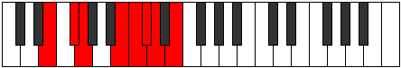
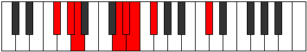
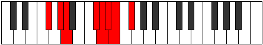

# Mode Mocrian

## Links

- [Documentation](README.md)
- [Scales Index](Scales.md)
- [Modes Index](Modes.md)
- [Chords Index](Chords.md)

## Parent Scale

[Zogian](ScaleZogian.md)

## Number

[1933](https://ianring.com/musictheory/scales/1933)

## Transposition

2, 1, 4, 1, 1, 1, 2

## Chord Pattern

v⁰b3, vi⁰

## Perfection

- 5 Perfect notes
- 2 Perfect notes

## Perfection Profile

true, true, true, true, true, false, false

## Permutations

| Tonic | Notes | Signature | Illustration | Audio |
|-------|-------|-----------|--------------|-------|
| [C](ModeCNaturalMocrian.md) | C, D, Eb, F##, G#, **A**, **Bb**, C | C |  | [midi](https://github.com/edipermadi/music/blob/main/docs/ModeCNaturalMocrian.mid?raw=true) |
| [C#](ModeCSharpMocrian.md) | C#, D#, E, F###, G##, **A#**, **B**, C# | C |  | [midi](https://github.com/edipermadi/music/blob/main/docs/ModeCSharpMocrian.mid?raw=true) |
| [Db](ModeDFlatMocrian.md) | Db, Eb, Fb, G#, A, **Bb**, **Cb**, Db | C |  | [midi](https://github.com/edipermadi/music/blob/main/docs/ModeDFlatMocrian.mid?raw=true) |
| [D](ModeDNaturalMocrian.md) | D, E, F, G##, A#, **B**, **C**, D | C |  | [midi](https://github.com/edipermadi/music/blob/main/docs/ModeDNaturalMocrian.mid?raw=true) |
| [D#](ModeDSharpMocrian.md) | D#, E#, F#, G###, A##, **B#**, **C#**, D# | C |  | [midi](https://github.com/edipermadi/music/blob/main/docs/ModeDSharpMocrian.mid?raw=true) |
| [Eb](ModeEFlatMocrian.md) | Eb, F, Gb, A#, B, **C**, **Db**, Eb | C |  | [midi](https://github.com/edipermadi/music/blob/main/docs/ModeEFlatMocrian.mid?raw=true) |
| [E](ModeENaturalMocrian.md) | E, F#, G, A##, B#, **C#**, **D**, E | C |  | [midi](https://github.com/edipermadi/music/blob/main/docs/ModeENaturalMocrian.mid?raw=true) |
| [F](ModeFNaturalMocrian.md) | F, G, Ab, B#, C#, **D**, **Eb**, F | C |  | [midi](https://github.com/edipermadi/music/blob/main/docs/ModeFNaturalMocrian.mid?raw=true) |
| [F#](ModeFSharpMocrian.md) | F#, G#, A, B##, C##, **D#**, **E**, F# | C |  | [midi](https://github.com/edipermadi/music/blob/main/docs/ModeFSharpMocrian.mid?raw=true) |
| [Gb](ModeGFlatMocrian.md) | Gb, Ab, Bbb, C#, D, **Eb**, **Fb**, Gb | C |  | [midi](https://github.com/edipermadi/music/blob/main/docs/ModeGFlatMocrian.mid?raw=true) |
| [G](ModeGNaturalMocrian.md) | G, A, Bb, C##, D#, **E**, **F**, G | C |  | [midi](https://github.com/edipermadi/music/blob/main/docs/ModeGNaturalMocrian.mid?raw=true) |
| [G#](ModeGSharpMocrian.md) | G#, A#, B, C###, D##, **E#**, **F#**, G# | C |  | [midi](https://github.com/edipermadi/music/blob/main/docs/ModeGSharpMocrian.mid?raw=true) |
| [Ab](ModeAFlatMocrian.md) | Ab, Bb, Cb, D#, E, **F**, **Gb**, Ab | C |  | [midi](https://github.com/edipermadi/music/blob/main/docs/ModeAFlatMocrian.mid?raw=true) |
| [A](ModeANaturalMocrian.md) | A, B, C, D##, E#, **F#**, **G**, A | C |  | [midi](https://github.com/edipermadi/music/blob/main/docs/ModeANaturalMocrian.mid?raw=true) |
| [A#](ModeASharpMocrian.md) | A#, B#, C#, D###, E##, **F##**, **G#**, A# | C |  | [midi](https://github.com/edipermadi/music/blob/main/docs/ModeASharpMocrian.mid?raw=true) |
| [Bb](ModeBFlatMocrian.md) | Bb, C, Db, E#, F#, **G**, **Ab**, Bb | C |  | [midi](https://github.com/edipermadi/music/blob/main/docs/ModeBFlatMocrian.mid?raw=true) |
| [B](ModeBNaturalMocrian.md) | B, C#, D, E##, F##, **G#**, **A**, B | C |  | [midi](https://github.com/edipermadi/music/blob/main/docs/ModeBNaturalMocrian.mid?raw=true) |
